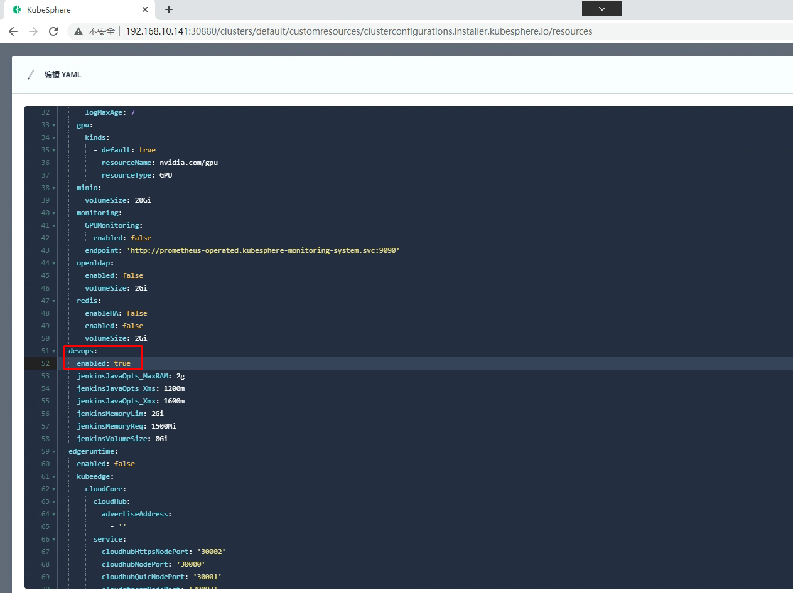

# 微服务项目 基于Kubernetes集群PaaS云平台 Kubesphere部署

# 一、Kubernetes集群持久存储准备 NFS

> 在安装之前，需要配置kubernetes个课程上的默认存储类型。

## 1.1  准备硬盘

~~~powershell
查看准备的磁盘
[root@nfsserver ~]# lsblk
NAME            MAJ:MIN RM  SIZE RO TYPE MOUNTPOINT
sda               8:0    0  100G  0 disk
├─sda1            8:1    0    1G  0 part /boot
└─sda2            8:2    0   99G  0 part
  ├─centos-root 253:0    0   50G  0 lvm  /
  ├─centos-swap 253:1    0    2G  0 lvm  [SWAP]
  └─centos-home 253:2    0   47G  0 lvm  /home
sdb               8:16   0  100G  0 disk
~~~

## 1.2  安装NFS软件

~~~powershell
安装NFS软件，即是客户端也是服务器端
# yum -y install nfs-utils
~~~

## 1.3  NFS配置

~~~powershell
创建挂载点
# mkdir /netshare
~~~

~~~powershell
格式化硬盘
# mkfs.xfs /dev/sdb
~~~

~~~powershell
编辑文件系统配置文件
# vim /etc/fstab
在文件最后添加此行内容
/dev/sdb                /netshare               xfs     defaults        0 0
~~~

~~~powershell
手动挂载全部分区
# mount -a
~~~

~~~powershell
在本地查看文件系统挂载情况
# df -h
文件系统                 容量  已用  可用 已用% 挂载点

/dev/sdb                 100G   33M  100G    1% /netshare
~~~

~~~powershell
添加共享目录到配置文件
# vim /etc/exports
# cat /etc/exports
/netshare       *(rw,sync,no_root_squash)
~~~

~~~powershell
启动服务及设置开机自启动
# systemctl enable nfs-server
# systemctl start nfs-server
~~~

## 1.4 验证

~~~powershell
本地验证目录是否共享
# showmount -e
Export list for nfsserver:
/netshare *
~~~

~~~powershell
在k8s master节点验证目录是否共享
# showmount -e 192.168.10.147
Export list for 192.168.10.147:
/netshare *
~~~

~~~powershell
在k8s worker01节点验证目录是否共享
# showmount -e 192.168.10.147
Export list for 192.168.10.147:
/netshare *
~~~

## 1.5  部署存储动态供给

### 1.5.1  获取资源清单文件

~~~powershell
在k8s master节点获取NFS后端存储动态供给配置资源清单文件

# for file in class.yaml deployment.yaml rbac.yaml  ; do wget https://raw.githubusercontent.com/kubernetes-incubator/external-storage/master/nfs-client/deploy/$file ; done
~~~

~~~powershell
查看是否下载
# ls
class.yaml  deployment.yaml  rbac.yaml
~~~

### 1.5.2 应用资源清单文件

~~~powershell
应用rbac资源清单文件
# kubectl apply -f rbac.yaml
~~~

~~~powershell
修改存储类名称
# vim class.yaml
# cat class.yaml
apiVersion: storage.k8s.io/v1
kind: StorageClass
metadata:
  name: nfs-client
provisioner: fuseim.pri/ifs # or choose another name, must match deployment's env PROVISIONER_NAME'
parameters:
  archiveOnDelete: "false"
~~~

~~~powershell
应用class（存储类）资源清单文件
# kubectl apply -f class.yaml
storageclass.storage.k8s.io/nfs-client created
~~~

~~~powershell
应用deployment资源清单文件之前修改其配置，主要配置NFS服务器及其共享的目录
# vim deployment.yaml

注意修改处内容

# vim deployment.yaml
# cat deployment.yaml
apiVersion: apps/v1
kind: Deployment
metadata:
  name: nfs-client-provisioner
  labels:
    app: nfs-client-provisioner
  # replace with namespace where provisioner is deployed
  namespace: default
spec:
  replicas: 1
  strategy:
    type: Recreate
  selector:
    matchLabels:
      app: nfs-client-provisioner
  template:
    metadata:
      labels:
        app: nfs-client-provisioner
    spec:
      serviceAccountName: nfs-client-provisioner
      containers:
        - name: nfs-client-provisioner
          image: registry.cn-beijing.aliyuncs.com/pylixm/nfs-subdir-external-provisioner:v4.0.0
          volumeMounts:
            - name: nfs-client-root
              mountPath: /persistentvolumes
          env:
            - name: PROVISIONER_NAME
              value: fuseim.pri/ifs
            - name: NFS_SERVER
              value: 192.168.10.147
            - name: NFS_PATH
              value: /netshare
      volumes:
        - name: nfs-client-root
          nfs:
            server: 192.168.10.147
            path: /netshare

~~~

~~~powershell
应用资源清单文件
# kubectl apply -f deployment.yaml
~~~

~~~powershell
查看pod运行情况

# kubectl get pods
出现以下表示成功运行
NAME                                     READY   STATUS    RESTARTS   AGE
nfs-client-provisioner-8bcf6c987-7cb8p   1/1     Running   0          74s
~~~

~~~powershell
设置默认存储类
# kubectl patch storageclass nfs-client -p '{"metadata": {"annotations":{"storageclass.kubernetes.io/is-default-class":"true"}}}'
~~~

~~~powershell
# kubectl get sc
NAME                   PROVISIONER      RECLAIMPOLICY   VOLUMEBINDINGMODE   ALLOWVOLUMEEXPANSION   AGE
nfs-client (default)   fuseim.pri/ifs   Delete          Immediate           false                  18m
~~~

### 1.5.3 测试用例验证动态供给是否可用

> 使用测试用例测试NFS后端存储是否可用

~~~powershell
测试用例：
# vim nginx.yaml
# cat nginx.yaml
---
apiVersion: v1
kind: Service
metadata:
  name: nginx
  labels:
    app: nginx
spec:
  ports:
  - port: 80
    name: web
  clusterIP: None
  selector:
    app: nginx
---
apiVersion: apps/v1
kind: StatefulSet
metadata:
  name: web
spec:
  selector:
    matchLabels:
      app: nginx
  serviceName: "nginx"
  replicas: 2
  template:
    metadata:
      labels:
        app: nginx
    spec:
      containers:
      - name: nginx
        image: nginx:latest
        ports:
        - containerPort: 80
          name: web
        volumeMounts:
        - name: www
          mountPath: /usr/share/nginx/html
  volumeClaimTemplates:
  - metadata:
      name: www
    spec:
      accessModes: [ "ReadWriteOnce" ]
      storageClassName: "nfs-client"
      resources:
        requests:
          storage: 1Gi
~~~

~~~powershell
# kubectl apply -f nginx.yaml
service/nginx created
statefulset.apps/web created
~~~

~~~powershell
# kubectl get pvc
NAME        STATUS   VOLUME                                     CAPACITY   ACCESS MODES   STORAGECLASS   AGE
www-web-0   Bound    pvc-57bee742-326b-4d41-b241-7f2b5dd22596   1Gi        RWO            nfs-client     3m19s
~~~

# 二、Kubesphere部署

~~~powershell
# kubectl apply -f https://github.com/kubesphere/ks-installer/releases/download/v3.2.1/kubesphere-installer.yaml
~~~

~~~powershell
# kubectl apply -f https://github.com/kubesphere/ks-installer/releases/download/v3.2.1/cluster-configuration.yaml
~~~

~~~powershell
# kubectl logs -n kubesphere-system $(kubectl get pod -n kubesphere-system -l 'app in (ks-install, ks-installer)' -o jsonpath='{.items[0].metadata.name}') -f
~~~

~~~powershell
**************************************************
Waiting for all tasks to be completed ...
task network status is successful  (1/4)
task openpitrix status is successful  (2/4)
task multicluster status is successful  (3/4)
task monitoring status is successful  (4/4)
**************************************************
Collecting installation results ...
#####################################################
###              Welcome to KubeSphere!           ###
#####################################################

Console: http://192.168.10.141:30880
Account: admin
Password: P@88w0rd

NOTES：
  1. After you log into the console, please check the
     monitoring status of service components in
     "Cluster Management". If any service is not
     ready, please wait patiently until all components
     are up and running.
  2. Please change the default password after login.

#####################################################
~~~

# 三、Kubesphere开启devops功能

