# kubesphere多租户管理系统应用

# 一、kubesphere平台登录

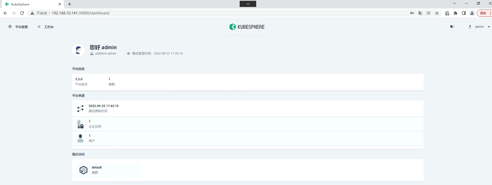

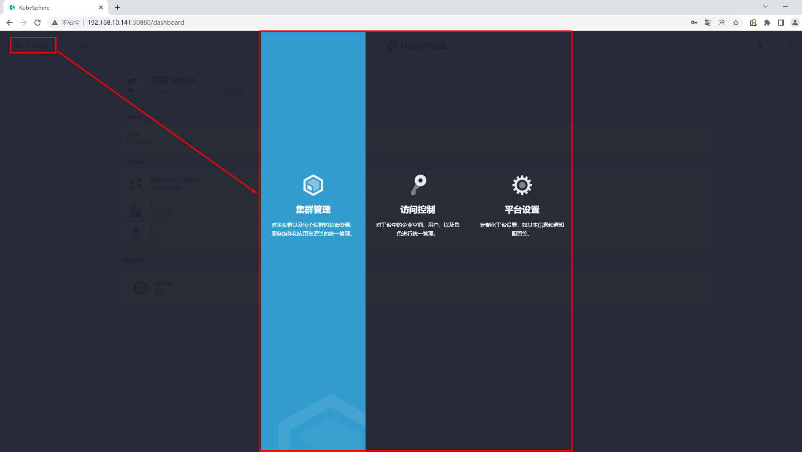

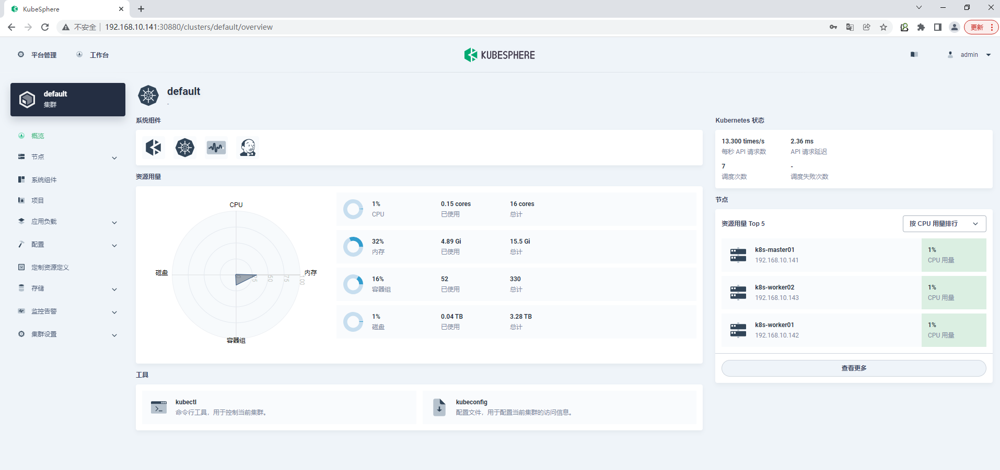

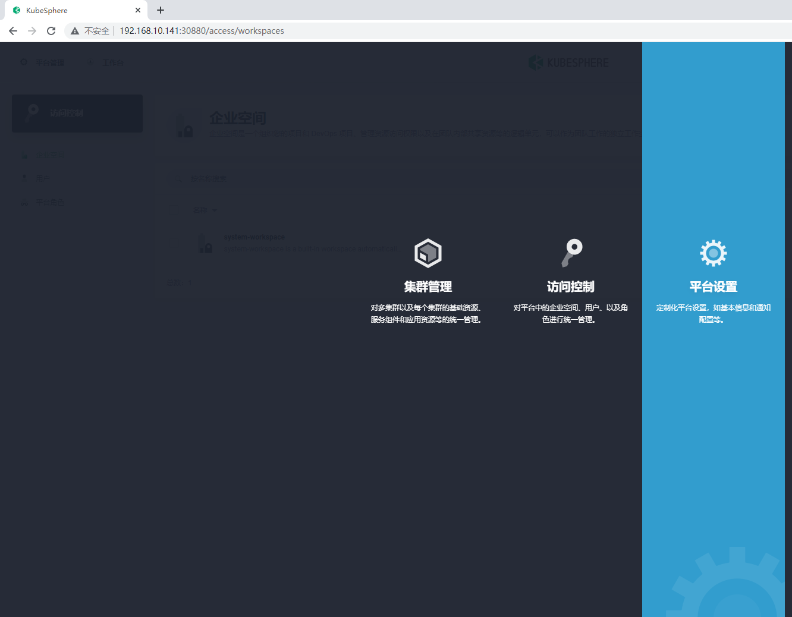

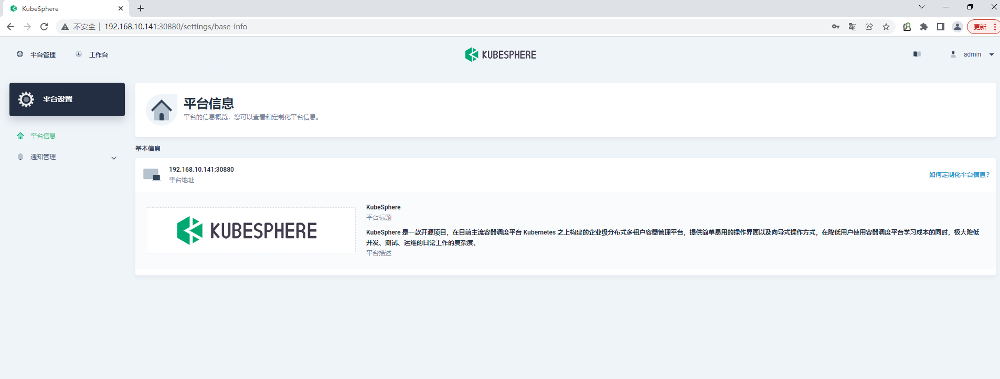

# 二、Kubesphere应用架构

## 2.1 架构介绍

- KubeSphere 的多租户系统分**三个**层级，即集群、企业空间和项目。
  - **集群**即为kubernetes集群
  - **企业空间**是用来管理[项目](https://kubesphere.com.cn/docs/v3.3/project-administration/)、[DevOps 项目](https://kubesphere.com.cn/docs/v3.3/devops-user-guide/)、[应用模板](https://kubesphere.com.cn/docs/v3.3/workspace-administration/upload-helm-based-application/)和应用仓库的一种逻辑单元。可以在企业空间中控制资源访问权限，也可以安全地在团队内部分享资源。
  - **项目**即为kubernetes的命名空间
- 您需要创建一个新的企业空间进行操作，而不是使用系统企业空间，系统企业空间中运行着系统资源，绝大部分仅供查看。出于安全考虑，强烈建议给不同的租户授予不同的权限在企业空间中进行协作。

- 可以在一个 KubeSphere 集群中创建多个企业空间，每个企业空间下可以创建多个项目。

## 2.2 创建企业空间、项目、用户和平台角色

KubeSphere 为每个级别默认设有多个内置角色。此外，您还可以创建拥有自定义权限的角色。KubeSphere 多层次结构适用于具有不同团队或组织以及每个团队中需要不同角色的企业用户。

### 2.2.1 创建用户

安装 KubeSphere 之后，您需要向平台添加具有不同角色的用户，以便他们可以针对自己授权的资源在不同的层级进行工作。一开始，系统默认只有一个用户 `admin`，具有 `platform-admin` 角色。在本步骤中，您将创建一个示例用户 `user-manager`，然后使用 `user-manager` 创建新用户。

1.以 `admin` 身份使用默认帐户和密码 (`admin/P@88w0rd`,本次使用`admin/Kubemsb123`) 登录 Web 控制台。

>出于安全考虑，强烈建议您在首次登录控制台时更改密码。若要更改密码，在右上角的下拉列表中选择**用户设置**，在**密码设置**中设置新密码，您也可以在**用户设置** > **基本信息**中修改控制台语言。

2.点击左上角的**平台管理**，然后选择**访问控制**。在左侧导航栏中，选择**平台角色**。四个内置角色的描述信息如下表所示。

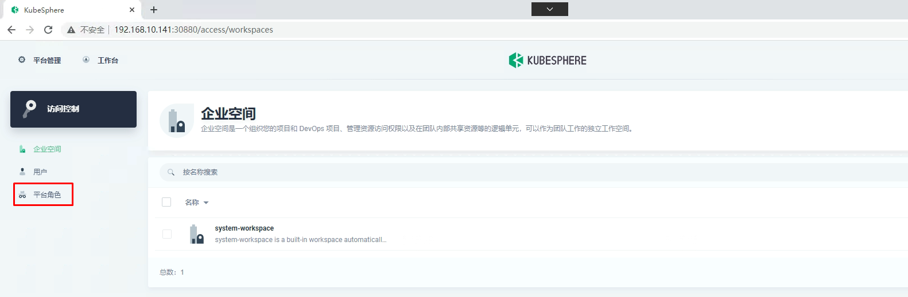

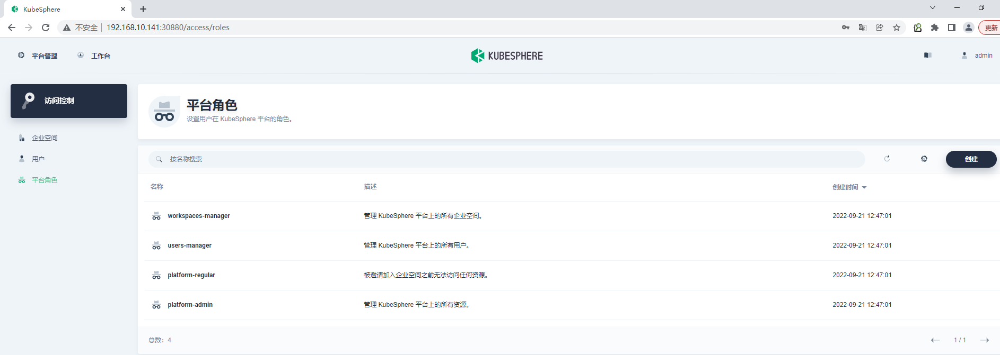

| 内置角色             | 描述                                                         |
| :------------------- | :----------------------------------------------------------- |
| `workspaces-manager` | 企业空间管理员，管理平台所有企业空间。                       |
| `users-manager`      | 用户管理员，管理平台所有用户。                               |
| `platform-regular`   | 平台普通用户，在被邀请加入企业空间或集群之前没有任何资源操作权限。 |
| `platform-admin`     | 平台管理员，可以管理平台内的所有资源。                       |

>内置角色由 KubeSphere 自动创建，无法编辑或删除。

3.在**用户**中，点击**创建**。在弹出的对话框中，提供所有必要信息（带有*标记），然后在**平台角色**一栏选择 `users-manager`

完成后，点击**确定**。新创建的用户将显示在**用户**页面。

4.切换用户使用 `user-manager` 重新登录，创建如下四个新用户，这些用户将在其他的教程中使用。

>- 帐户登出请点击右上角的用户名，然后选择**登出**。
>- 下面仅为示例用户名，请根据实际情况修改。

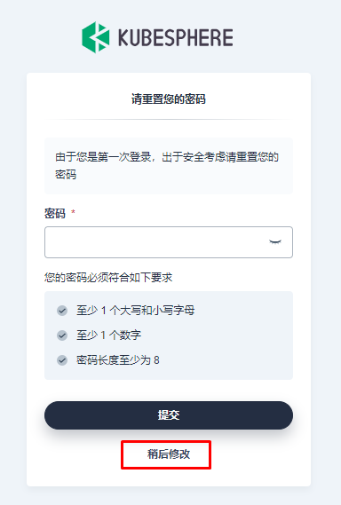

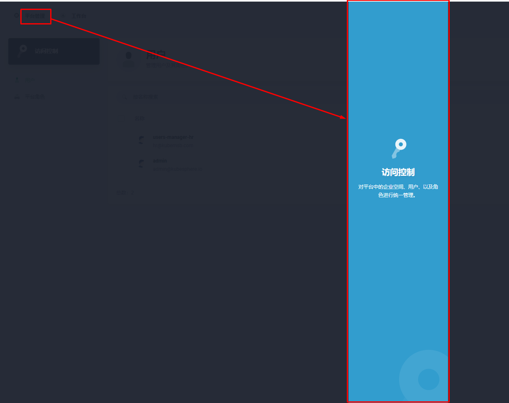

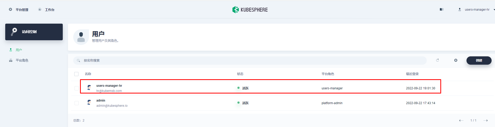

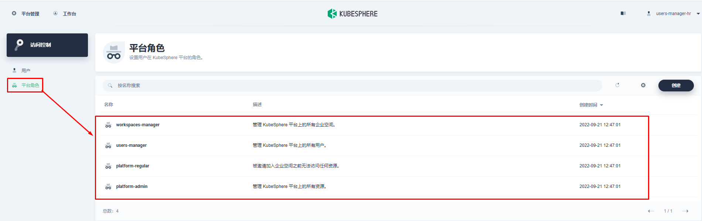

| 用户              | 指定的平台角色       | 用户权限                                                     |
| :---------------- | :------------------- | :----------------------------------------------------------- |
| `ws-manager`      | `workspaces-manager` | 创建和管理所有企业空间。                                     |
| `ws-admin`        | `platform-regular`   | 被邀请到企业空间后，管理该企业空间中的所有资源（在此示例中，此用户用于邀请新成员加入该企业空间）。 |
| `project-admin`   | `platform-regular`   | 创建和管理项目以及 DevOps 项目，并邀请新成员加入项目。       |
| `project-regular` | `platform-regular`   | `project-regular` 将由 `project-admin` 邀请至项目或 DevOps 项目。该用户将用于在指定项目中创建工作负载、流水线和其他资源。 |

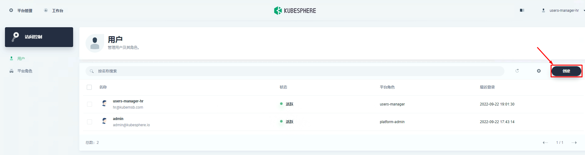

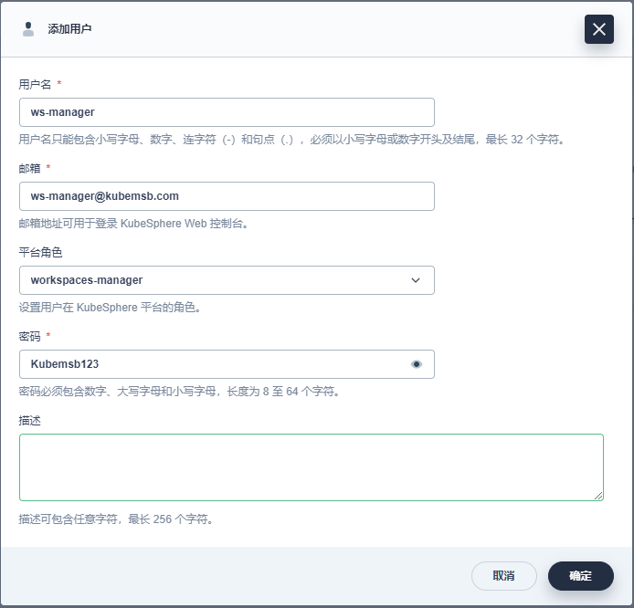

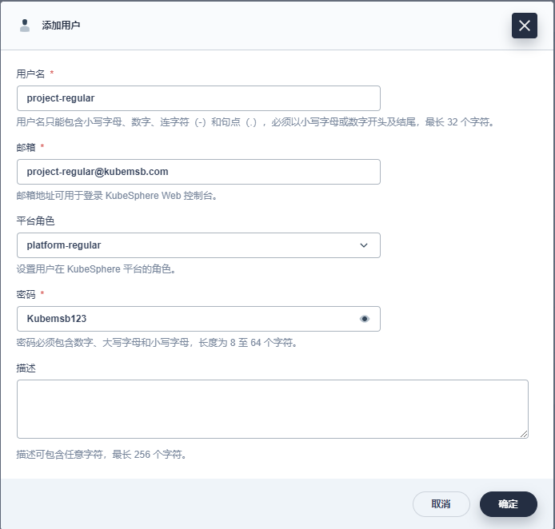

5.在**用户**页面，查看创建的四个用户。

>您可以点击用户名称后的  图标选择启用或禁用某个用户。您也可以勾选多个用户进行批量操作。

### 2.2.2 创建企业空间

需要使用上一个步骤中创建的用户 `ws-manager` 创建一个企业空间。作为管理项目、DevOps 项目和组织成员的基本逻辑单元，企业空间是 KubeSphere 多租户系统的基础。

1.以 `ws-manager` 身份登录 KubeSphere。点击左上角的**平台管理**，选择**访问控制**。在**企业空间**中，可以看到仅列出了一个默认企业空间 `system-workspace`，即系统企业空间，其中运行着与系统相关的组件和服务，您无法删除该企业空间。

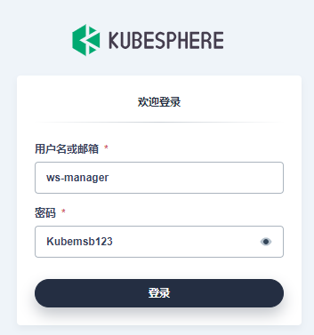

2.点击右侧的**创建**，将新企业空间命名为 `demo-workspace`，并将用户 `ws-admin` 设置为企业空间管理员。完成后，点击**创建**。

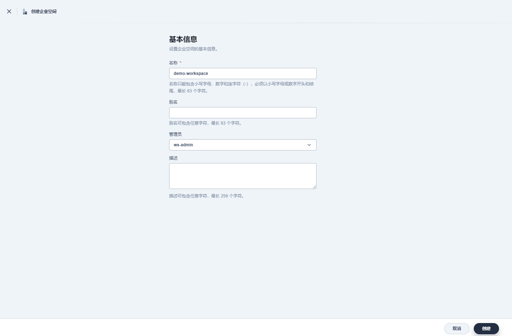

>如果您已启用[多集群功能](https://kubesphere.com.cn/docs/v3.3/multicluster-management/)，您需要为企业空间[分配一个或多个可用集群](https://kubesphere.com.cn/docs/v3.3/cluster-administration/cluster-settings/cluster-visibility-and-authorization/#在创建企业空间时选择可用集群)，以便项目可以在集群中创建。

3.登出控制台，然后以 `ws-admin` 身份重新登录。在**企业空间设置**中，选择**企业空间成员**，然后点击**邀请**。

4.邀请 `project-admin` 和 `project-regular` 进入企业空间，分别授予 `demo-workspace-self-provisioner` 和 `demo-workspace-viewer` 角色，点击**确定**。

> 实际角色名称的格式：`<workspace name>-<role name>`。例如，在名为 `demo-workspace` 的企业空间中，角色 `viewer` 的实际角色名称为 `demo-workspace-viewer`。

5.将 `project-admin` 和 `project-regular` 都添加到企业空间后，点击**确定**。在**企业空间成员**中，您可以看到列出的三名成员。

| 用户              | 分配的企业空间角色                | 角色权限                                                     |
| :---------------- | :-------------------------------- | :----------------------------------------------------------- |
| `ws-admin`        | `demo-workspace-admin`            | 管理指定企业空间中的所有资源（在此示例中，此用户用于邀请新成员加入企业空间）。 |
| `project-admin`   | `demo-workspace-self-provisioner` | 创建和管理项目以及 DevOps 项目，并邀请新成员加入项目。       |
| `project-regular` | `demo-workspace-viewer`           | `project-regular` 将由 `project-admin` 邀请至项目或 DevOps 项目。该用户将用于在指定项目中创建工作负载、流水线和其他资源。 |

### 2.2.3 创建项目

在此步骤中，您需要使用在上一步骤中创建的帐户 `project-admin` 来创建项目。KubeSphere 中的项目与 Kubernetes 中的命名空间相同，为资源提供了虚拟隔离。有关更多信息，请参见[命名空间](https://kubernetes.io/zh/docs/concepts/overview/working-with-objects/namespaces/)。

1.以 `project-admin` 身份登录 KubeSphere Web 控制台，在**项目**中，点击**创建**。

2.输入项目名称（例如 `demo-project`），点击**确定**。您还可以为项目添加别名和描述。

3.在**项目**中，点击刚创建的项目查看其详情页面。

4.在项目的**概览**页面，默认情况下未设置项目配额。您可以点击**编辑配额**并根据需要指定[资源请求和限制](https://v3-2.docs.kubesphere.io/zh/docs/workspace-administration/project-quotas/)（例如：CPU 和内存的限制分别设为 1 Core 和 1000 Gi）。

5.在**项目设置** > **项目成员**中，邀请 `project-regular` 至该项目，并授予该用户 `operator` 角色。

>具有 `operator` 角色的用户是项目维护者，可以管理项目中除用户和角色以外的资源。

6.在创建[应用路由](https://v3-2.docs.kubesphere.io/zh/docs/project-user-guide/application-workloads/routes/)（即 Kubernetes 中的 [Ingress](https://kubernetes.io/docs/concepts/services-networking/ingress/)）之前，需要启用该项目的网关。网关是在项目中运行的 [NGINX Ingress 控制器](https://github.com/kubernetes/ingress-nginx)。若要设置网关，请转到**项目设置**中的**网关设置**，然后点击**设置网关**。此步骤中仍使用帐户 `project-admin`。

7.选择访问方式 **NodePort**，然后点击**确定**。

8.在**网关设置**下，可以在页面上看到网关地址以及 http/https 的端口。

>如果要使用 `LoadBalancer` 暴露服务，则需要使用云厂商的 LoadBalancer 插件。如果您的 Kubernetes 集群在裸机环境中运行，建议使用 [OpenELB](https://github.com/kubesphere/openelb) 作为 LoadBalancer 插件。

### 2.2.4 创建角色

完成上述步骤后，您已了解可以为不同级别的用户授予不同角色。先前步骤中使用的角色都是 KubeSphere 提供的内置角色。在此步骤中，您将学习如何创建自定义角色以满足工作需求。

1.再次以 `admin` 身份登录 KubeSphere Web 控制台，转到**访问控制**。

2.点击左侧导航栏中的**平台角色**，再点击右侧的**创建**。

>**平台角色**页面的预设角色无法编辑或删除。

3.在**创建平台角色**对话框中，设置角色标识符（例如，`clusters-admin`）、角色名称和描述信息，然后点击**编辑权限**。

> 本示例演示如何创建负责集群管理的角色。

4.在**编辑权限**对话框中，设置角色权限（例如，选择**集群管理**）并点击**确定**。

>- 在本示例中，角色 `clusters-admin` 包含**集群管理**和**集群查看**权限。
>- 一些权限依赖于其他权限，依赖项由每项权限下的**依赖于**字段指定。
>- 选择权限后，将自动选择它所依赖的权限。
>- 若要取消选择权限，则需要首先取消选择其从属权限。

5.在**平台角色**页面，可以点击所创建角色的名称查看角色详情，点击  以编辑角色、编辑角色权限或删除该角色。

6.在**用户**页面，可以在创建帐户或编辑现有帐户时为帐户分配该角色。

### 2.2.5 创建DevOps

>若要创建 DevOps 项目，需要预先启用 KubeSphere DevOps 系统，该系统是个可插拔的组件，提供 CI/CD 流水线、Binary-to-Image 和 Source-to-Image 等功能。有关如何启用 DevOps 的更多信息，请参见 [KubeSphere DevOps 系统](https://v3-2.docs.kubesphere.io/zh/docs/pluggable-components/devops/)。

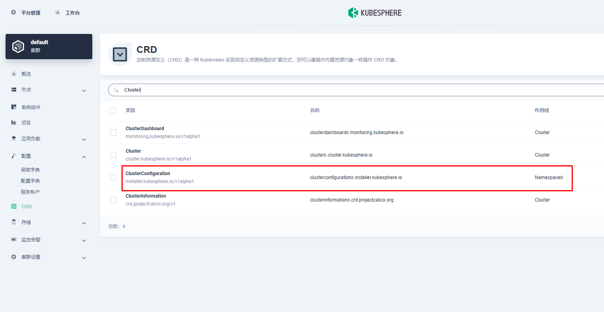

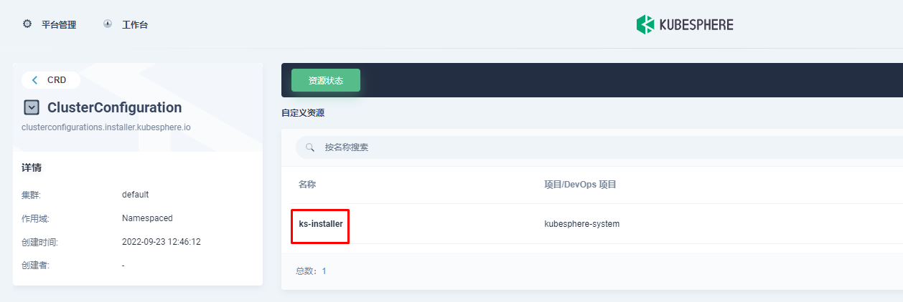

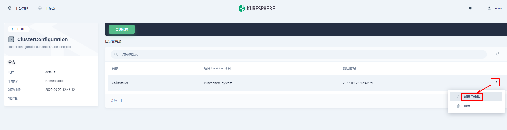

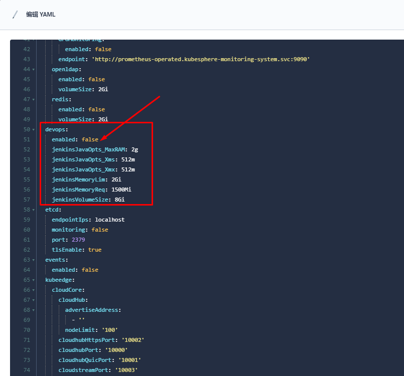

~~~powershell
# kubectl logs -n kubesphere-system $(kubectl get pod -n kubesphere-system -l app=ks-install -o jsonpath='{.items[0].metadata.name}') -f
~~~

1.以 `project-admin` 身份登录控制台，在 **DevOps 项目**中，点击**创建**。

2.输入 DevOps 项目名称（例如 `demo-devops`），然后点击**确定**，也可以为该项目添加别名和描述。

3.点击刚创建的项目查看其详细页面。

4.转到 **DevOps 项目设置**，然后选择 **DevOps 项目成员**。点击**邀请**授予 `project-regular` 用户 `operator` 的角色，允许其创建流水线和凭证。

至此，您已熟悉 KubeSphere 的多租户管理系统。在其他教程中，`project-regular` 帐户还将用于演示如何在项目或 DevOps 项目中创建应用程序和资源。