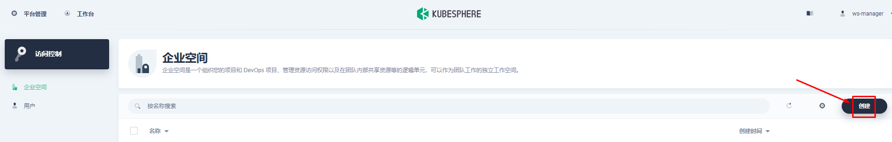
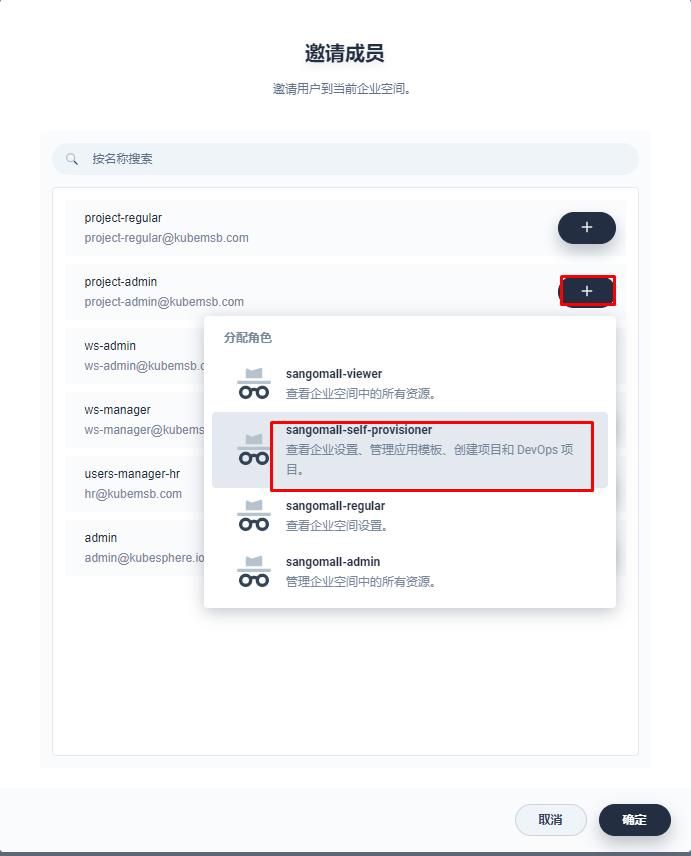
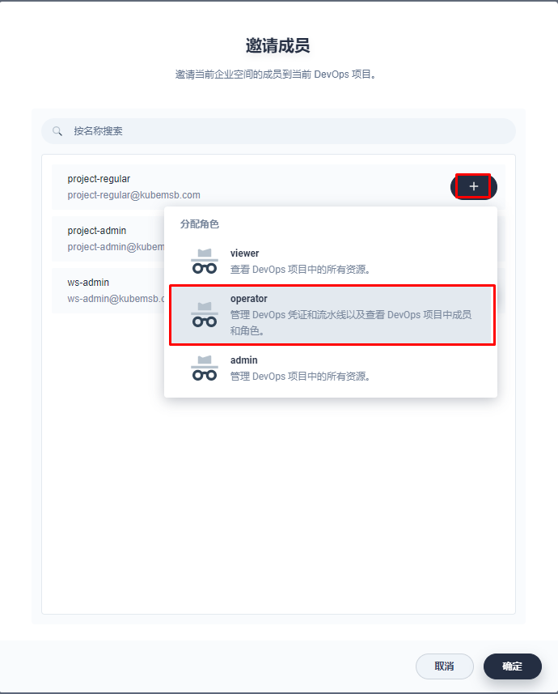

# KubeSphere部署三高商城组织架构说明

# 一、 创建企业空间

1.使用ws-manager用户登录KubeSphere  web控制器，创建企业空间。

2.登出控制台，然后以 `ws-admin` 身份重新登录。在**企业空间设置**中，选择**企业空间成员**，然后点击**邀请**。

4.邀请 `project-admin` 和 `project-regular` 进入企业空间，分别授予 `demo-workspace-self-provisioner` 和 `demo-workspace-viewer` 角色，点击**确定**。

# 二、 创建项目

在此步骤中，您需要使用在上一步骤中创建的帐户 `project-admin` 来创建项目。KubeSphere 中的项目与 Kubernetes 中的命名空间相同，为资源提供了虚拟隔离。有关更多信息，请参见[命名空间](https://kubernetes.io/zh/docs/concepts/overview/working-with-objects/namespaces/)。

1.以 `project-admin` 身份登录 KubeSphere Web 控制台，在**项目**中，点击**创建**。

2.输入项目名称（例如 `sangomall`），点击**确定**。您还可以为项目添加别名和描述。

3.在**项目**中，点击刚创建的项目查看其详情页面。

4.在项目的**概览**页面，默认情况下未设置项目配额。您可以点击**编辑配额**并根据需要指定[资源请求和限制](https://v3-2.docs.kubesphere.io/zh/docs/workspace-administration/project-quotas/)（例如：CPU 和内存的限制分别设为 1 Core 和 1000 Gi）。

5.在**项目设置** > **项目成员**中，邀请 `project-regular` 至该项目，并授予该用户 `operator` 角色。

>如果要使用 `LoadBalancer` 暴露服务，则需要使用云厂商的 LoadBalancer 插件。如果您的 Kubernetes 集群在裸机环境中运行，建议使用 [OpenELB](https://github.com/kubesphere/openelb) 作为 LoadBalancer 插件。

# 三、 创建DevOps项目

> 项目准备好后，创建流水线即可实现发布。

