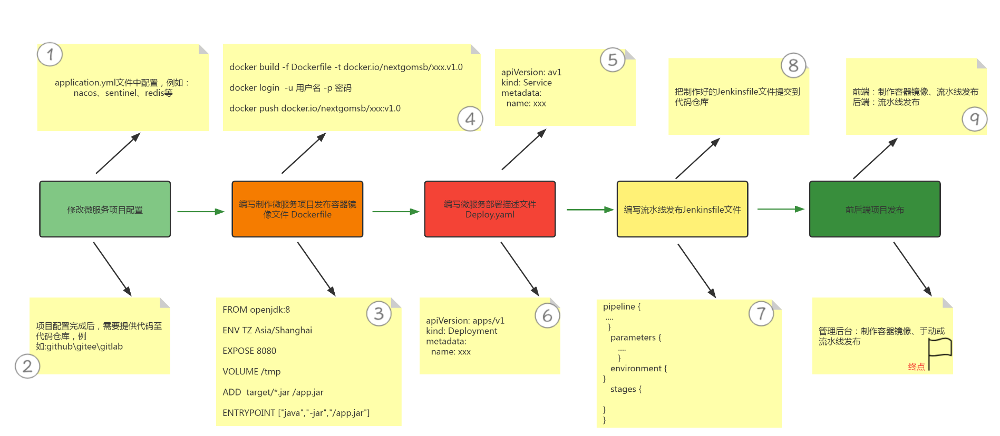

# 微服务部署思路

# 一、部署服务思路

## 1.1 传统部署方式

- 配置微服务之间调用链接地址

- 把服务打包
- 基于打包后的文件生成容器镜像(Dockerfile)
- 把容器镜像上传到容器镜像仓库Harbor
- 编写资源清单文件（YAML）
- 在K8S集群中执行YAML资源清单文件
- 在K8S集群内或K8S集群外访问测试

## 1.2 使用流水线部署方式

- 配置微服务之间调用链接地址等
- 服务代码上传到代码仓库
- 编写流水线
  - 获取项目代码
  - 把服务编译打包
  - 基于打包后的文件生成容器镜像（Dockerfile）
  - 把容器镜像上传到容器镜像仓库Harbor
- 编写资源清单文件（YAML）
  - Deployment
  - Service
  - Ingress
- 在K8S集群中执行YAML资源清单文件
  - 使用流水线中步骤完成资源清单文件执行
- 在K8S集群内或K8S集群外访问测试
- 创建集群外访问方式（除个别服务外，非必须）

# 二、KubeSphere部署微服务项目注意事项

## 2.1 Dockerfile

为每一个微服务编写Dockerfile文件，Docker会按照Dockerfile将项目制作成镜像

## 2.2 资源清单文件（部署描述文件）

为每一个微服务部署编写一个资源清单文件

## 2.3 部署方式

### 2.3.1 使用KubeSphere Web UI

可以使用KubeSphere Web UI一个一个微服务部署

### 2.3.2 使用KubeSphere Web UI中DevOps项目

使用流水线方式进行部署，需要编写对应的流水线文件，本案例使用Jenkinsfile文件。

