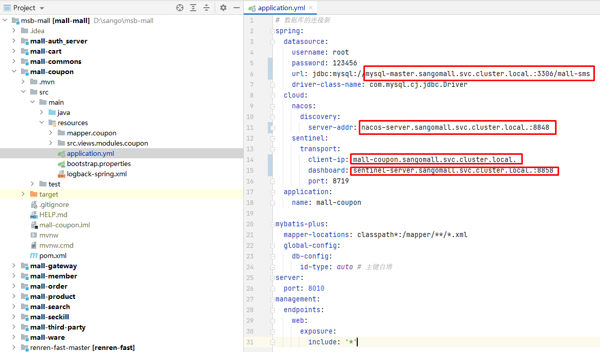
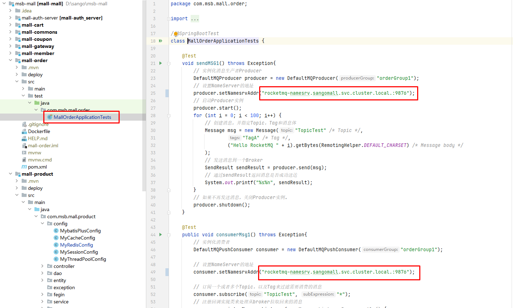
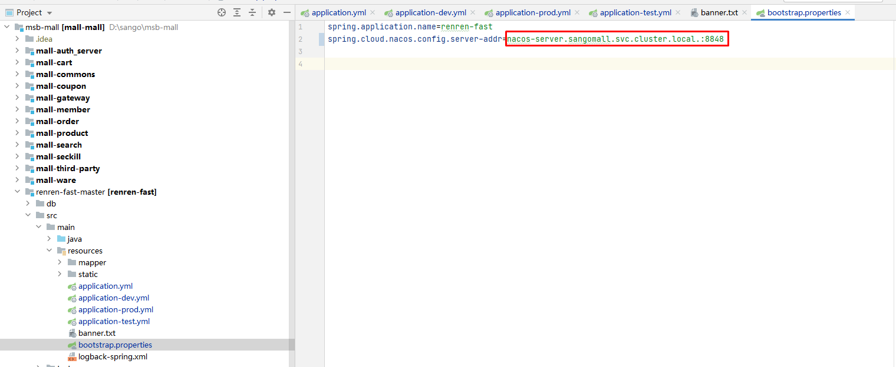

# 微服务项目sangomall应用环境配置说明

# 一、应用环境配置文件创建

可以创建多个application.properties或application.yml文件,通过关键配置进行激活使用，例如测试环境和生产环境等。

## 1.1 创建开发环境（dev）

名称：application-dev.properties

激活的方法：

~~~powershell
在application.properties中添加激活使用
spring.profiles.active=dev
~~~

也可以在Dockerfile文件中启动命令时添加

~~~powershell
FROM openjdk:8
EXPOSE 8080

VOLUME /tmp

ADD target/*/jar /app.jar

RUN bash -c 'touch /app.jar'

ENTRYPOINT ["java","-jar","/app.jar","--spring.profiles.active=dev"]
~~~

## 1.2 创建生产环境（prod）

 名称：application-prod.properties

激活的方法：

~~~powershell
在application.properties中添加激活使用
spring.profiles.active=prod
~~~

也可以在Dockerfile文件中启动命令时添加

~~~powershell
FROM openjdk:8
EXPOSE 8080

VOLUME /tmp

ADD target/*/jar /app.jar

RUN bash -c 'touch /app.jar'

ENTRYPOINT ["java","-jar","/app.jar","--spring.profiles.active=prod"]
~~~

# 二、应用环境配置文件修改

## 2.1 Nacos

~~~powershell
集群外域名访问：
nacos-server.msb.com 192.168.10.70
~~~

~~~powershell
集群内域名访问：
nacos-server.sangomall.svc.cluster.local.  8848
~~~

## 2.2 Redis

~~~powershell
集群内域名访问：
redis.sangomall.svc.cluster.local.  6379
~~~

## 2.3 Sentinel

~~~powershell
集群外域名访问：
sentinel-server.msb.com  192.168.10.70
~~~

~~~powershell
集群内域名访问：
sentinel-server.sangomall.svc.cluster.local. 8858
~~~

## 2.4 Zipkin

~~~powershell
集群外域名访问：
zipkin-server.msb.com 192.168.10.70
~~~

~~~powershell
集群内域名访问：
zipkin-server.sangomall.svc.cluster.local. 9411
~~~

## 2.5 RocketMQ

~~~powershell
集群内域名访问：

rocketmq-namesrv.sangomall.svc.cluster.local.:9876
~~~

## 2.6 MySQL

~~~powershell
集群内域名访问：
mysql-master.sangomall.svc.cluster.local.:3306
~~~

## 2.7 elasticsearch

~~~powershell
elasticsearch.sangomall.svc.cluster.local.:9200
~~~

# 三、各微服务应用环境配置文件修改

## 3.1 mall-auth_server

~~~powershell
集群内访问域名：
nacos-server.sangomall.svc.cluster.local.:8848
sentinel-server.sangomall.svc.cluster.local.:8858

redis.sangomall.svc.cluster.local.
~~~

~~~powershell
  thymeleaf:
    cache: false 
    prefix: classpath:/templates
    suffix: .html
~~~

## 3.2 mall-cart

~~~powershell
集群内访问域名：
nacos-server.sangomall.svc.cluster.local.:8848
sentinel-server.sangomall.svc.cluster.local.:8858

redis.sangomall.svc.cluster.local.
~~~

## 3.3 mall-commons

> 不需要配置

## 3.4 mall-coupon

~~~powershell
集群内访问域名：
nacos-server.sangomall.svc.cluster.local.:8848
sentinel-server.sangomall.svc.cluster.local.:8858
redis.sangomall.svc.cluster.local.

mysql-master.sangomall.svc.cluster.local.:3306/mall_sms
~~~

## 3.5 mall-gateway

~~~powershell
集群内访问域名：
nacos-server.sangomall.svc.cluster.local.:8848
sentinel-server.sangomall.svc.cluster.local.:8858

redis.sangomall.svc.cluster.local.
~~~

## 3.6 mall-member

~~~powershell
集群内访问域名：
nacos-server.sangomall.svc.cluster.local.:8848
sentinel-server.sangomall.svc.cluster.local.:8858
redis.sangomall.svc.cluster.local.

mysql-master.sangomall.svc.cluster.local.:3306/mall_ums
~~~

## 3.7 mall-order

~~~powershell
集群内访问域名：
nacos-server.sangomall.svc.cluster.local.:8848
sentinel-server.sangomall.svc.cluster.local.:8858
redis.sangomall.svc.cluster.local.

mysql-master.sangomall.svc.cluster.local.:3306/mall_oms

rocketmq-namesrv.sangomall.svc.cluster.local.:9876
~~~

## 3.8 mall-product

~~~powershell
集群内访问域名：
nacos-server.sangomall.svc.cluster.local.:8848
sentinel-server.sangomall.svc.cluster.local.:8858
redis.sangomall.svc.cluster.local.

mysql-master.sangomall.svc.cluster.local.:3306/mall_pms

rocketmq-namesrv.sangomall.svc.cluser.local.:9876
~~~

~~~powershell

endpoint oss-cn-beijing.aliyuncs.com

bucket名称 msb-laoshi-public
地域 beijing
~~~

## 3.9 mall-search

~~~powershell
集群内访问域名：
nacos-server.sangomall.svc.cluster.local.:8848
sentinel-server.sangomall.svc.cluster.local.:8858
redis.sangomall.svc.cluster.local.

elasticsearch.sangomall.svc.cluster.local.:9200
~~~

## 3.10 mall-seckill

~~~powershell
集群内访问域名：
nacos-server.sangomall.svc.cluster.local.:8848
sentinel-server.sangomall.svc.cluster.local.:8858
redis.sangomall.svc.cluster.local.

rocketmq-namesrv.sangomall.svc.cluser.local.:9876
~~~

## 3.11 mall-third-party

~~~powershell
集群内访问域名：
nacos-server.sangomall.svc.cluster.local.:8848
sentinel-server.sangomall.svc.cluster.local.:8858
redis.sangomall.svc.cluster.local.

rocketmq-namesrv.sangomall.svc.cluser.local.:9876
~~~

~~~powershell

endpoint oss-cn-beijing.aliyuncs.com

bucket名称 msb-laoshi-public
地域 beijing
~~~

## 3.12 mall-ware

~~~powershell
集群内访问域名：
nacos-server.sangomall.svc.cluster.local.:8848
sentinel-server.sangomall.svc.cluster.local.:8858

mysql-master.sangomall.svc.cluster.local.:3306/mall_wms
~~~

## 3.13 renren-fast-master

~~~powershell
集群内访问域名：
nacos-server.sangomall.svc.cluster.local.:8848
sentinel-server.sangomall.svc.cluster.local.:8858
redis.sangomall.svc.cluster.local.

mysql-master.sangomall.svc.cluster.local.:3306/renren_fast

rocketmq-namesrv.sangomall.svc.cluser.local.:9876
~~~

## 3.14 renre-generator-master

~~~powershell
mysql-master.sangomall.svc.cluster.local.:3306/mall_sms
~~~

# 四、添加nexus-aliyun仓库

~~~powershell
<settings>
    <mirrors>
        <mirror>
            <id>nexus-aliyun</id>
            <mirrorOf>central</mirrorOf>
            <name>Nexus aliyun</name>
            <url>http://maven.aliyun.com/nexus/content/groups/public</url>
        </mirror>
    </mirrors>

</settings>
~~~

