# 微服务项目各微服务Dockerfile文件准备

# 一、获取jar的方法

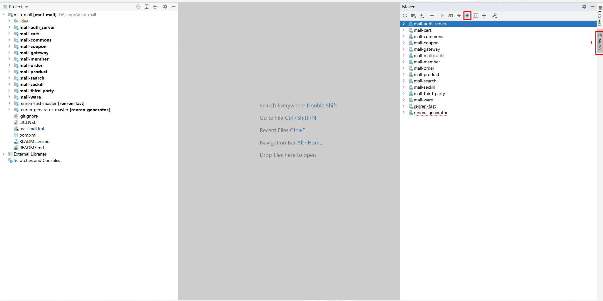

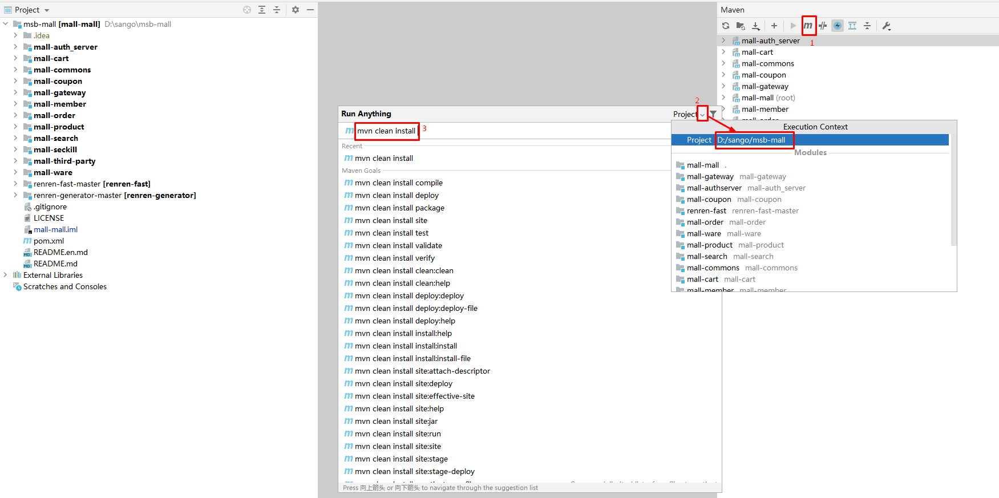

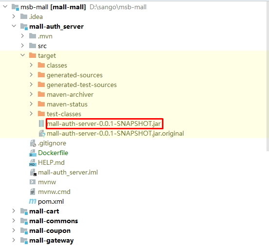

# 二、各微服务Dockerfile文件准备

## 2.1  mall-auth

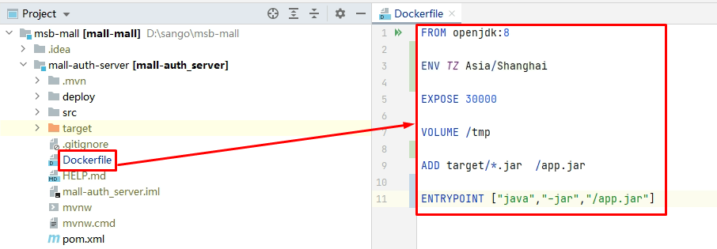

~~~powershell
FROM openjdk:8

ENV TZ Asia/Shanghai

EXPOSE 30000

VOLUME /tmp

ADD target/*.jar  /app.jar

ENTRYPOINT ["java","-jar","/app.jar"]
~~~

## 2.2 mall-cart

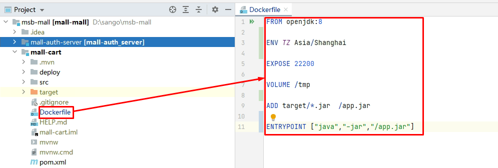

~~~powershell
FROM openjdk:8

ENV TZ Asia/Shanghai

EXPOSE 22200

VOLUME /tmp

ADD target/*.jar  /app.jar

ENTRYPOINT ["java","-jar","/app.jar"]
~~~

## 2.3 mall-coupon

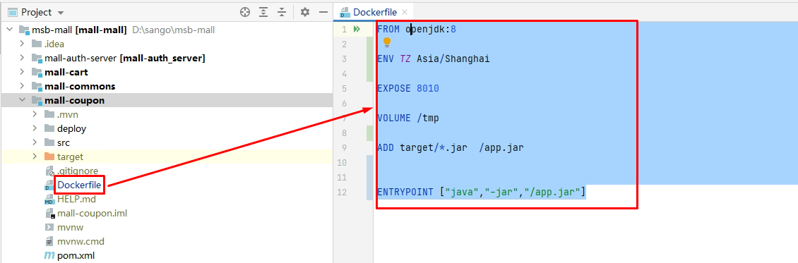

~~~powershell
FROM openjdk:8

ENV TZ Asia/Shanghai

EXPOSE 8010

VOLUME /tmp

ADD target/*.jar  /app.jar

ENTRYPOINT ["java","-jar","/app.jar"]
~~~

## 2.4 mall-gateway

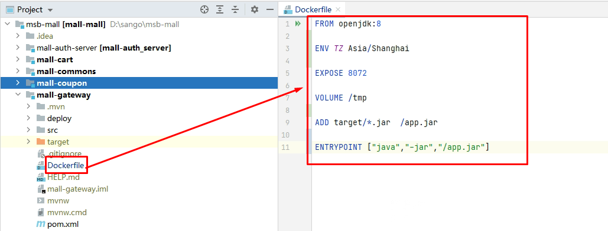

~~~powershell
FROM openjdk:8

ENV TZ Asia/Shanghai

EXPOSE 8072

VOLUME /tmp

ADD target/*.jar  /app.jar

ENTRYPOINT ["java","-jar","/app.jar"]
~~~

## 2.5 mall-member

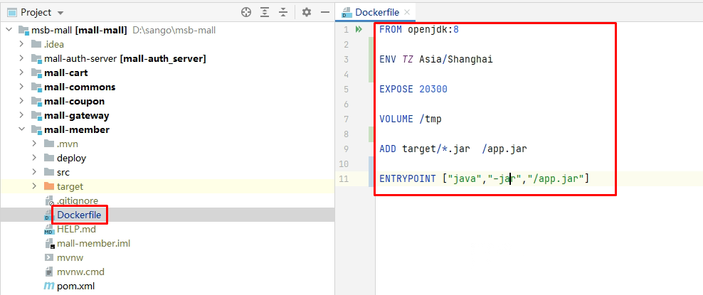

~~~powershell
FROM openjdk:8

ENV TZ Asia/Shanghai

EXPOSE 20300

VOLUME /tmp

ADD target/*.jar  /app.jar

ENTRYPOINT ["java","-jar","/app.jar"]
~~~

## 2.6 mall-order

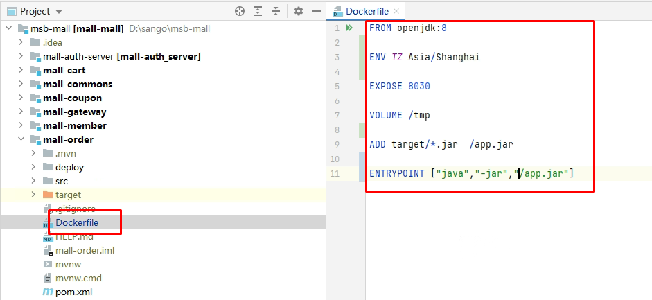

~~~powershell
FROM openjdk:8

ENV TZ Asia/Shanghai

EXPOSE 8030

VOLUME /tmp

ADD target/*.jar  /app.jar

ENTRYPOINT ["java","-jar","/app.jar"]
~~~

## 2.7 mall-product

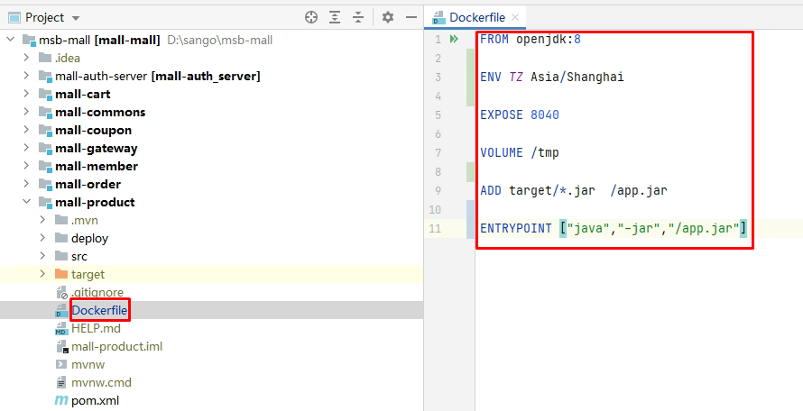

~~~powershell
FROM openjdk:8

ENV TZ Asia/Shanghai

EXPOSE 8040

VOLUME /tmp

ADD target/*.jar  /app.jar

ENTRYPOINT ["java","-jar","/app.jar"]
~~~

## 2.8 mall-search

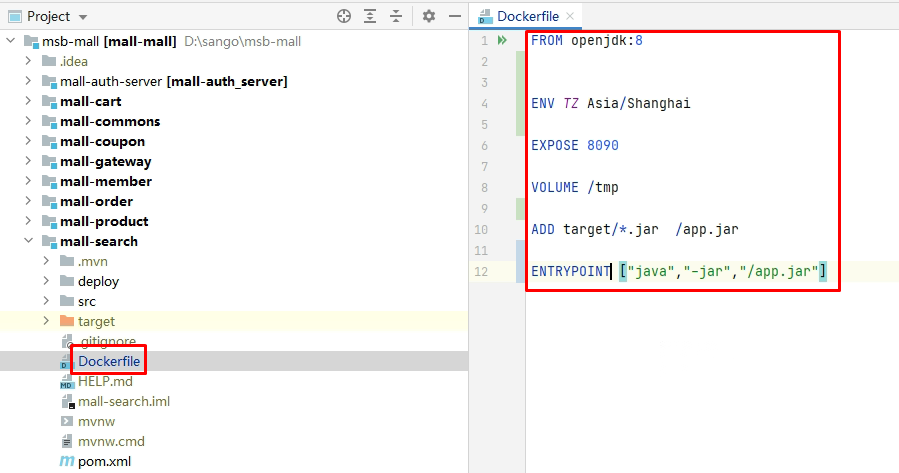

~~~powershell
FROM openjdk:8

ENV TZ Asia/Shanghai

EXPOSE 8090

VOLUME /tmp

ADD target/*.jar  /app.jar

ENTRYPOINT ["java","-jar","/app.jar"]
~~~

## 2.9 mall-seckill

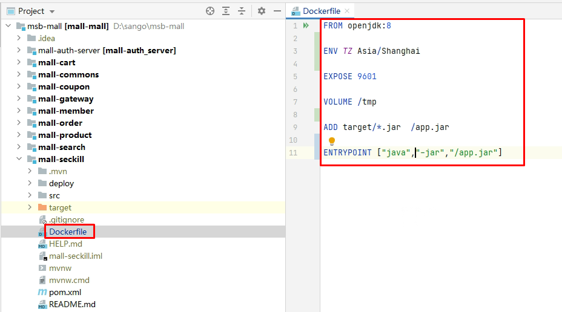

~~~powershell
FROM openjdk:8

ENV TZ Asia/Shanghai

EXPOSE 9601

VOLUME /tmp

ADD target/*.jar  /app.jar

ENTRYPOINT ["java","-jar","/app.jar"]
~~~

## 2.10 mall-third-party

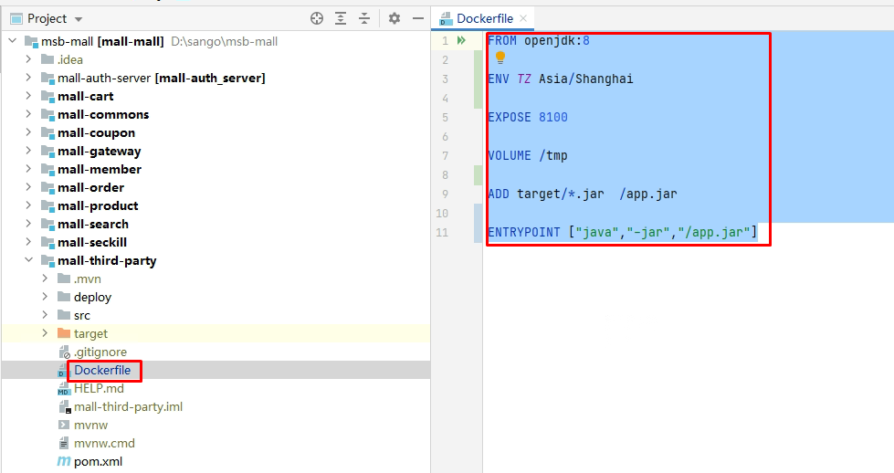

~~~powershell
FROM openjdk:8

ENV TZ Asia/Shanghai

EXPOSE 8100

VOLUME /tmp

ADD target/*.jar  /app.jar

ENTRYPOINT ["java","-jar","/app.jar"]
~~~

## 2.11 mall-ware

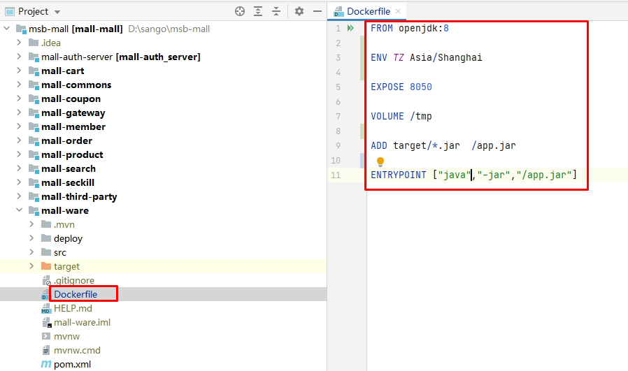

~~~powershell
FROM openjdk:8

ENV TZ Asia/Shanghai

EXPOSE 8050

VOLUME /tmp

ADD target/*.jar  /app.jar

ENTRYPOINT ["java","-jar","/app.jar"]
~~~

## 2.12 renren-fast-master

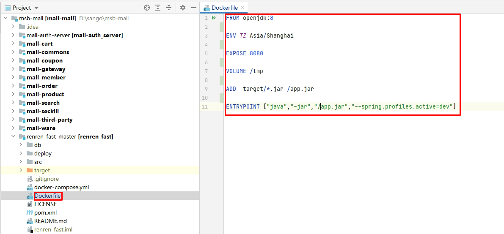

~~~powershell
FROM openjdk:8

ENV TZ Asia/Shanghai

EXPOSE 8080

VOLUME /tmp

ADD  target/*.jar /app.jar

ENTRYPOINT ["java","-jar","/app.jar","--spring.profiles.active=dev"]
~~~

## 2.13 renren-generator-master

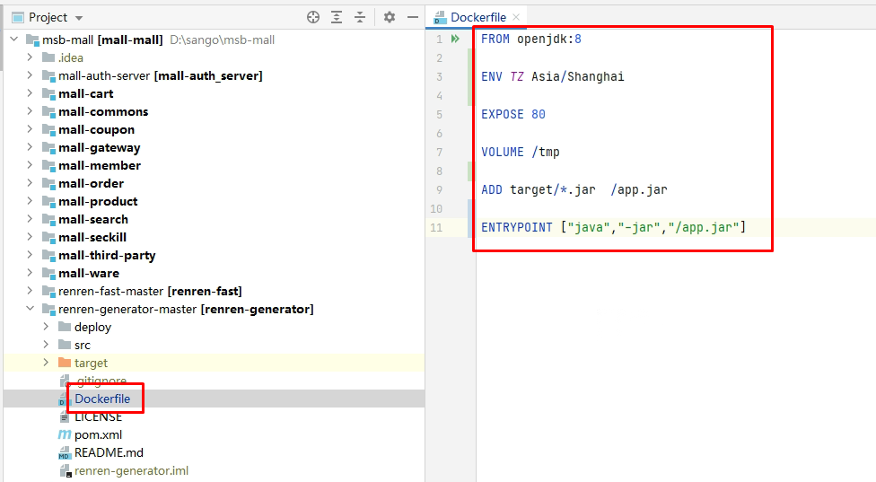

~~~powershell
FROM openjdk:8

ENV TZ Asia/Shanghai

EXPOSE 80

VOLUME /tmp

ADD target/*.jar  /app.jar

ENTRYPOINT ["java","-jar","/app.jar"]
~~~

# 三、容器镜像构建命令

~~~powershell
# docker build -f Dockerfile -t harbor.msb.com/sangomall/xxx:v1.0 .
~~~

~~~powershell
# docker build -f Dockerfile -t docker.io/nextgomsb/xxx:v1.0 .
~~~

