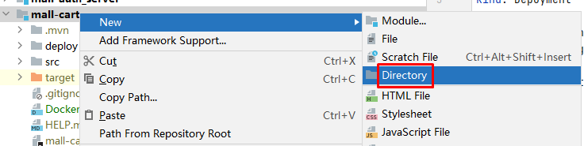
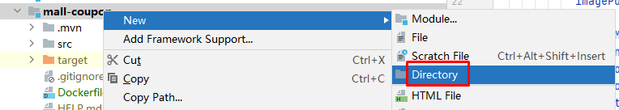

# 微服务部署描述文件Deploy.yaml

# 一、各微服务创建部署描述文件

## 1.1 mall-auth-server

~~~powershell
---
apiVersion: apps/v1
kind: Deployment
metadata:
  name: mall-auth-server
  namespace: sangomall
  labels:
    app: mall-auth-server
spec:
  replicas: 1
  selector:
    matchLabels:
      app: mall-auth-server
  template:
    metadata:
      labels:
        app: mall-auth-server
    spec:
      containers:
      - name: mall-auth-server
        image: $REGISTRY/$DOCKERHUB_NAMESPACE/$PROJECT_NAME:latest
        imagePullPolicy: Always
        ports:
        - name: tcp-30000
          containerPort: 30000
          protocol: TCP
        resources:
          limits:
            cpu: 1000m
            memory: 500Mi
          requests:
            cpu: 10m
            memory: 10Mi

---
kind: Service
apiVersion: v1
metadata:
  name: mall-auth-server
  namespace: sangomall
  labels:
    app: mall-auth-server
spec:
  ports:
  - name: http
    protocol: TCP
    port: 30000
    targetPort: 30000
  selector:
    app: mall-auth-server
~~~

## 1.2  mall-cart

~~~powershell
---
apiVersion: apps/v1
kind: Deployment
metadata:
  name: mall-cart
  namespace: sangomall
  labels:
    app: mall-cart
spec:
  replicas: 1
  selector:
    matchLabels:
      app: mall-cart
  template:
    metadata:
      labels:
        app: mall-cart
    spec:
      containers:
      - name: mall-cart
        image: $REGISTRY/$DOCKERHUB_NAMESPACE/$PROJECT_NAME:latest
        imagePullPolicy: Always
        ports:
        - name: tcp-22200
          containerPort: 22200
          protocol: TCP
        resources:
          limits:
            cpu: 1000m
            memory: 500Mi
          requests:
            cpu: 10m
            memory: 10Mi

---
kind: Service
apiVersion: v1
metadata:
  name: mall-cart
  namespace: sangomall
  labels:
    app: mall-cart
spec:
  ports:
    - name: http
      protocol: TCP
      port: 22200
      targetPort: 22200
  selector:
    app: mall-cart
~~~

## 1.3 mall-coupon

~~~powershell
---
apiVersion: apps/v1
kind: Deployment
metadata:
  name: mall-coupon
  namespace: sangomall
  labels:
    app: mall-coupon
spec:
  replicas: 1
  selector:
    matchLabels:
      app: mall-coupon
  template:
    metadata:
      labels:
        app: mall-coupon
    spec:
      containers:
      - name: mall-coupon
        image: $REGISTRY/$DOCKERHUB_NAMESPACE/$PROJECT_NAME:latest
        imagePullPolicy: Always
        ports:
        - name: tcp-8010
          containerPort: 8010
          protocol: TCP
        resources:
          limits:
            cpu: 1000m
            memory: 500Mi
          requests:
            cpu: 10m
            memory: 10Mi

---
kind: Service
apiVersion: v1
metadata:
  name: mall-coupon
  namespace: sangomall
  labels:
    app: mall-coupon
spec:
  ports:
    - name: http
      protocol: TCP
      port: 8010
      targetPort: 8010
  selector:
    app: mall-coupon
~~~

## 1.4 mall-gateway

~~~powershell
---
apiVersion: apps/v1
kind: Deployment
metadata:
  name: mall-gateway
  namespace: sangomall
  labels:
    app: mall-gateway
spec:
  replicas: 1
  selector:
    matchLabels:
      app: mall-gateway
  template:
    metadata:
      labels:
        app: mall-gateway
    spec:
      containers:
      - name: mall-gateway
        image: $REGISTRY/$DOCKERHUB_NAMESPACE/$PROJECT_NAME:latest
        imagePullPolicy: Always
        ports:
          - name: tcp-8072
            containerPort: 8072
            protocol: TCP
        resources:
          limits:
            cpu: 1000m
            memory: 1024Mi
          requests:
            cpu: 10m
            memory: 512Mi
---
kind: Service
apiVersion: v1
metadata:
  name: mall-gateway
  namespace: sangomall
  labels:
    app: mall-gateway
spec:
  ports:
  - name: http
    protocol: TCP
    port: 8072
    targetPort: 8072
  selector:
    app: mall-gateway
~~~

## 1.5 mall-member

~~~powershell
---
apiVersion: apps/v1
kind: Deployment
metadata:
  name: mall-member
  namespace: sangomall
  labels:
    app: mall-member
spec:
  replicas: 1
  selector:
    matchLabels:
      app: mall-member
  template:
    metadata:
      labels:
        app: mall-member
    spec:
      containers:
      - name: mall-member
        image: $REGISTRY/$DOCKERHUB_NAMESPACE/$PROJECT_NAME:latest
        imagePullPolicy: Always
        ports:
        - name: tcp-20300
          containerPort: 20300
          protocol: TCP
        resources:
          limits:
            cpu: 1000m
            memory: 500Mi
          requests:
            cpu: 10m
            memory: 10Mi
---
kind: Service
apiVersion: v1
metadata:
  name: mall-member
  namespace: sangomall
  labels:
    app: mall-member
spec:
  ports:
    - name: http
      protocol: TCP
      port: 20300
      targetPort: 20300
  selector:
    app: mall-member
~~~

## 1.6 mall-order

~~~powershell
---
apiVersion: apps/v1
kind: Deployment
metadata:
  name: mall-order
  namespace: sangomall
  labels:
    app: mall-order
spec:
  replicas: 1
  selector:
    matchLabels:
      app: mall-order
  template:
    metadata:
      labels:
        app: mall-order
    spec:
      containers:
      - name: mall-order
        image: $REGISTRY/$DOCKERHUB_NAMESPACE/$PROJECT_NAME:latest
        imagePullPolicy: Always
        ports:
        - name: tcp-8030
          containerPort: 8030
          protocol: TCP
        resources:
          limits:
            cpu: 1000m
            memory: 500Mi
          requests:
            cpu: 10m
            memory: 10Mi

---
kind: Service
apiVersion: v1
metadata:
  name: mall-order
  namespace: sangomall
  labels:
    app: mall-order
spec:
  ports:
    - name: http
      protocol: TCP
      port: 8030
      targetPort: 8030
  selector:
    app: mall-order
~~~

## 1.7 mall-product

~~~powershell
---
apiVersion: apps/v1
kind: Deployment
metadata:
  name: mall-product
  namespace: sangomall
  labels:
    app: mall-product
spec:
  replicas: 1
  selector:
    matchLabels:
      app: mall-product
  template:
    metadata:
      labels:
        app: mall-product
    spec:
      containers:
      - name: mall-product
        image: $REGISTRY/$DOCKERHUB_NAMESPACE/$PROJECT_NAME:latest
        imagePullPolicy: Always
        ports:
          - name: tcp-8040
            containerPort: 8040
            protocol: TCP
        resources:
          limits:
            cpu: 1000m
            memory: 500Mi
          requests:
            cpu: 10m
            memory: 10Mi

---
kind: Service
apiVersion: v1
metadata:
  name: mall-product
  namespace: sangomall
  labels:
    app: mall-product
spec:
  ports:
    - name: http
      protocol: TCP
      port: 8040
      targetPort: 8040
  selector:
    app: mall-product
~~~

## 1.8 mall-search

~~~powershell
---
apiVersion: apps/v1
kind: Deployment
metadata:
  name: mall-search
  namespace: sangomall
  labels:
    app: mall-search
spec:
  replicas: 1
  selector:
    matchLabels:
      app: mall-search
  template:
    metadata:
      labels:
        app: mall-search
    spec:
      containers:
        - name: mall-search
          image: $REGISTRY/$DOCKERHUB_NAMESPACE/$PROJECT_NAME:latest
          imagePullPolicy: Always
          ports:
          - name: tcp-8090
            containerPort: 8090
            protocol: TCP
          resources:
            limits:
              cpu: 1000m
              memory: 500Mi
            requests:
              cpu: 10m
              memory: 10Mi

---
kind: Service
apiVersion: v1
metadata:
  name: mall-search
  namespace: sangomall
  labels:
    app: mall-search
spec:
  ports:
    - name: http
      protocol: TCP
      port: 8090
      targetPort: 8090
  selector:
    app: mall-search
~~~

## 1.9 mall-seckill

~~~powershell
---
apiVersion: apps/v1
kind: Deployment
metadata:
  name: mall-seckill
  namespace: sangomall
  labels:
    app: mall-seckill
spec:
  replicas: 1
  selector:
    matchLabels:
      app: mall-seckill
  template:
    metadata:
      labels:
        app: mall-seckill
    spec:
      containers:
        - name: mall-seckill
          image: $REGISTRY/$DOCKERHUB_NAMESPACE/$PROJECT_NAME:latest
          imagePullPolicy: Always
          ports:
          - name: tcp-9601
            containerPort: 9601
            protocol: TCP
          resources:
            limits:
              cpu: 1000m
              memory: 500Mi
            requests:
              cpu: 10m
              memory: 10Mi

---
kind: Service
apiVersion: v1
metadata:
  name: mall-seckill
  namespace: sangomall
  labels:
    app: mall-seckill
spec:
  ports:
    - name: http
      protocol: TCP
      port: 9601
      targetPort: 9601
  selector:
    app: mall-seckill
~~~

## 1.10 mall-third-party

~~~powershell
---
apiVersion: apps/v1
kind: Deployment
metadata:
  name: mall-third-party
  namespace: sangomall
  labels:
    app: mall-third-party
spec:
  replicas: 1
  selector:
    matchLabels:
      app: mall-third-party
  template:
    metadata:
      labels:
        app: mall-third-party
    spec:
      containers:
        - name: mall-third-party
          image: $REGISTRY/$DOCKERHUB_NAMESPACE/$PROJECT_NAME:latest
          imagePullPolicy: Always
          ports:
          - name: tcp-8100
            containerPort: 8100
            protocol: TCP
          resources:
            limits:
              cpu: 1000m
              memory: 500Mi
            requests:
              cpu: 10m
              memory: 10Mi

---
kind: Service
apiVersion: v1
metadata:
  name: mall-third-party
  namespace: sangomall
  labels:
    app: mall-third-party
spec:
  ports:
    - name: http
      protocol: TCP
      port: 8100
      targetPort: 8100
  selector:
    app: mall-third-party
~~~

## 1.11 mall-ware

~~~powershell
---
apiVersion: apps/v1
kind: Deployment
metadata:
  name: mall-ware
  namespace: sangomall
  labels:
    app: mall-ware
spec:
  replicas: 1
  selector:
    matchLabels:
      app: mall-ware
  template:
    metadata:
      labels:
        app: mall-ware
    spec:
      containers:
        - name: mall-ware
          image: $REGISTRY/$DOCKERHUB_NAMESPACE/$PROJECT_NAME:latest
          imagePullPolicy: Always
          ports:
          - name: tcp-8050
            containerPort: 8050
            protocol: TCP
          resources:
            limits:
              cpu: 1000m
              memory: 500Mi
            requests:
              cpu: 10m
              memory: 10Mi

---
kind: Service
apiVersion: v1
metadata:
  name: mall-ware
  namespace: sangomall
  labels:
    app: mall-ware
spec:
  ports:
    - name: http
      protocol: TCP
      port: 8050
      targetPort: 8050
  selector:
    app: mall-ware
~~~

## 1.12 renren-fast-master [renren-fast]

~~~powershell
---
apiVersion: apps/v1
kind: Deployment
metadata:
  name: renren-fast
  namespace: sangomall
  labels:
    app: renren-fast
spec:
  replicas: 1
  selector:
    matchLabels:
      app: renren-fast
  template:
    metadata:
      labels:
        app: renren-fast
    spec:
      containers:
      - name: renren-fast
        image: $REGISTRY/$DOCKERHUB_NAMESPACE/$PROJECT_NAME:latest
        imagePullPolicy: Always
        ports:
        - name: tcp-8093
          containerPort: 8093
          protocol: TCP
        resources:
          limits:
            cpu: 1000m
            memory: 500Mi
          requests:
            cpu: 10m
            memory: 10Mi
---
kind: Service
apiVersion: v1
metadata:
  name: renren-fast
  namespace: sangomall
  labels:
    app: renren-fast
spec:
  ports:
    - name: http
      protocol: TCP
      port: 8093
      targetPort: 8093
  selector:
    app: renren-fast
~~~

## 1.13 renren-generator-master [renren-generator]

~~~powershell
---
apiVersion: apps/v1
kind: Deployment
metadata:
  name: renren-generator
  namespace: sangomall
  labels:
    app: renren-generator
spec:
  replicas: 1
  selector:
    matchLabels:
      app: renren-generator
  template:
    metadata:
      labels:
        app: renren-generator
    spec:
      containers:
      - name: renren-generator
        image: $REGISTRY/$DOCKERHUB_NAMESPACE/$PROJECT_NAME:latest
        imagePullPolicy: Always
        ports:
          - name: tcp-80
            containerPort: 80
            protocol: TCP
        resources:
          limits:
            cpu: 1000m
            memory: 500Mi
          requests:
            cpu: 10m
            memory: 10Mi

---
kind: Service
apiVersion: v1
metadata:
  name: renren-generator
  namespace: sangomall
  labels:
    app: renren-generator
spec:
  ports:
    - name: http
      protocol: TCP
      port: 80
      targetPort: 80
  selector:
    app: renren-generator
~~~

# 二、部署描述文件使用

> 本案例通过流水线方式执行部署描述文件，在流水线中讲解。

~~~powershell
# kubectl apply -f deploy.yml
~~~

