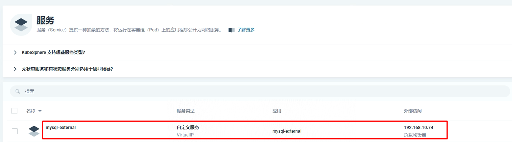

# k8s集群中部署微服务项目之数据库准备

# 一、navicat准备

# 二、 MySQL数据库连接

~~~powershell
lb.kubesphere.io/v1alpha1: openelb
protocol.openelb.kubesphere.io/v1alpha1: layer2
eip.openelb.kubesphere.io/v1alpha2: layer2-eip
~~~

# 三、 创建项目数据库及数据导入

## 3.1 mall_oms（订单数据库）

## 3.2 mall_pms（商品数据库）

**导入商品分类表**

## 3.3 mall_sms（综合管理数据库）

## 3.4 mall_ums（会员数据库）

## 3.5 mall_wms（仓储数据库）

## 3.6 renren_fast（后端管理数据库）

