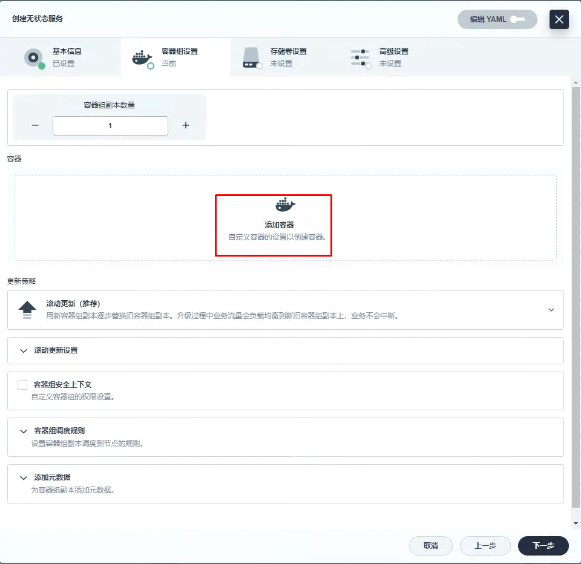
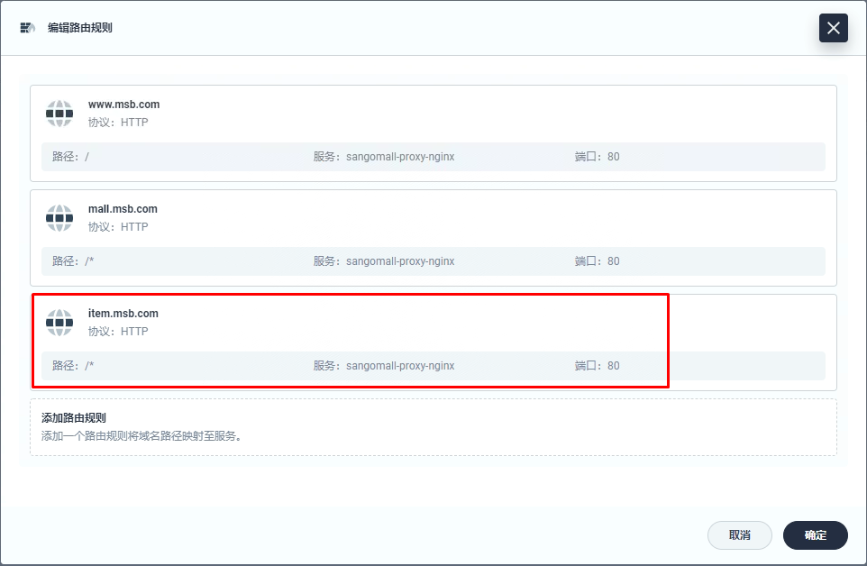
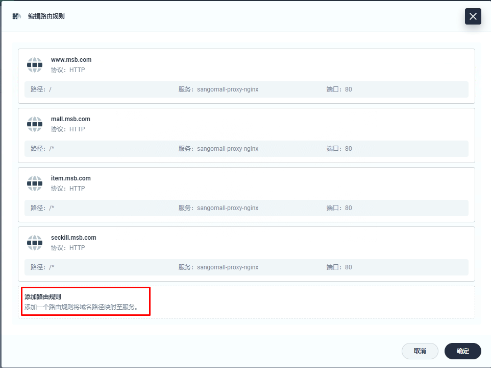
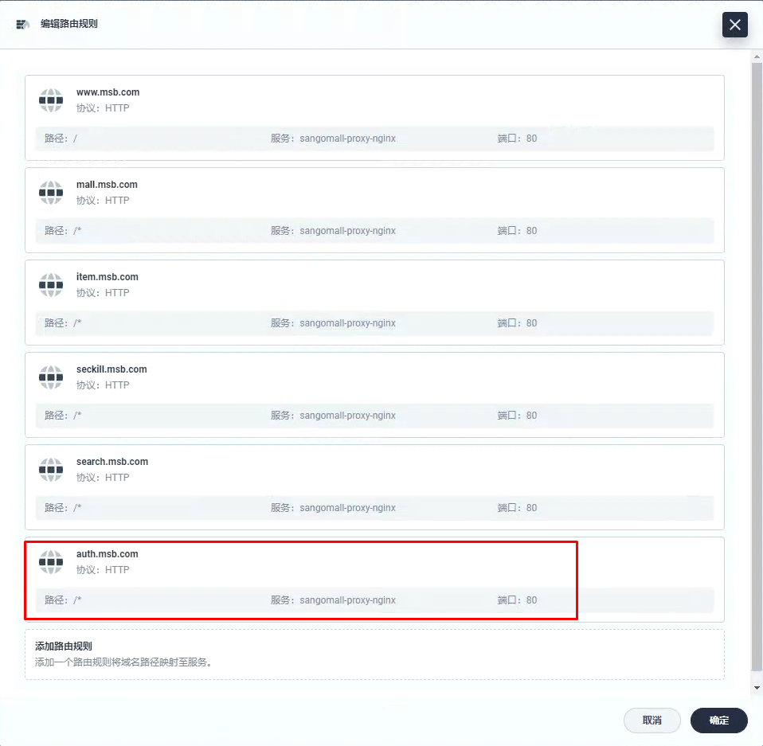
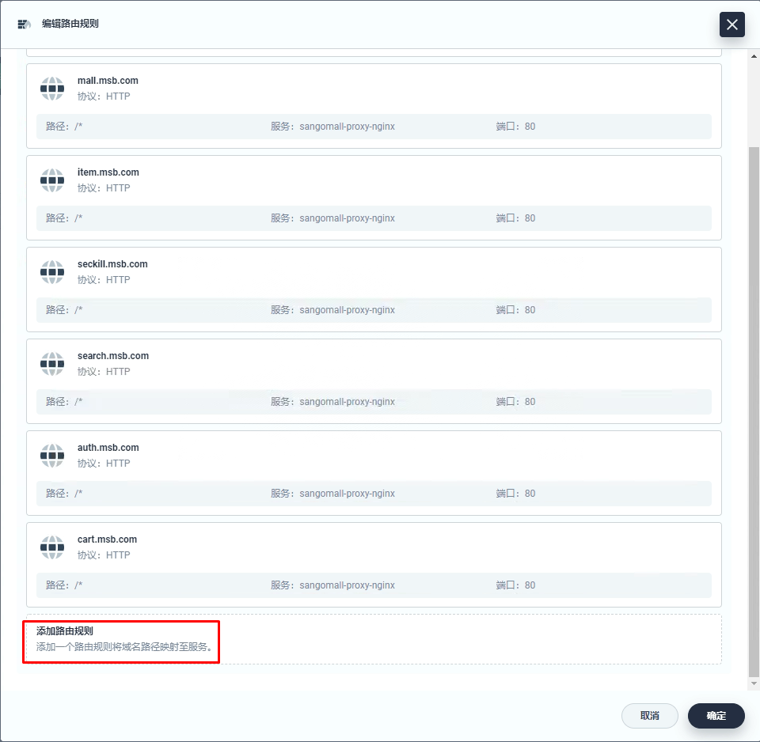

# k8s集群中部署微服务项目前端代理服务 Nginx

# 一、微服务项目静态资源准备

~~~powershell
# mkdir sangomall-proxy
# cd sangomall-proxy/
~~~

~~~powershell
[root@k8s-master01 sangomall-proxy]# ls
conf  Dockerfile  html  html.tar.gz
~~~

~~~powershell
[root@k8s-master01 sangomall-proxy]# cd conf/
[root@k8s-master01 conf]# ls
default.conf
[root@k8s-master01 conf]# vim default.conf
[root@k8s-master01 conf]# cat default.conf

upstream sangomall {
      server mall-gateway.sangomall.svc.cluster.local.:8072;
    }

server {
    listen       80;
    server_name  *.msb.com;

    #access_log  /var/log/nginx/host.access.log  main;

    location /static/ {
       root   /usr/share/nginx/html;
    }

    location / {
       proxy_set_header Host $host;
       proxy_pass http://sangomall;
    }

    #error_page  404              /404.html;

    # redirect server error pages to the static page /50x.html
    #
    error_page   500 502 503 504  /50x.html;
    location = /50x.html {
        root   /usr/share/nginx/html;
    }

    # proxy the PHP scripts to Apache listening on 127.0.0.1:80
    #
    #location ~ \.php$ {
    #    proxy_pass   http://127.0.0.1;
    #}

    # pass the PHP scripts to FastCGI server listening on 127.0.0.1:9000
    #
    #location ~ \.php$ {
    #    root           html;
    #    fastcgi_pass   127.0.0.1:9000;
    #    fastcgi_index  index.php;
    #    fastcgi_param  SCRIPT_FILENAME  /scripts$fastcgi_script_name;
    #    include        fastcgi_params;
    #}

    # deny access to .htaccess files, if Apache's document root
    # concurs with nginx's one
    #
    #location ~ /\.ht {
    #    deny  all;
    #}
}
~~~

~~~powershell
[root@k8s-master01 sangomall-proxy]# ls
conf  Dockerfile  html  html.tar.gz
[root@k8s-master01 sangomall-proxy]# cd html
[root@k8s-master01 html]# ls
es  index.html  static
[root@k8s-master01 html]# cat es/fenci.txt
sango
mall
[root@k8s-master01 html]# cat index.html
<h1>sangomall </h1>
~~~

~~~powershell
[root@k8s-master01 html]# ls static
cart  index  item  login  order  reg  search
~~~

~~~powershell
[root@k8s-master01 sangomall-proxy]# cd html/
# tar czvf html.tar.gz *
~~~

~~~powershell
[root@k8s-master01 sangomall-proxy]# mv html.tar.gz ../
~~~

~~~powershell
[root@k8s-master01 sangomall-proxy]# vim Dockerfile
[root@k8s-master01 sangomall-proxy]# cat Dockerfile
FROM nginx

MAINTAINER nextgo@126.com

RUN rm -rf /etc/nginx/conf.d/*

COPY conf/* /etc/nginx/conf.d/

ADD html.tar.gz  /usr/share/nginx/html/

EXPOSE 80

ENTRYPOINT nginx -g "daemon off;"
~~~

# 二、微服务项目前端代理服务镜像制作

~~~powershell
[root@k8s-master01 sangomall-proxy]# docker build -t docker.io/nextgomsb/nginx:v1 .
~~~

~~~powershell
[root@k8s-master01 sangomall-proxy]# docker images
REPOSITORY                                TAG       IMAGE ID       CREATED         SIZE
nextgomsb/nginx                           v1        f83f673f91df   4 seconds ago   173MB
~~~

~~~powershell
[root@k8s-master01 sangomall-proxy]# docker login
Login with your Docker ID to push and pull images from Docker Hub. If you don't have a Docker ID, head over to https://hub.docker.com to create one.
Username: nextgomsb
Password:
WARNING! Your password will be stored unencrypted in /root/.docker/config.json.
Configure a credential helper to remove this warning. See
https://docs.docker.com/engine/reference/commandline/login/#credentials-store

Login Succeeded
~~~

~~~powershell
[root@k8s-master01 sangomall-proxy]# docker push docker.io/nextgomsb/nginx:v1
~~~

# 三、微服务项目前端代理服务部署及访问

# 四、添加微服务访问路由规则

# 五、添加域名解析

~~~powershell
[root@dnsserver ~]# cat /var/named/msb.com.zone
$TTL 1D
@       IN SOA  msb.com admin.msb.com. (
                                        0       ; serial
                                        1D      ; refresh
                                        1H      ; retry
                                        1W      ; expire
                                        3H )    ; minimum
@       NS      ns.msb.com.
ns      A       192.168.10.145
harbor  A       192.168.10.146
reg-test        A       192.168.10.70
kibana          A       192.168.10.70
rabbitmq        A       192.168.10.70
nacos-server    A       192.168.10.70
zipkin-server   A       192.168.10.70
sentinel-server A       192.168.10.70
skywalking-ui   A       192.168.10.70
rocketmq-dashboard      A       192.168.10.70
mall-gateway    A       192.168.10.73

mall    A       192.168.10.70
item    A       192.168.10.70
seckill A       192.168.10.70
search  A       192.168.10.70
auth    A       192.168.10.70
cart    A       192.168.10.70
order   A       192.168.10.70
~~~

~~~powershell
[root@dnsserver ~]# systemctl restart named
~~~

# 六、微服务商城访问

