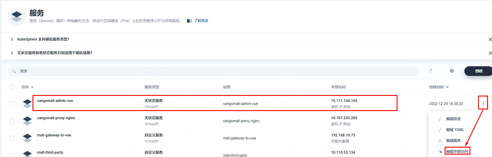
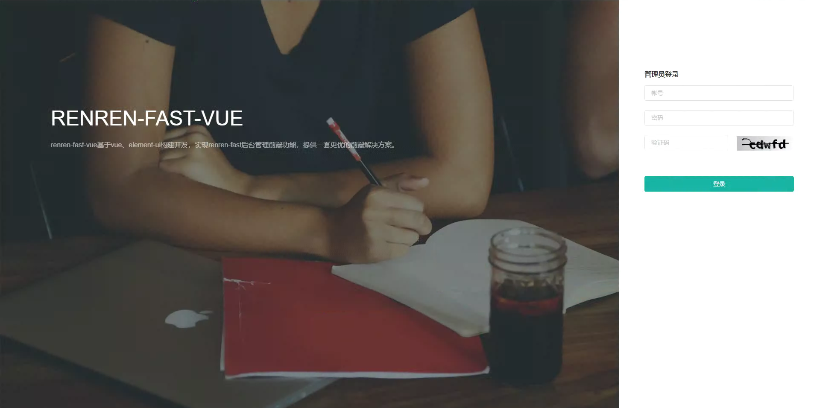

# k8s集群中部署微服务后台管理项目 admin

#  一、项目创建

**修改依据**

> npm版本为12.2.0,可以使用 nvm进行安装及切换使用。

~~~powershell
npm install node-sass@4.14
~~~

~~~powershell
npm install
~~~

# 二、项目容器镜像准备

~~~powershell
[root@k8s-master01 sangomall-admin-vue]# ls
dist  Dockerfile

[root@k8s-master01 sangomall-admin-vue]# cd dist
[root@k8s-master01 dist]# ls
202212051119  config  index.html
[root@k8s-master01 dist]# tar czvf dist.tar.gz *

~~~

~~~powershell
[root@k8s-master01 dist]# ls
202212051119  config  dist.tar.gz  index.html
[root@k8s-master01 dist]# mv dist.tar.gz ../
~~~

~~~powershell
[root@k8s-master01 sangomall-admin-vue]# ls
dist  dist.tar.gz  Dockerfile
~~~

~~~powershell
[root@k8s-master01 sangomall-admin-vue]# vim Dockerfile
[root@k8s-master01 sangomall-admin-vue]# cat Dockerfile
FROM nginx

MAINTAINER <nextgo@126.com>

ADD dist.tar.gz /usr/share/nginx/html

EXPOSE 80

ENTRYPOINT nginx -g "daemon off;"
~~~

~~~powershell
[root@k8s-master01 sangomall-admin-vue]# docker build -t docker.io/nextgomsb/sangomall-admin-vue:v1 .
Sending build context to Docker daemon  11.88MB
Step 1/5 : FROM nginx
 ---> 88736fe82739
Step 2/5 : MAINTAINER <nextgo@126.com>
 ---> Using cache
 ---> 22c7c840a649
Step 3/5 : ADD dist.tar.gz /usr/share/nginx/html
 ---> 8d9f01fb4ec4
Step 4/5 : EXPOSE 80
 ---> Running in 50b427be6df4
Removing intermediate container 50b427be6df4
 ---> 9e71fb5c6fba
Step 5/5 : ENTRYPOINT nginx -g "daemon off;"
 ---> Running in 30663598ecdb
Removing intermediate container 30663598ecdb
 ---> 284474f86092
Successfully built 284474f86092
Successfully tagged nextgomsb/sangomall-admin-vue:v1
~~~

~~~powershell
[root@k8s-master01 sangomall-admin-vue]# docker login
Login with your Docker ID to push and pull images from Docker Hub. If you don't have a Docker ID, head over to https://hub.docker.com to create one.
Username: nextgomsb
Password:
WARNING! Your password will be stored unencrypted in /root/.docker/config.json.
Configure a credential helper to remove this warning. See
https://docs.docker.com/engine/reference/commandline/login/#credentials-store

Login Succeeded
~~~

~~~powershell
[root@k8s-master01 sangomall-admin-vue]# docker push docker.io/nextgomsb/sangomall-admin-vue:v1
~~~

# 三、项目部署

# 四、项目访问

~~~powershell
lb.kubesphere.io/v1alpha1: openelb
protocol.openelb.kubesphere.io/v1alpha1: layer2
eip.openelb.kubesphere.io/v1alpha2: layer2-eip
~~~

~~~powershell
[root@dnsserver ~]# vim /var/named/msb.com.zone
[root@dnsserver ~]# cat /var/named/msb.com.zone
$TTL 1D
@       IN SOA  msb.com admin.msb.com. (
                                        0       ; serial
                                        1D      ; refresh
                                        1H      ; retry
                                        1W      ; expire
                                        3H )    ; minimum
@       NS      ns.msb.com.
ns      A       192.168.10.145
harbor  A       192.168.10.146
rabbitmq        A       192.168.10.70
nacos-server    A       192.168.10.70
zipkin-server   A       192.168.10.70
sentinel-server A       192.168.10.70
skywalking-ui   A       192.168.10.70
rocketmq-dashboard      A       192.168.10.70
mall-gateway    A       192.168.10.73

mall    A       192.168.10.70
item    A       192.168.10.70
seckill A       192.168.10.70
search  A       192.168.10.70
auth    A       192.168.10.70
cart    A       192.168.10.70
order   A       192.168.10.70

sangomall-admin-vue   A       192.168.10.74
~~~

~~~powershell
[root@dnsserver ~]# systemctl restart named
~~~

~~~powershell
访问域名：sangomall-admin-vue.msb.com
~~~

