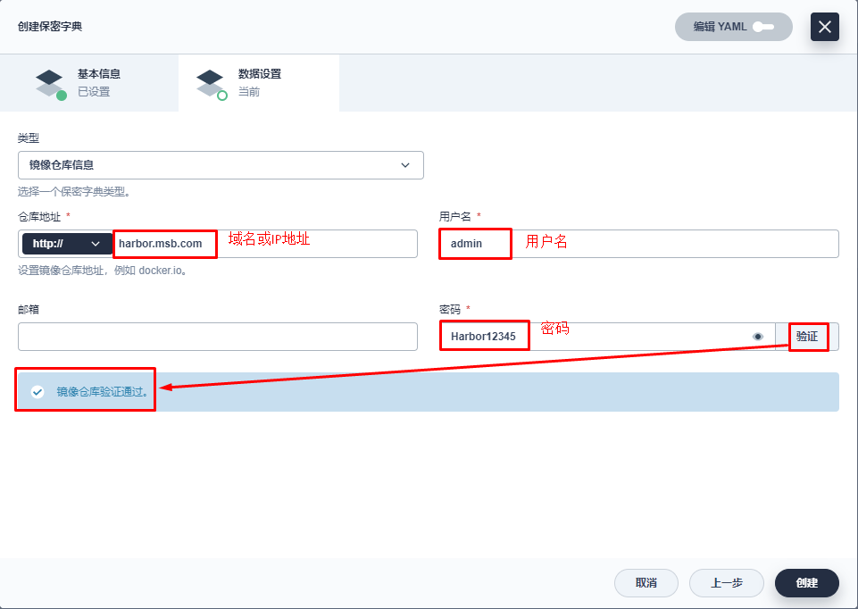
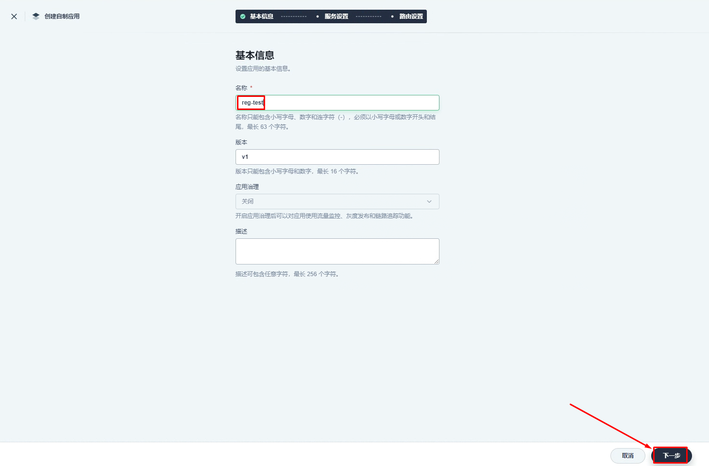
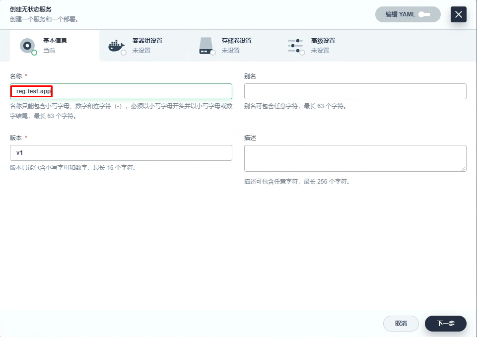

# KubeSphere集成本地容器镜像仓库 Harbor

# 一、CoreDNS级别本地DNS服务器

~~~powershell
# kubectl edit configmap coredns -n kube-system

apiVersion: v1
data:
  Corefile: |
    .:53 {
        errors
        health {
           lameduck 5s
        }
        ready
        kubernetes cluster.local in-addr.arpa ip6.arpa {
           pods insecure
           fallthrough in-addr.arpa ip6.arpa
           ttl 30
        }
        prometheus :9153
        forward . /etc/resolv.conf { 修改这里为本地DNS IP地址
           max_concurrent 1000
        }
        cache 30
        loop
        reload
        loadbalance
    }
    
    
 修改为：
 apiVersion: v1
data:
  Corefile: |
    .:53 {
        errors
        health {
           lameduck 5s
        }
        ready
        kubernetes cluster.local in-addr.arpa ip6.arpa {
           pods insecure
           fallthrough in-addr.arpa ip6.arpa
           ttl 30
        }
        prometheus :9153
        forward . 192.168.10.145 { 重点注意看IP地址，修改为本地DNS IP地址
           max_concurrent 1000
        }
        cache 30
        loop
        reload
        loadbalance
    }
~~~

~~~powershell
# dig -t a harbor.msb.com @10.96.0.10
~~~

# 二、添加本地非安全容器镜像仓库至Docker配置

~~~powershell
# cat /etc/docker/daemon.json
{
        "exec-opts": ["native.cgroupdriver=systemd"]，
        "insecure-registries": ["http://harbor.msb.com"]
}

修改为：

# cat /etc/docker/daemon.json
{
        "exec-opts": ["native.cgroupdriver=systemd"]
}
~~~

~~~powershell
# cat /usr/lib/systemd/system/docker.service
[Unit]
Description=Docker Application Container Engine
Documentation=https://docs.docker.com
After=network-online.target docker.socket firewalld.service containerd.service
Wants=network-online.target
Requires=docker.socket containerd.service

[Service]
Environment="DOCKER_OPTS=--insecure-registry=http://harbor.msb.com" 在此处添加
Type=notify
# the default is not to use systemd for cgroups because the delegate issues still
# exists and systemd currently does not support the cgroup feature set required
# for containers run by docker
ExecStart=/usr/bin/dockerd -H fd:// --containerd=/run/containerd/containerd.sock --insecure-registry=http://harbor.msb.com
ExecReload=/bin/kill -s HUP $MAINPID
TimeoutSec=0
RestartSec=2
Restart=always

~~~

~~~powershell
# systemctl daemon-reload 

# systemctl restart docker
~~~

# 三、KubeSphere仓库配置密钥

> 在使用本地容器镜像仓库Harbor之前，需要创建密钥文件

# 四、创建应用进行测试及访问

## 4.1 容器镜像准备

~~~powershell
# docker pull nginx:latest
~~~

~~~powershell
# docker tag nginx:latest harbor.msb.com/library/nginx:v1
~~~

~~~powershell
# docker push harbor.msb.com/library/nginx:v1
~~~

## 4.2 创建应用

## 4.3 应用访问

~~~powershell
[root@dnsserver ~]# vim /var/named/msb.com.zone

[root@dnsserver ~]# cat /var/named/msb.com.zone
$TTL 1D
@       IN SOA  msb.com admin.msb.com. (
                                        0       ; serial
                                        1D      ; refresh
                                        1H      ; retry
                                        1W      ; expire
                                        3H )    ; minimum
@       NS      ns.msb.com.
ns      A       192.168.10.145
harbor  A       192.168.10.146
reg-test        A       192.168.10.72  添加此处内容
~~~

~~~powershell
[root@dnsserver ~]# systemctl restart named
~~~

~~~powershell
[root@harborserver ~]# curl http://reg-test.msb.com
<!DOCTYPE html>
<html>
<head>
<title>Welcome to nginx!</title>

</head>
<body>
<h1>Welcome to nginx!</h1>

If you see this page, the nginx web server is successfully installed and
working. Further configuration is required.

For online documentation and support please refer to
<a href="http://nginx.org/">nginx.org</a>. 
Commercial support is available at
<a href="http://nginx.com/">nginx.com</a>.

<em>Thank you for using nginx.</em>

</body>
</html>
~~~

