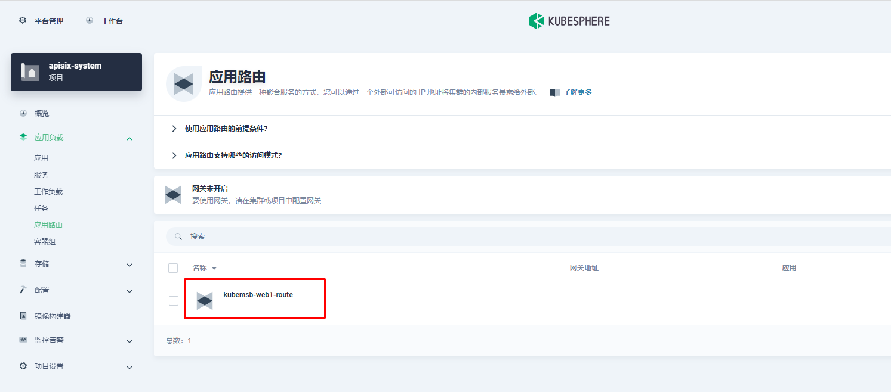
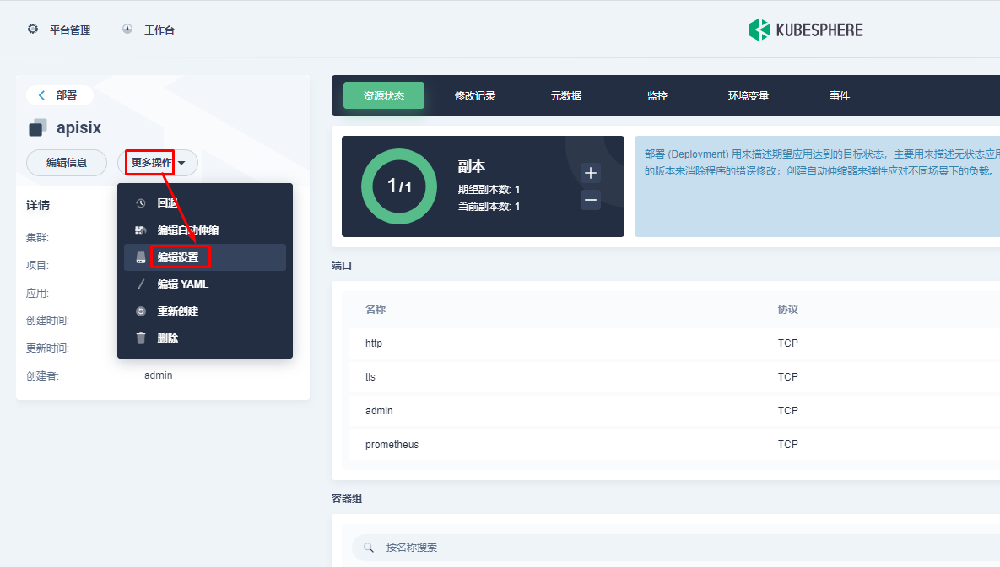

# KubeSphere中集成ApiSix

# 一、Apache APISIX 介绍

Apache APISIX 是一款开源的高性能、动态云原生网关，由深圳支流科技有限公司于 2019 年捐赠给 Apache 基金会，当前已经成为 Apache 基金会的顶级开源项目，也是 GitHub 上最活跃的网关项目。Apache APISIX 当前已经覆盖了 [API](https://so.csdn.net/so/search?q=API&spm=1001.2101.3001.7020) 网关，LB，Kubernetes Ingress，Service Mesh 等多种场景。


# 二、部署Apache APISIX Ingress Controller


## 2.1 进入企业空间添加应用仓库


首先还是先要添加 Apache APISIX Helm Chart 仓库，推荐用这种自管理的方式来保障仓库内容是得到及时同步的。我们选定一个企业空间后，通过「应用管理」下面的「应用仓库」来添加如下一个 Apache APISIX 的仓库（仓库 URL：`https://charts.apiseven.com`）。


## 2.2 创建项目部署apisix


接下来我们创建一个名为 `apisix-system` 的项目。进入项目页面后，选择在「应用负载」中创建「应用」的方式来部署 Apache APISIX，并选择 `apisix` 应用模版开始进行部署。


>为何是部署 Apache APISIX 应用的 Helm Chart，而不是直接部署 Apache APISIX Ingress Controller?
>
>这是因为 Apache APISIX Ingress Controller 目前和 Apache APISIX 网关是强关联的（如下图所示），且目前通过 Apache APISIX Helm Charts 同时部署 Apache APISIX Gateway + Dashboard + Ingress Controller 是最方便的，因此本文推荐直接使用 Apache APISIX 的 Helm Chart 进行整套组件的部署。


> 将应用命名为 `apisix` 以避免多个组件（Gateway, Dashboard, Ingress Controller）的工作负载及服务名称产生不匹配的情况


>在安装步骤中编辑的「应用设置」的部分，请参照以下配置进行填写


~~~powershell
以下方式gateway使用nodeport方式访问
#
# Licensed to the Apache Software Foundation (ASF) under one or more
# contributor license agreements.  See the NOTICE file distributed with
# this work for additional information regarding copyright ownership.
# The ASF licenses this file to You under the Apache License, Version 2.0
# (the "License"); you may not use this file except in compliance with
# the License.  You may obtain a copy of the License at
#
#     http://www.apache.org/licenses/LICENSE-2.0
#
# Unless required by applicable law or agreed to in writing, software
# distributed under the License is distributed on an "AS IS" BASIS,
# WITHOUT WARRANTIES OR CONDITIONS OF ANY KIND, either express or implied.
# See the License for the specific language governing permissions and
# limitations under the License.

global:
  # e.g.
  # imagePullSecrets:
  #   - my-registry-secrets
  #   - other-registry-secrets
  #
  imagePullSecrets: []

apisix:
  # Enable or disable Apache APISIX itself
  # Set it to false and ingress-controller.enabled=true will deploy only ingress-controller
  enabled: true

  # Enable nginx IPv6 resolver
  enableIPv6: true

  # Whether the APISIX version number should be shown in Server header
  enableServerTokens: true

  # Use Pod metadata.uid as the APISIX id.
  setIDFromPodUID: false

  customLuaSharedDicts: []
    # - name: foo
    #   size: 10k
    # - name: bar
    #   size: 1m
  luaModuleHook:
    enabled: false
    # extend lua_package_path to load third party code
    luaPath: ""
    # the hook module which will be used to inject third party code into APISIX
    # use the lua require style like: "module.say_hello"
    hookPoint: ""
    # configmap that stores the codes
    configMapRef:
      name: ""
      # mounts decides how to mount the codes to the container.
      mounts:
        - key: ""
          path: ""

  # Defines how apisix handles routing:
  # - radixtree_uri: match route by uri(base on radixtree)
  # - radixtree_host_uri: match route by host + uri(base on radixtree)
  # - radixtree_uri_with_parameter: match route by uri with parameters
  httpRouter: radixtree_uri

  enableCustomizedConfig: false
  customizedConfig: {}

  image:
    repository: apache/apisix
    pullPolicy: IfNotPresent
    # Overrides the image tag whose default is the chart appVersion.
    tag: 2.15.0-alpine

  # Use a `DaemonSet` or `Deployment`
  kind: Deployment
  # kind is DaemonSet, replicaCount not become effective
  replicaCount: 1

  priorityClassName: ""
  podAnnotations: {}
  podSecurityContext: {}
    # fsGroup: 2000
  securityContext: {}
    # capabilities:
    #   drop:
    #   - ALL
    # readOnlyRootFilesystem: true
    # runAsNonRoot: true
    # runAsUser: 1000

  # See https://kubernetes.io/docs/tasks/run-application/configure-pdb/ for more details
  podDisruptionBudget:
    enabled: false
    minAvailable: 90%
    maxUnavailable: 1

  resources: {}
    # We usually recommend not to specify default resources and to leave this as a conscious
    # choice for the user. This also increases chances charts run on environments with little
    # resources, such as Minikube. If you do want to specify resources, uncomment the following
    # lines, adjust them as necessary, and remove the curly braces after 'resources:'.
    # limits:
    #   cpu: 100m
    #   memory: 128Mi
    # requests:
    #   cpu: 100m
    #   memory: 128Mi
  hostNetwork: false

  nodeSelector: {}
  tolerations: []
  affinity: {}

  # timezone is the timezone where apisix uses.
  # For example: "UTC" or "Asia/Shanghai"
  # This value will be set on apisix container's environment variable TZ.
  # You may need to set the timezone to be consistent with your local time zone,
  # otherwise the apisix's logs may used to retrieve event maybe in wrong timezone.
  timezone: ""

  # extraEnvVars An array to add extra env vars
  # e.g:
  # extraEnvVars:
  #   - name: FOO
  #     value: "bar"
  #   - name: FOO2
  #     valueFrom:
  #       secretKeyRef:
  #         name: SECRET_NAME
  #         key: KEY
  extraEnvVars: []

nameOverride: ""
fullnameOverride: ""

serviceAccount:
  create: false
  annotations: {}
  name: ""

rbac:
  create: false

gateway:
  type: NodePort  注意此处，现在默认是NodePort类型，后期可修改。
  # If you want to keep the client source IP, you can set this to Local.
  # ref: https://kubernetes.io/docs/tasks/access-application-cluster/create-external-load-balancer/#preserving-the-client-source-ip
  externalTrafficPolicy: Cluster
  # type: LoadBalancer
  # annotations:
  #   service.beta.kubernetes.io/aws-load-balancer-type: nlb
  externalIPs: []
  http:
    enabled: true
    servicePort: 80
    containerPort: 9080
  tls:
    enabled: false
    servicePort: 443
    containerPort: 9443
    existingCASecret: ""
    certCAFilename: ""
    http2:
      enabled: true
    sslProtocols: "TLSv1.2 TLSv1.3"
  # L4 proxy (TCP/UDP)
  stream:
    enabled: false
    only: false
    tcp: []
    udp: []
  ingress:
    enabled: false
    annotations: {}
      # kubernetes.io/ingress.class: nginx
      # kubernetes.io/tls-acme: "true"
    hosts:
      - host: apisix.local
        paths: []
    tls: []
  #  - secretName: apisix-tls
  #    hosts:
  #      - chart-example.local

admin:
  # Enable Admin API
  enabled: true
  # admin service type
  type: ClusterIP
  # loadBalancerIP: a.b.c.d
  # loadBalancerSourceRanges:
  #   - "143.231.0.0/16"
  externalIPs: []
  #
  port: 9180
  servicePort: 9180
  # Admin API support CORS response headers
  cors: true
  # Admin API credentials
  credentials:
    admin: edd1c9f034335f136f87ad84b625c8f1
    viewer: 4054f7cf07e344346cd3f287985e76a2

  allow:
    # The client IP CIDR allowed to access Apache APISIX Admin API service.
    ipList:
      - 0.0.0.0/0 修改后可以在任意节点访问

nginx:
  workerRlimitNofile: "20480"
  workerConnections: "10620"
  workerProcesses: auto
  enableCPUAffinity: true
  envs: []

# APISIX plugins to be enabled
plugins:
  - api-breaker
  - authz-keycloak
  - basic-auth
  - batch-requests
  - consumer-restriction
  - cors
  - echo
  - fault-injection
  - file-logger
  - grpc-transcode
  - hmac-auth
  - http-logger
  - ip-restriction
  - ua-restriction
  - jwt-auth
  - kafka-logger
  - key-auth
  - limit-conn
  - limit-count
  - limit-req
  - node-status
  - openid-connect
  - authz-casbin
  - prometheus
  - proxy-cache
  - proxy-mirror
  - proxy-rewrite
  - redirect
  - referer-restriction
  - request-id
  - request-validation
  - response-rewrite
  - serverless-post-function
  - serverless-pre-function
  - sls-logger
  - syslog
  - tcp-logger
  - udp-logger
  - uri-blocker
  - wolf-rbac
  - zipkin
  - traffic-split
  - gzip
  - real-ip
  - ext-plugin-pre-req
  - ext-plugin-post-req
  - server-info  添加此行，以便配合dashboard展示服务信息
stream_plugins:
  - mqtt-proxy
  - ip-restriction
  - limit-conn

pluginAttrs: {}

extPlugin:
  enabled: false
  cmd: ["/path/to/apisix-plugin-runner/runner", "run"]

wasmPlugins:
  enabled: false
  plugins: []

# customPlugins allows you to mount your own HTTP plugins.
customPlugins:
  enabled: false
  # the lua_path that tells APISIX where it can find plugins,
  # note the last ';' is required.
  luaPath: "/opts/custom_plugins/?.lua"
  plugins:
    # plugin name.
    - name: "prometheus"   填写插件名称
      # plugin attrs
      attrs:   添加如下内容
        export_addr:
        ip: 0.0.0.0
        port: 9091
      # plugin codes can be saved inside configmap object.
      configMap:
        # name of configmap.
        name: "prometheus" 填写configmap名称
        # since keys in configmap is flat, mountPath allows to define the mount
        # path, so that plugin codes can be mounted hierarchically.
        mounts:
          - key: ""
            path: ""
          - key: ""
            path: ""

updateStrategy: {}
  # type: RollingUpdate

extraVolumes: []
# - name: extras
#   emptyDir: {}

extraVolumeMounts: []
# - name: extras
#   mountPath: /usr/share/extras
#   readOnly: true

extraInitContainers: []
# - name: init-myservice
#   image: busybox:1.28
#   command: ['sh', '-c', "until nslookup myservice.$(cat /var/run/secrets/kubernetes.io/serviceaccount/namespace).svc.cluster.local; do echo waiting for myservice; sleep 2; done"]

discovery:
  enabled: false
  registry: {}
    # Integration service discovery registry. E.g eureka\dns\nacos\consul_kv
    # reference:
    # https://apisix.apache.org/docs/apisix/discovery/#configuration-for-eureka
    # https://apisix.apache.org/docs/apisix/discovery/dns/#service-discovery-via-dns
    # https://apisix.apache.org/docs/apisix/discovery/consul_kv/#configuration-for-consul-kv
    # https://apisix.apache.org/docs/apisix/discovery/nacos/#configuration-for-nacos
    # https://apisix.apache.org/docs/apisix/discovery/kubernetes/#configuration
    #
    # an eureka example:
    # ```
    # eureka:
    #   host:
    #     - "http://${username}:${password}@${eureka_host1}:${eureka_port1}"
    #     - "http://${username}:${password}@${eureka_host2}:${eureka_port2}"
    #   prefix: "/eureka/"
    #   fetch_interval: 30
    #   weight: 100
    #   timeout:
    #     connect: 2000
    #     send: 2000
    #     read: 5000
    # ```
    #
    # the minimal Kubernetes example:
    # ```
    # kubernetes: {}
    # ```
    #
    # The prerequisites for the above minimal Kubernetes example:
    #  1. [Optional] Set `.serviceAccount.create` to `true` to create a dedicated ServiceAccount.
    #     It is recommended to do so, otherwise the default ServiceAccount "default" will be used.
    #  2. [Required] Set `.rbac.create` to `true` to create and bind the necessary RBAC resources.
    #     This grants the ServiceAccount in use to List-Watch Kubernetes Endpoints resources.
    #  3. [Required] Include the following environment variables in `.nginx.envs` to pass them into
    #     nginx worker processes (https://nginx.org/en/docs/ngx_core_module.html#env):
    #      - KUBERNETES_SERVICE_HOST
    #      - KUBERNETES_SERVICE_PORT
    #     This is for allowing the default `host` and `port` of `.discovery.registry.kubernetes.service`.

# access log and error log configuration
logs:
  enableAccessLog: true
  accessLog: "/dev/stdout"
  accessLogFormat: '$remote_addr - $remote_user [$time_local] $http_host \"$request\" $status $body_bytes_sent $request_time \"$http_referer\" \"$http_user_agent\" $upstream_addr $upstream_status $upstream_response_time \"$upstream_scheme://$upstream_host$upstream_uri\"'
  accessLogFormatEscape: default
  errorLog: "/dev/stderr"
  errorLogLevel: "warn"

dns:
  resolvers:
    - 127.0.0.1
    - 172.20.0.10
    - 114.114.114.114
    - 223.5.5.5
    - 1.1.1.1
    - 8.8.8.8
  validity: 30
  timeout: 5

initContainer:
  image: busybox
  tag: 1.28

autoscaling:
  enabled: false
  minReplicas: 1
  maxReplicas: 100
  targetCPUUtilizationPercentage: 80
  targetMemoryUtilizationPercentage: 80

# Custom configuration snippet.
configurationSnippet:
  main: |

  httpStart: |

  httpEnd: |

  httpSrv: |

  httpAdmin: |

  stream: |

# Observability configuration.
# ref: https://apisix.apache.org/docs/apisix/plugins/prometheus/
serviceMonitor:
  enabled: true 开启
  # namespace where the serviceMonitor is deployed, by default, it is the same as the namespace of the apisix
  namespace: "apisix-system" 填写命名空间
  # name of the serviceMonitor, by default, it is the same as the apisix fullname
  name: ""
  # interval at which metrics should be scraped
  interval: 15s
  # path of the metrics endpoint
  path: /apisix/prometheus/metrics
  # prefix of the metrics
  metricPrefix: apisix_
  # container port where the metrics are exposed
  containerPort: 9091
  # @param serviceMonitor.labels ServiceMonitor extra labels
  labels: {}
  # @param serviceMonitor.annotations ServiceMonitor annotations
  annotations: {}

# etcd configuration
# use the FQDN address or the IP of the etcd
etcd:
  # install etcd(v3) by default, set false if do not want to install etcd(v3) together
  enabled: true
  host:
    # host or ip e.g. http://172.20.128.89:2379
    - http://etcd.host:2379
  prefix: "/apisix"
  timeout: 30

  # if etcd.enabled is true, set more values of bitnami/etcd helm chart
  auth:
    rbac:
      # No authentication by default
      create: false
      user: ""
      password: ""
    tls:
      enabled: false
      existingSecret: ""
      certFilename: ""
      certKeyFilename: ""
      verify: true
      sni: ""

  service:
    port: 2379

  replicaCount: 1

dashboard:   开启并添加如下内容,实现访问
  enabled: true
  service:
    type: NodePort

ingress-controller:     开启并添加如下内容，实现监控。
  enabled: true
  config:
    apisix:
      serviceNamespace: apisix-system
  ServiceMonitor:
    enabled: true
    namespace: 'apisix-system'
    interval: 15s

vault:
  enabled: false
  host: ""
  timeout: 10
  token: ""
  prefix: ""
~~~


~~~powershell
以下内容gateway带有openELB分配IP地址功能：
#
# Licensed to the Apache Software Foundation (ASF) under one or more
# contributor license agreements.  See the NOTICE file distributed with
# this work for additional information regarding copyright ownership.
# The ASF licenses this file to You under the Apache License, Version 2.0
# (the "License"); you may not use this file except in compliance with
# the License.  You may obtain a copy of the License at
#
#     http://www.apache.org/licenses/LICENSE-2.0
#
# Unless required by applicable law or agreed to in writing, software
# distributed under the License is distributed on an "AS IS" BASIS,
# WITHOUT WARRANTIES OR CONDITIONS OF ANY KIND, either express or implied.
# See the License for the specific language governing permissions and
# limitations under the License.

global:
  # e.g.
  # imagePullSecrets:
  #   - my-registry-secrets
  #   - other-registry-secrets
  #
  imagePullSecrets: []

apisix:
  # Enable or disable Apache APISIX itself
  # Set it to false and ingress-controller.enabled=true will deploy only ingress-controller
  enabled: true

  # Enable nginx IPv6 resolver
  enableIPv6: true

  # Whether the APISIX version number should be shown in Server header
  enableServerTokens: true

  # Use Pod metadata.uid as the APISIX id.
  setIDFromPodUID: false

  customLuaSharedDicts: []
    # - name: foo
    #   size: 10k
    # - name: bar
    #   size: 1m
  luaModuleHook:
    enabled: false
    # extend lua_package_path to load third party code
    luaPath: ""
    # the hook module which will be used to inject third party code into APISIX
    # use the lua require style like: "module.say_hello"
    hookPoint: ""
    # configmap that stores the codes
    configMapRef:
      name: ""
      # mounts decides how to mount the codes to the container.
      mounts:
        - key: ""
          path: ""

  # Defines how apisix handles routing:
  # - radixtree_uri: match route by uri(base on radixtree)
  # - radixtree_host_uri: match route by host + uri(base on radixtree)
  # - radixtree_uri_with_parameter: match route by uri with parameters
  httpRouter: radixtree_uri

  enableCustomizedConfig: false
  customizedConfig: {}

  image:
    repository: apache/apisix
    pullPolicy: IfNotPresent
    # Overrides the image tag whose default is the chart appVersion.
    tag: 2.15.0-alpine

  # Use a `DaemonSet` or `Deployment`
  kind: Deployment
  # kind is DaemonSet, replicaCount not become effective
  replicaCount: 1

  priorityClassName: ""
  podAnnotations: {}
  podSecurityContext: {}
    # fsGroup: 2000
  securityContext: {}
    # capabilities:
    #   drop:
    #   - ALL
    # readOnlyRootFilesystem: true
    # runAsNonRoot: true
    # runAsUser: 1000

  # See https://kubernetes.io/docs/tasks/run-application/configure-pdb/ for more details
  podDisruptionBudget:
    enabled: false
    minAvailable: 90%
    maxUnavailable: 1

  resources: {}
    # We usually recommend not to specify default resources and to leave this as a conscious
    # choice for the user. This also increases chances charts run on environments with little
    # resources, such as Minikube. If you do want to specify resources, uncomment the following
    # lines, adjust them as necessary, and remove the curly braces after 'resources:'.
    # limits:
    #   cpu: 100m
    #   memory: 128Mi
    # requests:
    #   cpu: 100m
    #   memory: 128Mi
  hostNetwork: false

  nodeSelector: {}
  tolerations: []
  affinity: {}

  # timezone is the timezone where apisix uses.
  # For example: "UTC" or "Asia/Shanghai"
  # This value will be set on apisix container's environment variable TZ.
  # You may need to set the timezone to be consistent with your local time zone,
  # otherwise the apisix's logs may used to retrieve event maybe in wrong timezone.
  timezone: "Asia/Shanghai"

  # extraEnvVars An array to add extra env vars
  # e.g:
  # extraEnvVars:
  #   - name: FOO
  #     value: "bar"
  #   - name: FOO2
  #     valueFrom:
  #       secretKeyRef:
  #         name: SECRET_NAME
  #         key: KEY
  extraEnvVars: []

nameOverride: ""
fullnameOverride: ""

serviceAccount:
  create: false
  annotations: {}
  name: ""

rbac:
  create: false

gateway:
  # type: NodePort
  # If you want to keep the client source IP, you can set this to Local.
  # ref: https://kubernetes.io/docs/tasks/access-application-cluster/create-external-load-balancer/#preserving-the-client-source-ip
  externalTrafficPolicy: Cluster
  type: LoadBalancer
  annotations:
    lb.kubesphere.io/v1alpha1: openelb
    protocol.openelb.kubesphere.io/v1alpha1: layer2
    eip.openelb.kubesphere.io/v1alpha2: layer2-eip
  externalIPs: []
  http:
    enabled: true
    servicePort: 80
    containerPort: 9080
  tls:
    enabled: false
    servicePort: 443
    containerPort: 9443
    existingCASecret: ""
    certCAFilename: ""
    http2:
      enabled: true
    sslProtocols: "TLSv1.2 TLSv1.3"
  # L4 proxy (TCP/UDP)
  stream:
    enabled: false
    only: false
    tcp: []
    udp: []
  ingress:
    enabled: false
    annotations: {}
      # kubernetes.io/ingress.class: nginx
      # kubernetes.io/tls-acme: "true"
    hosts:
      - host: apisix.local
        paths: []
    tls: []
  #  - secretName: apisix-tls
  #    hosts:
  #      - chart-example.local

admin:
  # Enable Admin API
  enabled: true
  # admin service type
  type: ClusterIP
  # loadBalancerIP: a.b.c.d
  # loadBalancerSourceRanges:
  #   - "143.231.0.0/16"
  externalIPs: []
  #
  port: 9180
  servicePort: 9180
  # Admin API support CORS response headers
  cors: true
  # Admin API credentials
  credentials:
    admin: edd1c9f034335f136f87ad84b625c8f1
    viewer: 4054f7cf07e344346cd3f287985e76a2

  allow:
    # The client IP CIDR allowed to access Apache APISIX Admin API service.
    ipList:
      - 0.0.0.0/0

nginx:
  workerRlimitNofile: "20480"
  workerConnections: "10620"
  workerProcesses: auto
  enableCPUAffinity: true
  envs: []

# APISIX plugins to be enabled
plugins:
  - api-breaker
  - authz-keycloak
  - basic-auth
  - batch-requests
  - consumer-restriction
  - cors
  - echo
  - fault-injection
  - file-logger
  - grpc-transcode
  - hmac-auth
  - http-logger
  - ip-restriction
  - ua-restriction
  - jwt-auth
  - kafka-logger
  - key-auth
  - limit-conn
  - limit-count
  - limit-req
  - node-status
  - openid-connect
  - authz-casbin
  - prometheus
  - proxy-cache
  - proxy-mirror
  - proxy-rewrite
  - redirect
  - referer-restriction
  - request-id
  - request-validation
  - response-rewrite
  - serverless-post-function
  - serverless-pre-function
  - sls-logger
  - syslog
  - tcp-logger
  - udp-logger
  - uri-blocker
  - wolf-rbac
  - zipkin
  - traffic-split
  - gzip
  - real-ip
  - ext-plugin-pre-req
  - ext-plugin-post-req
  - server-info
stream_plugins:
  - mqtt-proxy
  - ip-restriction
  - limit-conn

pluginAttrs: {}

extPlugin:
  enabled: false
  cmd: ["/path/to/apisix-plugin-runner/runner", "run"]

wasmPlugins:
  enabled: false
  plugins: []

# customPlugins allows you to mount your own HTTP plugins.
customPlugins:
  enabled: false
  # the lua_path that tells APISIX where it can find plugins,
  # note the last ';' is required.
  luaPath: "/opts/custom_plugins/?.lua"
  plugins:
    # plugin name.
    - name: "prometheus"
      # plugin attrs
      attrs:
        export_addr:
        ip: 0.0.0.0
        port: 9091
      # plugin codes can be saved inside configmap object.
      configMap:
        # name of configmap.
        name: "prometheus"
        # since keys in configmap is flat, mountPath allows to define the mount
        # path, so that plugin codes can be mounted hierarchically.
        mounts:
          - key: ""
            path: ""
          - key: ""
            path: ""

updateStrategy: {}
  # type: RollingUpdate

extraVolumes: []
# - name: extras
#   emptyDir: {}

extraVolumeMounts: []
# - name: extras
#   mountPath: /usr/share/extras
#   readOnly: true

extraInitContainers: []
# - name: init-myservice
#   image: busybox:1.28
#   command: ['sh', '-c', "until nslookup myservice.$(cat /var/run/secrets/kubernetes.io/serviceaccount/namespace).svc.cluster.local; do echo waiting for myservice; sleep 2; done"]

discovery:
  enabled: false
  registry: {}
    # Integration service discovery registry. E.g eureka\dns\nacos\consul_kv
    # reference:
    # https://apisix.apache.org/docs/apisix/discovery/#configuration-for-eureka
    # https://apisix.apache.org/docs/apisix/discovery/dns/#service-discovery-via-dns
    # https://apisix.apache.org/docs/apisix/discovery/consul_kv/#configuration-for-consul-kv
    # https://apisix.apache.org/docs/apisix/discovery/nacos/#configuration-for-nacos
    # https://apisix.apache.org/docs/apisix/discovery/kubernetes/#configuration
    #
    # an eureka example:
    # ```
    # eureka:
    #   host:
    #     - "http://${username}:${password}@${eureka_host1}:${eureka_port1}"
    #     - "http://${username}:${password}@${eureka_host2}:${eureka_port2}"
    #   prefix: "/eureka/"
    #   fetch_interval: 30
    #   weight: 100
    #   timeout:
    #     connect: 2000
    #     send: 2000
    #     read: 5000
    # ```
    #
    # the minimal Kubernetes example:
    # ```
    # kubernetes: {}
    # ```
    #
    # The prerequisites for the above minimal Kubernetes example:
    #  1. [Optional] Set `.serviceAccount.create` to `true` to create a dedicated ServiceAccount.
    #     It is recommended to do so, otherwise the default ServiceAccount "default" will be used.
    #  2. [Required] Set `.rbac.create` to `true` to create and bind the necessary RBAC resources.
    #     This grants the ServiceAccount in use to List-Watch Kubernetes Endpoints resources.
    #  3. [Required] Include the following environment variables in `.nginx.envs` to pass them into
    #     nginx worker processes (https://nginx.org/en/docs/ngx_core_module.html#env):
    #      - KUBERNETES_SERVICE_HOST
    #      - KUBERNETES_SERVICE_PORT
    #     This is for allowing the default `host` and `port` of `.discovery.registry.kubernetes.service`.

# access log and error log configuration
logs:
  enableAccessLog: true
  accessLog: "/dev/stdout"
  accessLogFormat: '$remote_addr - $remote_user [$time_local] $http_host \"$request\" $status $body_bytes_sent $request_time \"$http_referer\" \"$http_user_agent\" $upstream_addr $upstream_status $upstream_response_time \"$upstream_scheme://$upstream_host$upstream_uri\"'
  accessLogFormatEscape: default
  errorLog: "/dev/stderr"
  errorLogLevel: "warn"

dns:
  resolvers:
    - 127.0.0.1
    - 172.20.0.10
    - 114.114.114.114
    - 223.5.5.5
    - 1.1.1.1
    - 8.8.8.8
  validity: 30
  timeout: 5

initContainer:
  image: busybox
  tag: 1.28

autoscaling:
  enabled: false
  minReplicas: 1
  maxReplicas: 100
  targetCPUUtilizationPercentage: 80
  targetMemoryUtilizationPercentage: 80

# Custom configuration snippet.
configurationSnippet:
  main: |

  httpStart: |

  httpEnd: |

  httpSrv: |

  httpAdmin: |

  stream: |

# Observability configuration.
# ref: https://apisix.apache.org/docs/apisix/plugins/prometheus/
serviceMonitor:
  enabled: true
  # namespace where the serviceMonitor is deployed, by default, it is the same as the namespace of the apisix
  namespace: "apisix-system"
  # name of the serviceMonitor, by default, it is the same as the apisix fullname
  name: ""
  # interval at which metrics should be scraped
  interval: 15s
  # path of the metrics endpoint
  path: /apisix/prometheus/metrics
  # prefix of the metrics
  metricPrefix: apisix_
  # container port where the metrics are exposed
  containerPort: 9091
  # @param serviceMonitor.labels ServiceMonitor extra labels
  labels: {}
  # @param serviceMonitor.annotations ServiceMonitor annotations
  annotations: {}

# etcd configuration
# use the FQDN address or the IP of the etcd
etcd:
  # install etcd(v3) by default, set false if do not want to install etcd(v3) together
  enabled: true
  host:
    # host or ip e.g. http://172.20.128.89:2379
    - http://etcd.host:2379
  prefix: "/apisix"
  timeout: 30

  # if etcd.enabled is true, set more values of bitnami/etcd helm chart
  auth:
    rbac:
      # No authentication by default
      create: false
      user: ""
      password: ""
    tls:
      enabled: false
      existingSecret: ""
      certFilename: ""
      certKeyFilename: ""
      verify: true
      sni: ""

  service:
    port: 2379

  replicaCount: 1

dashboard:
  enabled: true
  service:
    type: NodePort

ingress-controller: 
  enabled: true
  config:
    apisix:
      serviceNamespace: apisix-system
  ServiceMonitor:
    enabled: true
    namespace: 'apisix-system'
    interval: 15s

vault:
  enabled: false
  host: ""
  timeout: 10
  token: ""
  prefix: ""
~~~


>部署成功后，点击应用名称进入详情页面，可以在「资源状态」标签页下看到如下的服务部署和工作状态运行状态展示。


## 2.3 使用 Apache APISIX Dashboard 了解系统信息


Apache APISIX 应用部署完成后，首先我们通过 Apache APISIX Dashboard 来检验一下 Apache APISIX 网关的当前状态。从「应用负载」的「服务」页面，我们可以找到 `apisix-dashboard` 的服务，由于我们在应用配置中已经为 Dashboard 开启了 NodePort，所以这里我们可以直接通过 NodePort 端口来访问 Dashboard。


>使用默认的用户名及密码 `admin` 登录 Apache APISIX Dashboard，可以进入「系统信息」页面即可查看到我们当前连接管理的「Apache APISIX 节点」的信息。


# 三、使用 Apache APISIX Ingress Controller


## 3.1 创建应用及服务


## 3.2 创建应用路由


> 上图域名应该为 web1.msb.com


其添加 `kubernetes.io/ingress.class`: `apisix` 的键值。





创建完成后如何验证应用路由生效呢？首先，我们可以回到 Apache APISIX Dashboard，进入「路由」页面，可以看到新建的应用路由已经被 Apache APISIX Ingress Controller 识别之后自动添加到了 Apache APISIX 网关中，在「上游」页面也可以看到自动创建的一个上游条目。


然后我们回到 `apisix-system` 项目的「服务」页面，找到 `apisix-gateway` 服务对应的端口，由此访问 `<应用路由指定的域名>:<apisix-gateway 外部访问端口>`（例如此处为 `web1.msb.com:31532`）即可访问到 `kubemsb-web1-route` 应用路由所关联的后台服务。


~~~powershell
添加域名解析

[root@dnsserver ~]# cat  /var/named/msb.com.zone
$TTL 1D
@       IN SOA  msb.com admin.msb.com. (
                                        0       ; serial
                                        1D      ; refresh
                                        1H      ; retry
                                        1W      ; expire
                                        3H )    ; minimum
@       NS      ns.msb.com.
ns      A       192.168.10.145
harbor  A       192.168.10.146

web1    A       192.168.10.141  解析到集群节点IP地址

~~~


~~~powershell
[root@dnsserver ~]# systemctl restart named
~~~


~~~powershell
[root@k8s-master01 ~]# curl http://web1.msb.com:31532
<!DOCTYPE html>
<html>
<head>
<title>Welcome to nginx!</title>
<style>
html { color-scheme: light dark; }
body { width: 35em; margin: 0 auto;
font-family: Tahoma, Verdana, Arial, sans-serif; }
</style>
</head>
<body>
<h1>Welcome to nginx!</h1>
<p>If you see this page, the nginx web server is successfully installed and
working. Further configuration is required.</p>

<p>For online documentation and support please refer to
<a href="http://nginx.org/">nginx.org</a>.<br/>
Commercial support is available at
<a href="http://nginx.com/">nginx.com</a>.</p>

<p><em>Thank you for using nginx.</em></p>
</body>
</html>
~~~


# 四、使用OpenELB结合Apache APISIX实现访问


~~~powershell
    lb.kubesphere.io/v1alpha1: openelb
    protocol.openelb.kubesphere.io/v1alpha1: layer2
    eip.openelb.kubesphere.io/v1alpha2: layer2-eip
~~~


~~~powershell
[root@dnsserver ~]# cat /var/named/msb.com.zone
$TTL 1D
@       IN SOA  msb.com admin.msb.com. (
                                        0       ; serial
                                        1D      ; refresh
                                        1H      ; retry
                                        1W      ; expire
                                        3H )    ; minimum
@       NS      ns.msb.com.
ns      A       192.168.10.145
harbor  A       192.168.10.146
web1    A       192.168.10.72
~~~


~~~powershell
[root@dnsserver ~]# systemctl restart named
~~~


~~~powershell
[root@k8s-master01 ~]# curl http://web1.msb.com
<!DOCTYPE html>
<html>
<head>
<title>Welcome to nginx!</title>
<style>
html { color-scheme: light dark; }
body { width: 35em; margin: 0 auto;
font-family: Tahoma, Verdana, Arial, sans-serif; }
</style>
</head>
<body>
<h1>Welcome to nginx!</h1>
<p>If you see this page, the nginx web server is successfully installed and
working. Further configuration is required.</p>

<p>For online documentation and support please refer to
<a href="http://nginx.org/">nginx.org</a>.<br/>
Commercial support is available at
<a href="http://nginx.com/">nginx.com</a>.</p>

<p><em>Thank you for using nginx.</em></p>
</body>
</html>
~~~


# 五、自定义监控 Apache APISIX 网关


Apache APISIX 网关可用之后其实是缺少像原生集群或项目网关这样自带的状态监控能力的，但这个我们也可以通过 Apache APISIX 的 Prometheus 插件以及 KubeSphere 自带的自定义监控能力来弥补。


## 5.1 暴露 Apache APISIX 网关的 Prometheus 监控指标


由于我们在部署 Apache APISIX 应用时已经开启了 Prometheus 插件，所以这里我们只需要把 Prometheus 监控指标的接口暴露出来即可。进入 `apisix-system` 项目，在「工作负载」页面找到 `apisix` 并进入部署详情页面，随后在左侧操作面板的「更多操作」中选择「编辑设置」。





在弹出的「编辑设置」面板中，进入到 `apisix` 容器的编辑界面，找到「端口设置」，添加一个新的名为 `prom` 的端口映射到容器的 `9091` 端口，保存后 `apisix` 工作负载会重启。


## 5.2 为 Apache APISIX 网关监控指标创建 ServiceMonitor

下面我们需要将已暴露的指标接口接入到 KubeSphere 自带的 Prometheus 中使之可被访问（被抓取指标数据），由于 KubeSphere 是通过 Prometheus Operator 来维护内部的 Prometheus 系统的，所以最方便的方式自然是直接创建一个 ServiceMonitor 资源来实现指标接口的接入。

~~~powershell
[root@k8s-master01 ~]# cat sm.yaml

apiVersion: monitoring.coreos.com/v1
kind: ServiceMonitor
metadata:
  name: apisix
  namespace: apisix-system
spec:
  endpoints:
    - scheme: http
      targetPort: prometheus
      path: /apisix/prometheus/metrics
      interval: 15s
  namespaceSelector:
    matchNames:
      - apisix-system
  selector:
    matchLabels:
      app.kubernetes.io/name: apisix
      app.kubernetes.io/version: 2.15.0
      helm.sh/chart: apisix-0.11.2
~~~


使用 `kubectl apply -f your_service_monitor.yaml` 创建这个 ServiceMonitor 资源。创建成功后，如果有集群管理权限，也可以在集群的 CRD 管理页面中搜索查看 ServiceMonitor 资源并找到名为 `apisix` 的自定义资源，也可以在这里做后续的 YAML 修改。

~~~powershell
[root@k8s-master01 ~]# kubectl apply -f sm.yaml
~~~


## 5.3 将 Apache APISIX 网关指标接入自定义监控面板


下面我们在项目左侧菜单列表中找到「监控告警」中的「自定义监控」，开始「创建」自定义监控面板。


在弹出窗口中填入「名称」，选择「自定义」监控模版，并进入「下一步」的监控面板创建。


进入编辑页面后现在左侧点击 `+` 区域，在右侧的「数据」区域进行 Prometheus 监控指标的配置，例如这里我们可以用 `sum(apisix_nginx_http_current_connections)` 来统计 Apache APISIX 网关实时的连接总数。


保存后在页面右下角找到「+ 添加监控项」，我们选择「折线图」来创建一个 `Nginx connection state` 指标：使用 `sum(apisix_nginx_http_current_connections) by (state)` 作为指标、`{{state}}` 用作图例名称、选择「图例类型」为堆叠图，即可得到类似如下的图表显示效果。保存模版后即可得到您的第一个自定义监控面板！


> Apache APISIX 网关目前提供的 Prometheus 指标可以参见官方文档的 可有的指标部分。


由于指标配置起来还是比较麻烦的，推荐在集群层面的「自定义监控」中直接导入 Apache APISIX Grafana 模版（下载 JSON 通过「本地上传」进行导入）。

>Apache APISIX Grafana 模版: *https://grafana.com/grafana/dashboards/11719*


参考：https://blog.csdn.net/alex_yangchuansheng/article/details/121600884


