# 微服务部署前中间件部署

# 一、MySQL部署

## 1.1 使用Docker实现MySQL主从复制

~~~powershell
docker run -p 3307:3306 --name mysql-master \
-v /mydata/mysql/master/log:/var/log/mysql \
-v /mydata/mysql/master/data:/var/lib/mysql \
-v /mydata/mysql/master/conf:/etc/mysql \
-e MySQL_ROOT_PASSWORD=root \
-d mysql:5.7 
~~~

~~~powershell
vim /mydata/mysql/master/conf/my.cnf

[client]
default-character-set=utf8

[mysql]
default-character-set=utf8

[mysqld]
init_connect='SET collation_connection = utf8_unicode_ci'
init_connect='SET NAMES utf8'
character-set-server=utf8
collation-server=utf8_unicode_ci
skip-character-set-client-handshake
skip-name-resolve
~~~

> skip-name-resolve一定要加，不然连接mysql 会慢

~~~powershell
server_id=1
log_bin=mysql-bin
read-only=0
binlog-do-db=mall_oms
binlog-do-db=mall_pms
binlog-do-db=mall_sms
binlog-do-db=mall_ums
binlog-do-db=mall_wms

replicate-ignore-db=mysql
replicate-ignore-db=sys
replicate-ignore-db=information_schema
replicate-ignore-db=performance_schema
~~~

~~~powershell
docker run -p 3317:3306 --name mysql-slaver-01 \
-v /mydata/mysql/slaver/log:/var/log/mysql \
-v /mydata/mysql/slaver/data:/var/lib/mysql \
-v /mydata/mysql/slaver/conf:/etc/mysql \
-e MYSQL_ROOT_PASSWORD=root \
-d mysql:5.7
~~~

~~~powershell
vim /mydata/mysql/slaver/conf/my.cnf

[client]
default-character-set=utf8

[mysql]
default-character-set=utf8

[mysqld]
init_connect='SET collation_connection = utf8_unicode_ci'
init_connect='SET NAMES utf8'
character-set-server=utf8
collation-server=utf8_unicode_ci
skip-character-set-client-handshake
skip-name-resolve
~~~

~~~powershell
server_id=2
log_bin=mysql-bin
read-only=1
binlog-do-db=mall_oms
binlog-do-db=mall_pms
binlog-do-db=mall_sms
binlog-do-db=mall_ums
binlog-do-db=mall_wms

replicate-ignore-db=mysql
replicate-ignore-db=sys
replicate-ignore-db=information_schema
replicate-ignore-db=performance_schema
~~~

~~~powershell
docker restart mysql-master mysql-slaver-01
~~~

为master授权用户实现数据同步

~~~powershell
进入master容器
docker exec -it mysql /bin/bash

访问mysql数据库
mysql -uroot -proot

授权root可以远程访问，为了方便连接使用
grant all privileges on *.* to 'root'@'%' identified by 'root' with grant option;
flush privileges;

添加用于同步用户
grant replication slave on *.* to 'backup'@'%' identified by '123456';

查看master状态
show master status\G;
~~~

配置slaver同步master数据

~~~powershell
进入slaver容器
docker exec -it mysql-slaver-01 /bin/bash

访问mysql数据库
mysql -uroot -proot

授权root可以远程访问，为了方便连接使用
grant all privileges on *.* to 'root'@'%' identified by 'root' with grant option;
flush privileges;

设置主库连接
changer master to
master_host='192.168.56.10'
master_user='backup'
master_password='123456'
master_log_file='mysql-bin.000001'
master_log_pos=0
master_port=3307

启动从库同步
start slave;

查看从库的状态
show slave status\G;
~~~

可以使用kubesphere快速完成MySQL部署

- 有状态服务抽取配置为ConfigMap
- 有状态服务必须使用PVC持久化存储数据
- 服务集群内访问使用DNS提供稳定的域名

## 1.2 通过KubeSphere实现MySQL主从复制部署

### 1.2.1 持久存储准备

#### 1.2.1.1  master节点存储

#### 1.2.1.2 slave节点存储

### 1.2.2 配置文件准备

#### 1.2.2.1 master节点配置文件

~~~powershell
[client]
default-character-set=utf8

[mysql]
default-character-set=utf8

[mysqld]
init_connect='SET collation_connection = utf8_unicode_ci'
init_connect='SET NAMES utf8'
character-set-server=utf8
collation-server=utf8_unicode_ci
skip-character-set-client-handshake
skip-name-resolve

server_id=1
log_bin=mysql-bin
read-only=0
binlog-do-db=mall_oms
binlog-do-db=mall_pms
binlog-do-db=mall_sms
binlog-do-db=mall_ums
binlog-do-db=mall_wms

replicate-ignore-db=mysql
replicate-ignore-db=sys
replicate-ignore-db=information_schema
replicate-ignore-db=performance_schema
~~~

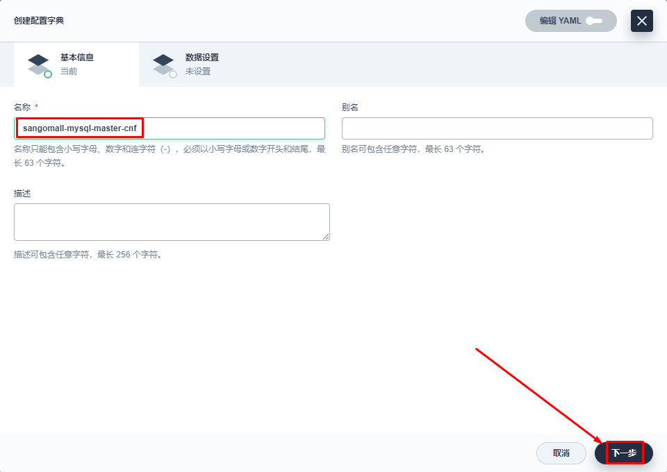

#### 1.2.2.2 slave节点配置文件

~~~powershell
[client]
default-character-set=utf8

[mysql]
default-character-set=utf8

[mysqld]
init_connect='SET collation_connection = utf8_unicode_ci'
init_connect='SET NAMES utf8'
character-set-server=utf8
collation-server=utf8_unicode_ci
skip-character-set-client-handshake
skip-name-resolve

server_id=2
log_bin=mysql-bin
read-only=1
binlog-do-db=mall_oms
binlog-do-db=mall_pms
binlog-do-db=mall_sms
binlog-do-db=mall_ums
binlog-do-db=mall_wms

replicate-ignore-db=mysql
replicate-ignore-db=sys
replicate-ignore-db=information_schema
replicate-ignore-db=performance_schema
~~~

### 1.2.3 mysql管理员root用户密码

### 1.2.4 master部署

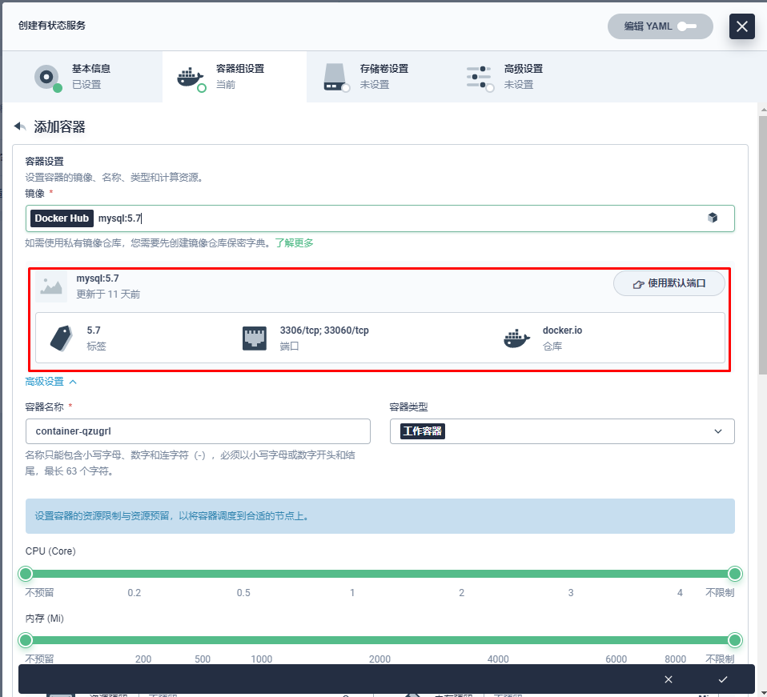

**把配置文件一定要挂载到/etc/mysql/conf.d目录中**

~~~powershell
# dig -t a mysql-master.sangomall.svc.cluster.local. @10.96.0.10
~~~

### 1.2.5 slaver部署

~~~powershell
# dig -t a mysql-slave.sangomall.svc.cluster.local. @10.96.0.10
~~~

### 1.2.6 MySQL主从复制

#### 1.2.6.1 MySQL Master节点授权

~~~powershell
mysql>grant replication slave on *.* to 'backup'@'%' identified by '123456';
~~~

~~~powershell
mysql>show master status\G;
~~~

#### 1.2.6.2 MySQL Slave配置

~~~powershell
mysql>change master to
master_host='mysql-master.sangomall.svc.cluster.local.',
master_user='backup',
master_password='123456',
master_log_file='mysql-bin.000003',
master_log_pos=439,
master_port=3306;
~~~

~~~powershell
mysql>start slave;
~~~

~~~powershell
mysql> show slave status\G;
*************************** 1. row ***************************
               Slave_IO_State: Waiting for master to send event
                  Master_Host: mysql-master.sangomall.svc.cluster.local.
                  Master_User: backup
                  Master_Port: 3306
                Connect_Retry: 60
              Master_Log_File: mysql-bin.000003
          Read_Master_Log_Pos: 439
               Relay_Log_File: mysql-slave-v1-0-relay-bin.000002
                Relay_Log_Pos: 652
        Relay_Master_Log_File: mysql-bin.000003
             Slave_IO_Running: Yes  一定要为Yes
            Slave_SQL_Running: Yes  一定要为Yes
              Replicate_Do_DB:
~~~

#### 1.2.6.3 验证

# 二、Redis部署

## 2.1 准备配置PVC

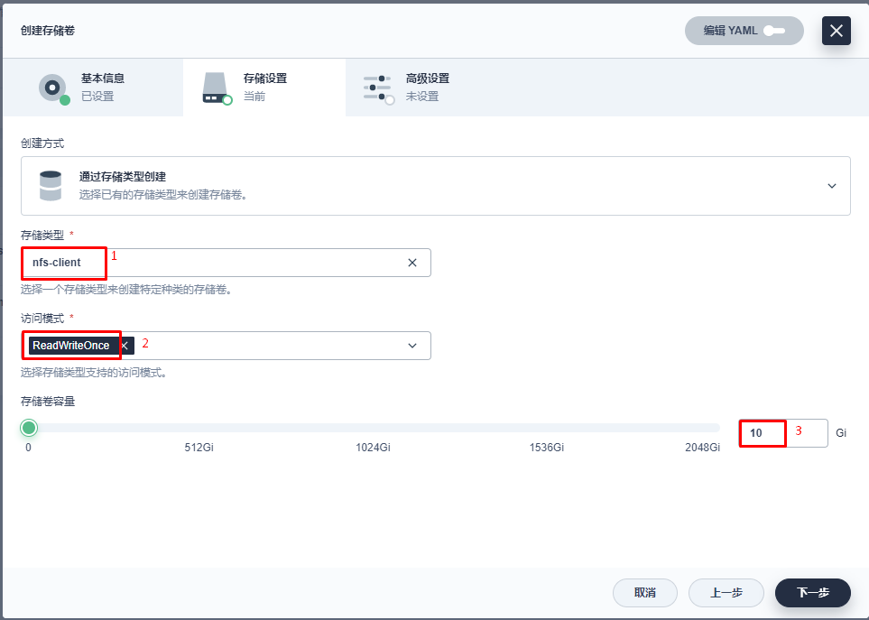

## 2.2 准备配置文件

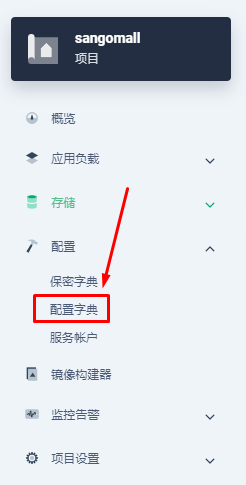

## 2.3 部署Redis

~~~powershell
# dig -t a redis.sangomall.svc.cluster.local. @10.96.0.10
~~~

# 三、ES&Kibana部署

## 3.1 elasticsearch pvc准备

## 3.2 elasticsearch 配置文件准备

~~~powershell
http.host: 0.0.0.0
discovery.type: single-node
ES_JAVA_OPTS: -Xms64m -Xmx512m
~~~

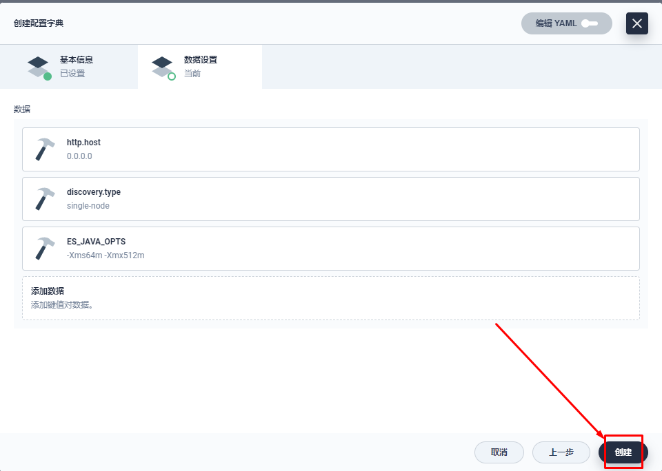

## 3.3 elasticsearch 部署

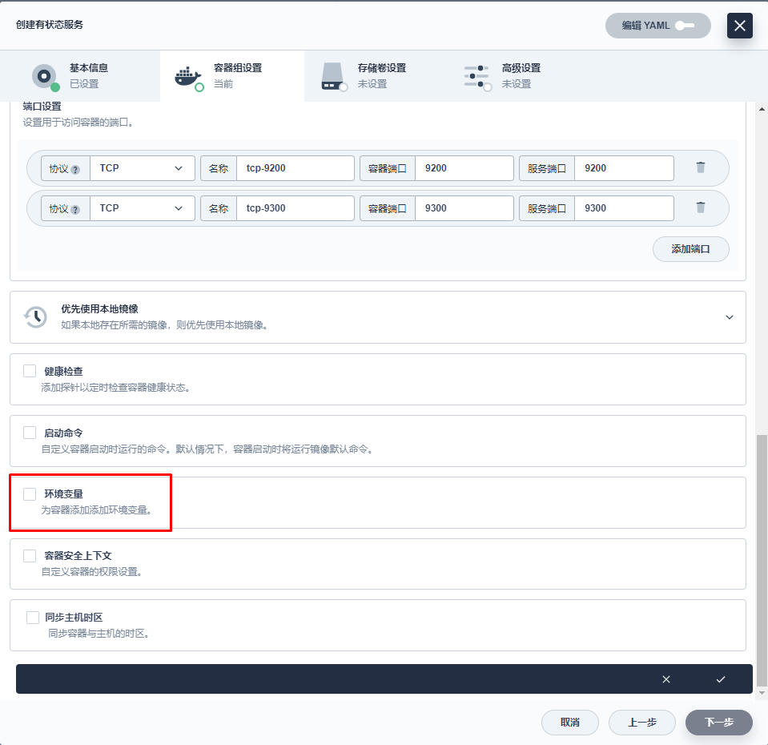

## 3.4 kibana部署

~~~powershell
ELASTICSEARCH_HOSTS=http://elasticsearch.sangomall.svc.cluster.local.:9200
~~~

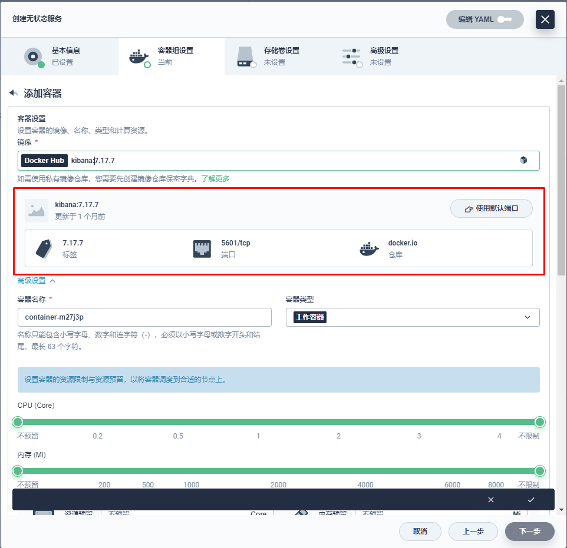

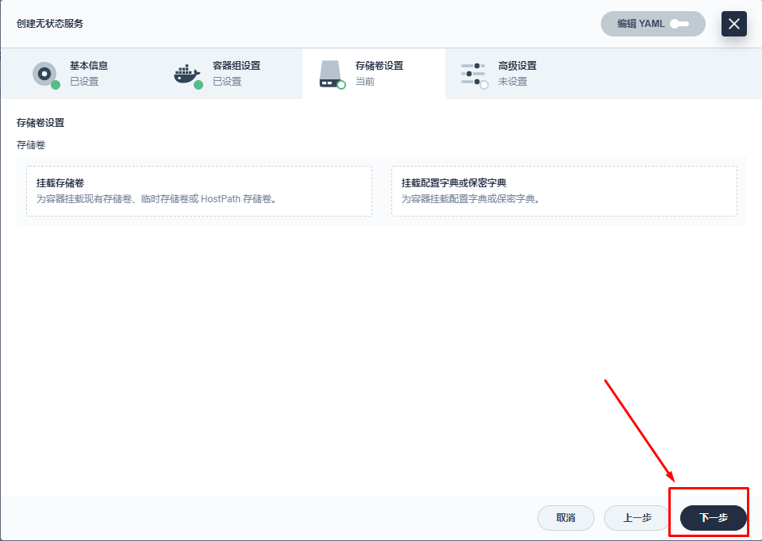

## 3.5 kibana访问

~~~powershell
lb.kubesphere.io/v1alpha1: openelb
protocol.openelb.kubesphere.io/v1alpha1: layer2
eip.openelb.kubesphere.io/v1alpha2: layer2-eip
~~~

~~~powershell
[root@dnsserver ~]# cat /var/named/msb.com.zone
$TTL 1D
@       IN SOA  msb.com admin.msb.com. (
                                        0       ; serial
                                        1D      ; refresh
                                        1H      ; retry
                                        1W      ; expire
                                        3H )    ; minimum
@       NS      ns.msb.com.
ns      A       192.168.10.145
harbor  A       192.168.10.146
reg-test        A       192.168.10.72
kibana  A       192.168.10.73
~~~

~~~powershell
[root@dnsserver ~]# systemctl restart named
~~~

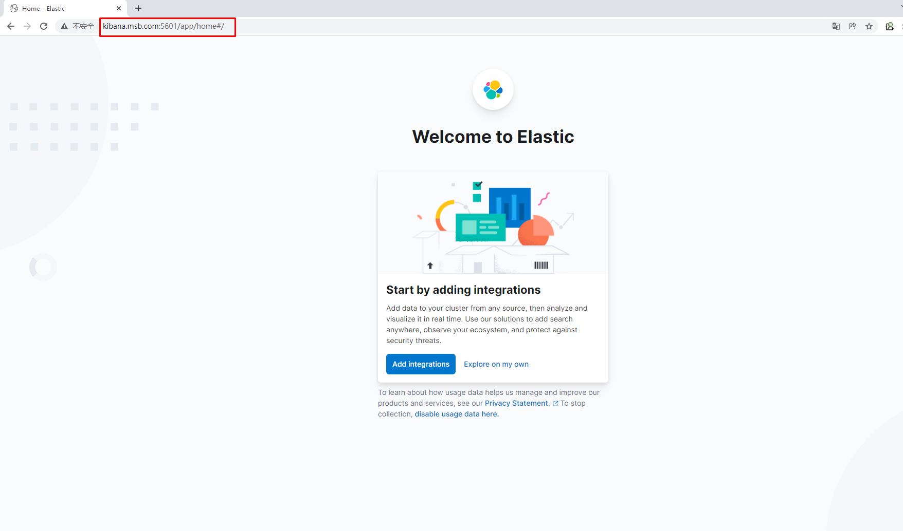

# 四、RabbitMQ部署

## 4.1 RabbitMQ持久存储准备 PVC

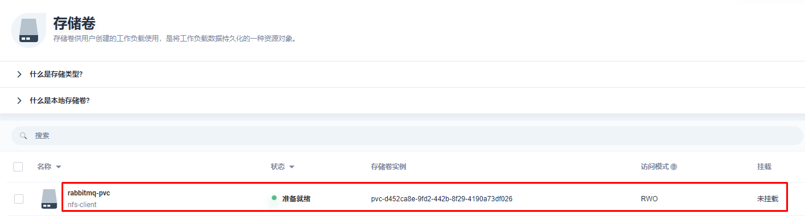

## 4.2 RabbitMQ部署

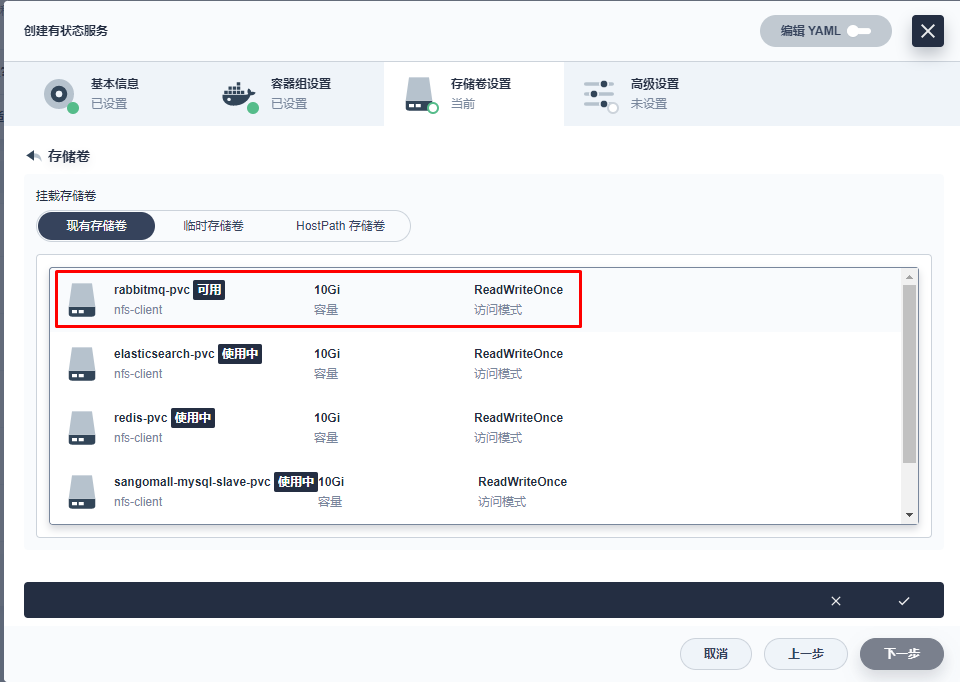

## 4.3 RabbitMQ访问

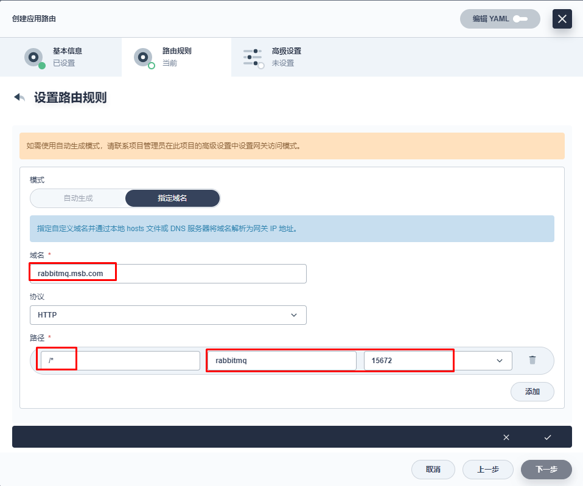

~~~powershell
[root@dnsserver ~]# cat /var/named/msb.com.zone
$TTL 1D
@       IN SOA  msb.com admin.msb.com. (
                                        0       ; serial
                                        1D      ; refresh
                                        1H      ; retry
                                        1W      ; expire
                                        3H )    ; minimum
@       NS      ns.msb.com.
ns      A       192.168.10.145
harbor  A       192.168.10.146
reg-test        A       192.168.10.72
rabbitmq        A       192.168.10.72
~~~

~~~powershell
[root@dnsserver ~]# systemctl restart named
~~~

# 五、Nacos部署

## 5.1 Nacos Server数据持久存储 PVC

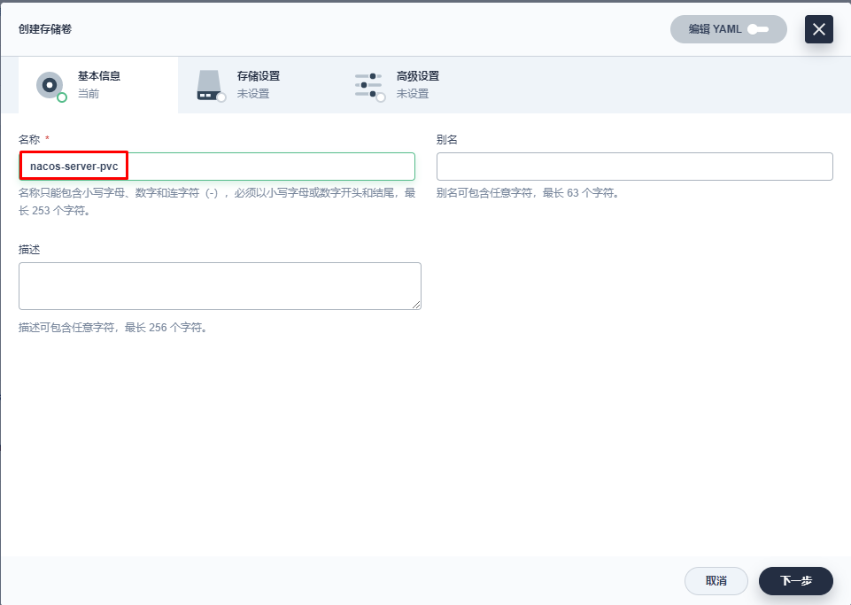

## 5.2 Nacos Server部署

~~~powershell
MODE: standalone
~~~

~~~powershell
# dig -t a nacos-server.sangomall.svc.cluster.local. @10.96.0.10
~~~

## 5.3 Nacos Server访问

~~~powershell
[root@dnsserver ~]# cat /var/named/msb.com.zone
$TTL 1D
@       IN SOA  msb.com admin.msb.com. (
                                        0       ; serial
                                        1D      ; refresh
                                        1H      ; retry
                                        1W      ; expire
                                        3H )    ; minimum
@       NS      ns.msb.com.
ns      A       192.168.10.145
harbor  A       192.168.10.146
nacos-server    A       192.168.10.72 添加主机记录
~~~

~~~powershell
[root@dnsserver ~]# systemctl restart named
~~~

# 六、链路跟踪服务 zipkin

## 6.1 依赖服务检查

~~~powershell
# dig -t a elasticsearch.sangomall.svc.cluster.local. @10.96.0.10
~~~

## 6.2 zipkin部署

~~~powershell
STORAGE_TYPE: elasticsearch
ES_HOSTS: elasticsearch.sangomall.svc.cluster.local.:9200
~~~

~~~powershell
# dig -t a zipkin-server.sangomall.svc.cluster.local. @10.96.0.10
~~~

## 6.3 zipkin访问

~~~powershell
[root@dnsserver ~]# cat /var/named/msb.com.zone
$TTL 1D
@       IN SOA  msb.com admin.msb.com. (
                                        0       ; serial
                                        1D      ; refresh
                                        1H      ; retry
                                        1W      ; expire
                                        3H )    ; minimum
@       NS      ns.msb.com.
ns      A       192.168.10.145
harbor  A       192.168.10.146

zipkin-server    A       192.168.10.72 添加主机记录
~~~

~~~powershell
[root@dnsserver ~]# systemctl restart named
~~~

# 七、sentinel 流量卫兵

## 7.1 获取容器镜像

## 7.2 sentinel部署

~~~powershell
bladex/sentinel-dashboard:latest
~~~

~~~powershell
#  dig -t a sentinel-server.sangomall.svc.cluster.local. @10.96.0.10
~~~

## 7.3 sentinel访问

~~~powershell
[root@dnsserver ~]# cat /var/named/msb.com.zone
$TTL 1D
@       IN SOA  msb.com admin.msb.com. (
                                        0       ; serial
                                        1D      ; refresh
                                        1H      ; retry
                                        1W      ; expire
                                        3H )    ; minimum
@       NS      ns.msb.com.
ns      A       192.168.10.145
harbor  A       192.168.10.146

sentinel-server    A       192.168.10.72 添加主机记录
~~~

~~~powershell
[root@dnsserver ~]# systemctl restart named
~~~

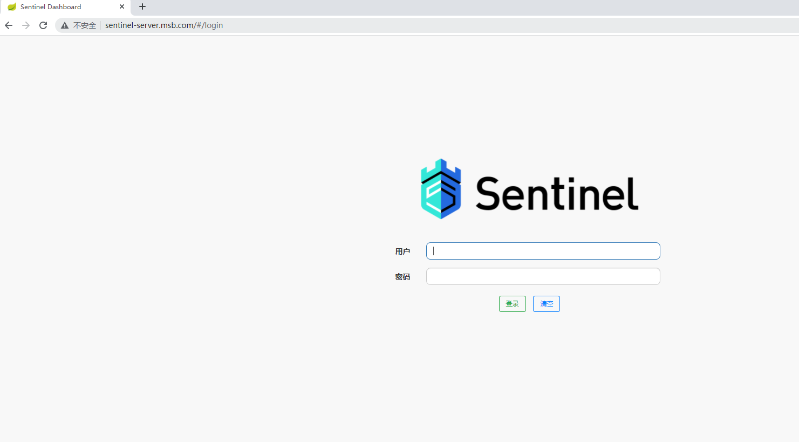

# 八、Skywalking部署

## 8.1 获取容器镜像方法及ES服务确认 

### 8.1.1 获取Skywalking oap server及Skywalking ui容器镜像

### 8.1.2 elasticsearch服务确认

~~~powershell
elasticsearch.sangomall.svc.cluster.local.
~~~

## 8.2 Skywalking oap server部署

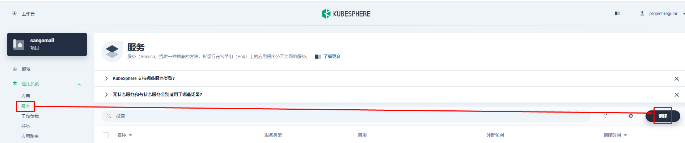

**CPU及内存限制要注意：CPU 500m至1000m，内存 100M至2000M**

~~~powershell
SW_STORAGE  elasticsearch

SW_STORAGE_ES_CLUSTER_NODES    elasticsearch.sangomall.svc.cluster.local.:9200
~~~

~~~powershell
# dig -t a skywalking-oap-server.sangomall.svc.cluster.local. @10.96.0.10
~~~

## 8.3 Skywalking ui部署

~~~powershell
SW_OAP_ADDRESS: http://skywalking-oap-server.sangomall.svc.cluster.local.:12800
~~~

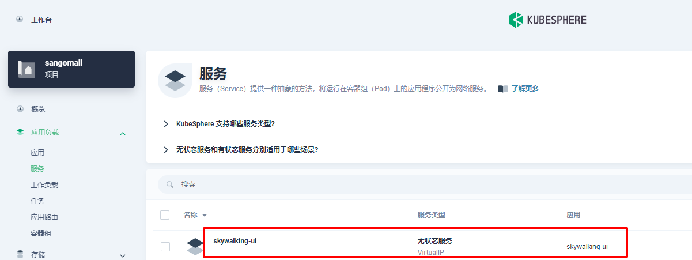

~~~powershell
# dig -t a skywalking-ui.sangomall.svc.cluster.local. @10.96.0.10
~~~

## 8.4 Skywalking ui访问

~~~powershell
[root@dnsserver ~]# cat /var/named/msb.com.zone
$TTL 1D
@       IN SOA  msb.com admin.msb.com. (
                                        0       ; serial
                                        1D      ; refresh
                                        1H      ; retry
                                        1W      ; expire
                                        3H )    ; minimum
@       NS      ns.msb.com.
ns      A       192.168.10.145
harbor  A       192.168.10.146
reg-test        A       192.168.10.72
kibana          A       192.168.10.72
rabbitmq        A       192.168.10.72
nacos-server    A       192.168.10.72
zipkin-server   A       192.168.10.72
sentinel-server A       192.168.10.72
skywalking-ui   A       192.168.10.72
~~~

~~~powershell
[root@dnsserver ~]# systemctl restart named
~~~

# 九、RocketMQ部署

## 9.1 rocketmq namesrv存储准备

## 9.2  rocketmq namesrv部署

~~~powershell
启动命令:
 /bin/bash
 参数:
 mqnamesrv
~~~

~~~powershell
环境变量
JAVA_OPT_EXT: -Xms512M -Xmx512M -Xmn128m
~~~

~~~powershell
dig -t a  rocketmq-namesrv.sangomall.svc.cluster.local. @10.96.0.10
~~~

## 9.3 rocketmq broker存储准备

## 9.4 rocketmq broker部署

~~~powershell
启动命令:
/bin/bash

参数:
mqbroker,-n,rocketmq-namesrv.sangomall.svc.cluster.local.:9876
~~~

~~~powershell
JAVA_OPT_EXT: -server -Xms128m -Xmx128m -Xmn128m
NAMESRV_ADDR: rocketmq-namesrv.sangomall.svc.cluster.local.:9876
~~~

## 9.5 rocketmq dashboard部署

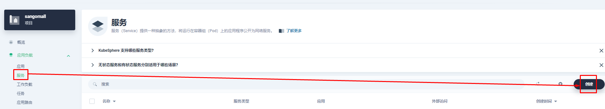

~~~powershell
JAVA_OPTS: -Drocketmq.namesrv.addr=rocketmq-namesrv.sangomall.svc.cluster.local.:9876
~~~

## 9.6 rocketmq dashboard创建应用路由

## 9.7 rocketmq dashboard访问

~~~powershell
[root@dnsserver ~]# cat /var/named/msb.com.zone
$TTL 1D
@       IN SOA  msb.com admin.msb.com. (
                                        0       ; serial
                                        1D      ; refresh
                                        1H      ; retry
                                        1W      ; expire
                                        3H )    ; minimum
@       NS      ns.msb.com.
ns      A       192.168.10.145
harbor  A       192.168.10.146
reg-test        A       192.168.10.72
kibana          A       192.168.10.72
rabbitmq        A       192.168.10.72
nacos-server    A       192.168.10.72
zipkin-server   A       192.168.10.72
sentinel-server A       192.168.10.72
skywalking-ui   A       192.168.10.72
rocketmq-dashboard      A       192.168.10.72
~~~

~~~powershell
[root@dnsserver ~]# systemctl restart named
~~~

