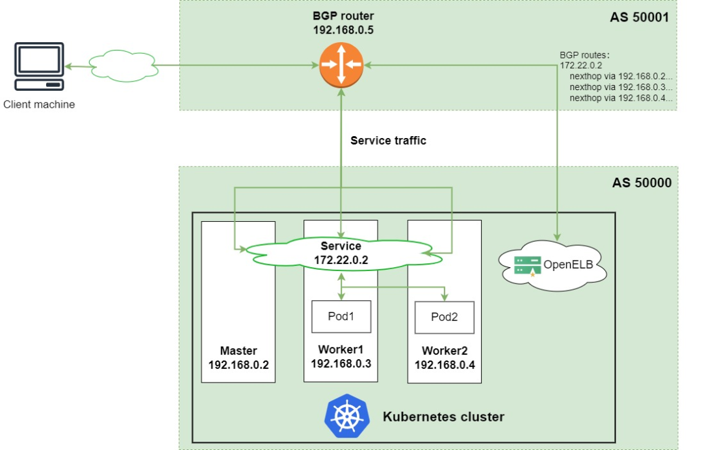

# OpenELB部署及应用

# 一、OpenELB介绍

> 网址： openelb.io

OpenELB 是一个开源的云原生负载均衡器实现，可以在基于裸金属服务器、边缘以及虚拟化的 Kubernetes 环境中使用 LoadBalancer 类型的 Service 对外暴露服务。OpenELB 项目最初由 KubeSphere 社区发起，目前已作为 CNCF 沙箱项目加入 CNCF 基金会，由 OpenELB 开源社区维护与支持。

与 MetalLB 类似，OpenELB 也拥有两种主要工作模式：Layer2 模式和 BGP 模式。OpenELB 的 BGP 模式目前暂不支持 IPv6。
无论是 Layer2 模式还是 BGP 模式，核心思路都是通过某种方式将特定 VIP 的流量引到 k8s 集群中，然后再通过 kube-proxy 将流量转发到后面的特定服务。

## 1.1 Layer2 模式

> Layer2 模式需要我们的 k8s 集群基础环境支持发送 anonymous ARP/NDP packets。因为 OpenELB 是针对裸金属服务器设计的，因此如果是在云环境中部署，需要注意是否满足条件。

- 图中有一个类型为 LoadBalancer 的 Service，其 VIP 为 192.168.0.91（**和 k8s 的节点相同网段**），后端有两个 pod（分别为 pod1 和 pod2）
- 安装在 Kubernetes 集群中的 OpenELB 随机选择一个节点（图中为 worker 1）来处理 Service  请求。当局域网中出现 arp request 数据包来查询 192.168.0.91 的 mac 地址的时候，OpenELB 会进行回应（使用 worker 1 的 MAC 地址），此时路由器（也可能是交换机）将 Service 的 VIP 192.168.0.91 和 worker 1 的 MAC  地址绑定，之后所有请求到 192.168.0.91 的数据包都会被转发到 worker1 上
- Service 流量到达 worker 1 后， worker 1 上的 kube-proxy 将流量转发到后端的两个 pod 进行负载均衡，这些 pod 不一定在 work1 上

主要的工作流程就如同上面描述的一般，但是还有几个需要额外注意的点：

- 如果 worker 1 出现故障，OpenELB 会重新向路由器发送 APR/NDP 数据包，将 Service IP 地址映射到 worker 2 的 MAC 地址，Service 流量切换到 worker 2
- 主备切换过程并不是瞬间完成的，中间会产生一定时间的服务中断（具体多久官方也没说，实际上应该是却决于检测到节点宕机的时间加上重新选主的时间）
- 如果集群中已经部署了多个 openelb-manager 副本，OpenELB 使用 Kubernetes 的领导者选举特性算法来进行选主，从而确保只有一个副本响应 ARP/NDP 请求

## 1.2 BGP 模式

OpenELB 的 BGP 模式使用的是gobgp实现的 BGP 协议，通过使用 BGP 协议和路由器建立 BGP 连接并实现 ECMP 负载均衡，从而实现高可用的 LoadBalancer。

- 图中有一个类型为 LoadBalancer 的 Service，其 VIP 为 172.22.0.2（**和 k8s 的节点不同网段**），后端有两个 pod（分别为 pod1 和 pod2）
- 安装在 Kubernetes 集群中的 OpenELB 与 BGP 路由器建立 BGP 连接，并将去往 172.22.0.2  的路由发布到 BGP 路由器，在配置得当的情况下，路由器上面的路由表可以看到 172.22.0.2  这个 VIP 的下一条有多个节点（均为 k8s 的宿主机节点）
- 当外部客户端机器尝试访问 Service 时，BGP 路由器根据从 OpenELB 获取的路由，在 master、worker 1 和  worker 2 节点之间进行流量负载均衡。Service 流量到达一个节点后，该节点上的 kube-proxy  将流量转发到后端的两个 pod 进行负载均衡，这些 pod 不一定在该节点上

## 1.3 注意事项

>配置 ARP 参数

部署 Layer2 模式需要把 k8s 集群中的 ipvs 配置打开strictARP，开启之后 k8s 集群中的 `kube-proxy` 会停止响应 `kube-ipvs0` 网卡之外的其他网卡的 arp 请求，而由 MetalLB 接手处理。

`strict ARP` 开启之后相当于把 将 `arp_ignore` 设置为 1 并将 `arp_announce` 设置为 2 启用严格的 ARP，这个原理和 LVS 中的 DR 模式对 RS 的配置一样。

# 二、OpenELB安装及配置

## 2.1 需求

- You need to prepare a Kubernetes cluster, and ensure that the Kubernetes version is 1.15 or later. OpenELB requires CustomResourceDefinition (CRD) v1, which is only supported by Kubernetes 1.15 or later. You can use the following methods to deploy a Kubernetes cluster:

- Use [KubeKey](https://kubesphere.io/docs/installing-on-linux/) (recommended). You can use KubeKey to deploy a Kubernetes cluster with or without KubeSphere.
- Follow [official Kubernetes guides](https://kubernetes.io/docs/home/).

OpenELB is designed to be used in bare-metal Kubernetes environments. However, you can also use a cloud-based Kubernetes cluster for learning and testing.

## 2.2 Install OpenELB Using kubectl

1.Log in to the Kubernetes cluster over SSH and run the following command:

~~~powershell
# kubectl apply -f https://raw.githubusercontent.com/openelb/openelb/master/deploy/openelb.yaml
~~~

2.Run the following command to check whether the status of `openelb-manager` is **READY**: **1/1** and **STATUS**: **Running**. If yes, OpenELB has been installed successfully.

~~~powershell
# kubectl get pods -n openelb-system
~~~

## 2.2 OpenELB配置

>Use OpenELB in Layer 2 Mode

### 2.2.1 需求

- You need to [prepare a Kubernetes cluster where OpenELB has been installed](https://openelb.io/docs/getting-started/installation/). All Kubernetes cluster nodes must be on the same Layer 2 network (under the same router).
- You need to prepare a client machine, which is used to verify whether OpenELB functions properly in Layer 2 mode. The client machine needs to be on the same network as the Kubernetes cluster nodes.
- The Layer 2 mode requires your infrastructure environment to allow anonymous ARP/NDP packets. If OpenELB is installed in a cloud-based Kubernetes cluster for testing, you need to confirm with your cloud vendor whether anonymous ARP/NDP packets are allowed. If not, the Layer 2 mode cannot be used.

### 2.2.2 配置步骤

**Step 1: Enable strictARP for kube-proxy**

In Layer 2 mode, you need to enable strictARP for kube-proxy so that all NICs in the Kubernetes cluster stop answering ARP requests from other NICs and OpenELB handles ARP requests instead.

1.Log in to the Kubernetes cluster and run the following command to edit the kube-proxy ConfigMap:

~~~powershell
# kubectl edit configmap kube-proxy -n kube-system
~~~

2.In the kube-proxy ConfigMap YAML configuration, set `data.config.conf.ipvs.strictARP` to `true`.

~~~powershell
ipvs:
  strictARP: true
~~~

3.Run the following command to restart kube-proxy:

~~~powershell
# kubectl rollout restart daemonset kube-proxy -n kube-system
~~~

**Step 2: Specify the NIC Used for OpenELB**

If the node where OpenELB is installed has multiple NICs, you need to specify the NIC used for OpenELB in Layer 2 mode. You can skip this step if the node has only one NIC.

In this example, the master1 node where OpenELB is installed has two NICs (eth0 192.168.0.2 and eth1 192.168.1.2), and eth0 192.168.0.2 will be used for OpenELB.

Run the following command to annotate master1 to specify the NIC:

~~~powershell
# kubectl annotate nodes k8s-master01 layer2.openelb.kubesphere.io/v1alpha1="192.168.10.141"
~~~

**Step 3: Create an Eip Object**

The Eip object functions as an IP address pool for OpenELB.

1.Run the following command to create a YAML file for the Eip object:

~~~powershell
# vim layer2-eip.yaml
~~~

2.Add the following information to the YAML file:

~~~powershell
apiVersion: network.kubesphere.io/v1alpha2
kind: Eip
metadata:
  name: layer2-eip
spec:
  address: 192.168.10.70-192.168.10.99
  interface: ens33
  protocol: layer2
~~~

>- The IP addresses specified in `spec:address` must be on the same network segment as the Kubernetes cluster nodes.
>- For details about the fields in the Eip YAML configuration, see [Configure IP Address Pools Using Eip](https://openelb.io/docs/getting-started/configuration/configure-ip-address-pools-using-eip/).

3.Run the following command to create the Eip object:

~~~powershell
# kubectl apply -f layer2-eip.yaml
~~~

# 三、OpenELB使用

## 3.1 在k8s命令行中使用

### 3.1.1 Create a Deployment

The following creates a Deployment of two Pods using the luksa/kubia image. Each Pod returns its own Pod name to external requests.

1.Run the following command to create a YAML file for the Deployment:

~~~powershell
# vim layer2-openelb.yaml
~~~

2.Add the following information to the YAML file:

~~~powershell
apiVersion: apps/v1
kind: Deployment
metadata:
  name: layer2-openelb
spec:
  replicas: 2
  selector:
    matchLabels:
      app: layer2-openelb
  template:
    metadata:
      labels:
        app: layer2-openelb
    spec:
      containers:
        - image: luksa/kubia
          name: kubia
          ports:
            - containerPort: 8080
~~~

3.Run the following command to create the Deployment:

~~~powershell
# kubectl apply -f layer2-openelb.yaml
~~~

### 3.1.2 Create a Service

1.Run the following command to create a YAML file for the Service:

~~~powershell
# vim layer2-svc.yaml
~~~

2.Add the following information to the YAML file:

~~~powershell
kind: Service
apiVersion: v1
metadata:
  name: layer2-svc
  annotations:
    lb.kubesphere.io/v1alpha1: openelb
    protocol.openelb.kubesphere.io/v1alpha1: layer2
    eip.openelb.kubesphere.io/v1alpha2: layer2-eip
spec:
  selector:
    app: layer2-openelb
  type: LoadBalancer
  ports:
    - name: http
      port: 80
      targetPort: 8080
  externalTrafficPolicy: Cluster
~~~

>- You must set `spec:type` to `LoadBalancer`.
>- The `lb.kubesphere.io/v1alpha1: openelb` annotation specifies that the Service uses OpenELB.
>- The `protocol.openelb.kubesphere.io/v1alpha1: layer2` annotation specifies that OpenELB is used in Layer 2 mode.
>- The `eip.openelb.kubesphere.io/v1alpha2: layer2-eip` annotation specifies the Eip object used by OpenELB. If this annotation is not configured, OpenELB automatically uses the first available Eip object that matches the protocol. You can also delete this annotation and add the `spec:loadBalancerIP` field (for example, `spec:loadBalancerIP: 192.168.0.91`) to assign a specific IP address to the Service.
>- If `spec:externalTrafficPolicy` is set to `Cluster` (default value), OpenELB randomly selects a node from all Kubernetes cluster nodes to handle Service requests. Pods on other nodes can also be reached over kube-proxy.
>- If `spec:externalTrafficPolicy` is set to `Local`, OpenELB randomly selects a node that contains a Pod in the Kubernetes cluster to handle Service requests. Only Pods on the selected node can be reached.

3.Run the following command to create the Service:

~~~powershell
kubectl apply -f layer2-svc.yaml
~~~

### 3.1.3  Verify OpenELB in Layer 2 Mode

In the Kubernetes cluster, run the following command to obtain the external IP address of the Service:

~~~powershell
# kubectl get svc
~~~

## 3.2 在kubesphere中使用

### 3.2.1创建项目

### 3.2.2 创建应用

### 3.2.3 创建服务

~~~powershell
lb.kubesphere.io/v1alpha1:openelb
protocol.openelb.kubesphere.io/v1alpha1:layer2
eip.openelb.kubesphere.io/v1alpha2:layer2-eip
~~~

### 3.2.4   创建应用路由

### 3.2.5 通过域名访问

#### 3.2.5.1 通过 hosts文件添加域名解析

#### 3.2.5.2 通过域名服务器实现域名解析

