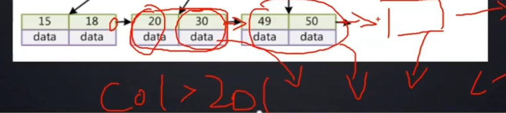

### MYSQL 索引数据结构

**索引**是帮助MySQL高效获取数据的**排好序**的数据结构

索引数据结构

- 二叉树
- 红黑树
- Hash表
- B-Tree

#### B-Tree结构

B-Tree

- 叶节点具有相同的深度，叶节点的指针为空
- 所有索引元素不重复
- 节点中的数据索引从左到右递增排列

#### B+Tree结构

B+Tree(B-Tree变种)

- 非叶子节点不存储data，只存储索引(冗余)，可以放更多的索引
- 叶子节点包含所有索引字段
- 叶子节点用指针连接，提高区间访问的性能

高度为3的B+树，可以存储 1170 * 1170 * 16 = 2KW 索引节点

经历三次磁盘IO，就能查询千万数据的索引数据

----

#### MyISAM存储引擎索引实现

#### InnoDB存储引擎索引实现

InnoDB索引实现(聚集)

- 表数据文件本身就是按B+Tree组织的一个索引结构文件
- **聚集索引-叶节点包含了完整的数据记录**
- 为什么InnoDB表$\color{red}{必须有主键}$，并且推荐使用**整型的自增主键**？
- 为什么**非主键索引**结构叶子节点存储的是$\color{red}{主键值}$？(一致性和节省存储空间)

#### 索引最左前缀原理

