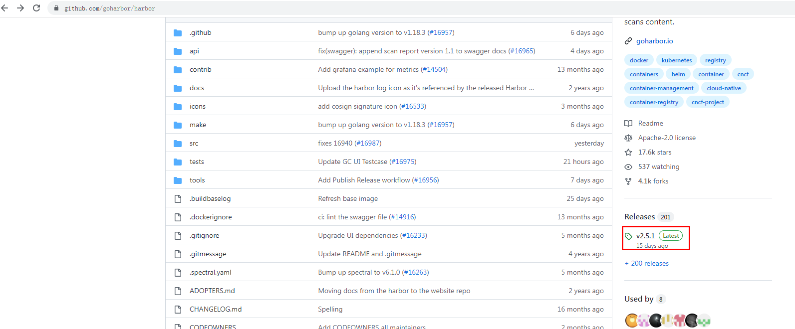
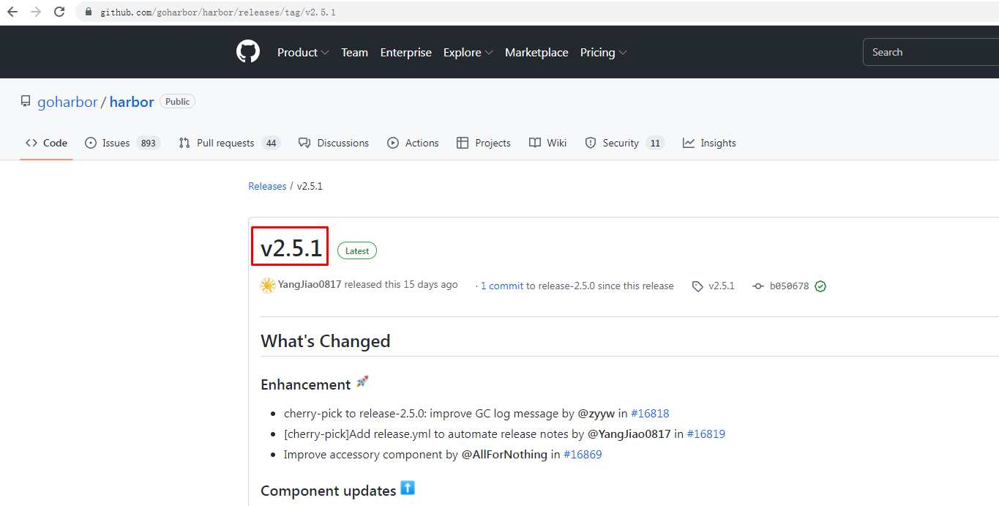
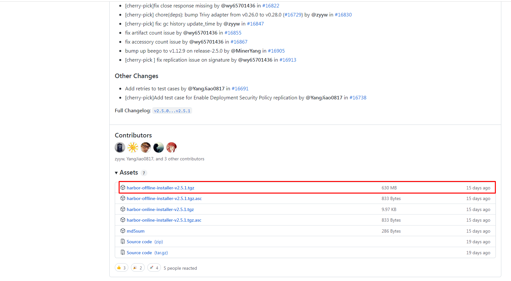
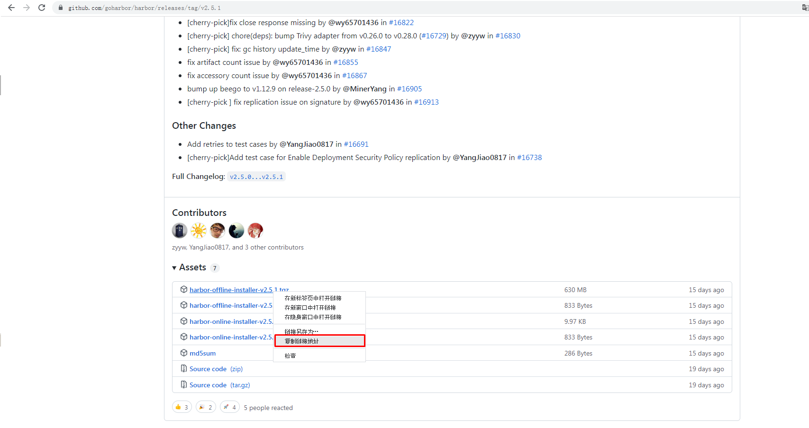

# kubernetes集群公共服务 Harbor

#  一、 docker-ce安装

## 1.1 获取YUM源

> 使用阿里云开源软件镜像站。

~~~powershell
# wget https://mirrors.aliyun.com/docker-ce/linux/centos/docker-ce.repo -O /etc/yum.repos.d/docker-ce.repo
~~~

## 1.2 安装并设置启动及开机自启动

~~~powershell
# yum -y install docker-ce
~~~

~~~powershell
# systemctl enable --now docker
~~~

# 二、 docker compose安装

~~~powershell
下载docker-compose二进制文件
# wget https://github.com/docker/compose/releases/download/1.25.0/docker-compose-Linux-x86_64
~~~

~~~powershell
查看已下载二进制文件
# ls
docker-compose-Linux-x86_64
~~~

~~~powershell
移动二进制文件到/usr/bin目录，并更名为docker-compose
# mv docker-compose-Linux-x86_64 /usr/bin/docker-compose
~~~

~~~powershell
为二进制文件添加可执行权限
# chmod +x /usr/bin/docker-compose
~~~

~~~powershell
安装完成后，查看docker-compse版本
# docker-compose version
docker-compose version 1.25.0, build 0a186604
docker-py version: 4.1.0
CPython version: 3.7.4
OpenSSL version: OpenSSL 1.1.0l  10 Sep 2019
~~~

# 三、 获取harbor安装文件

## 3.1 harbor下载

~~~powershell
下载harbor离线安装包
# wget https://github.com/goharbor/harbor/releases/download/v2.5.1/harbor-offline-installer-v2.5.1.tgz
~~~

~~~powershell
查看已下载的离线安装包
# ls
harbor-offline-installer-v2.5.1.tgz
~~~

## 3.2   修改配置文件

~~~powershell
解压harbor离线安装包
# tar xf harbor-offline-installer-v2.5.1.tgz
~~~

~~~powershell
查看解压出来的目录
# ls
harbor 
~~~

~~~powershell
查看harbor目录
# ls harbor
common.sh  harbor.v2.5.1.tar.gz  harbor.yml.tmpl  install.sh  LICENSE  prepare
~~~

~~~powershell
创建配置文件
# cd harbor/
# mv harbor.yml.tmpl harbor.yml
~~~

~~~powershell
修改配置文件内容

# vim harbor.yml

# Configuration file of Harbor

# The IP address or hostname to access admin UI and registry service.
# DO NOT use localhost or 127.0.0.1, because Harbor needs to be accessed by external clients.
hostname: harbor.msb.com

# http related config
http:
  # port for http, default is 80. If https enabled, this port will redirect to https port
  port: 80

# https related config
# https:
  # https port for harbor, default is 443
#  port: 443
  # The path of cert and key files for nginx
#  certificate: /root/harbor/6864844_kubemsb.com.pem 
#  private_key: /root/harbor/6864844_kubemsb.com.key

# # Uncomment following will enable tls communication between all harbor components
# internal_tls:
#   # set enabled to true means internal tls is enabled
#   enabled: true
#   # put your cert and key files on dir
#   dir: /etc/harbor/tls/internal

# Uncomment external_url if you want to enable external proxy
# And when it enabled the hostname will no longer used
# external_url: https://reg.mydomain.com:8433

# The initial password of Harbor admin
# It only works in first time to install harbor
# Remember Change the admin password from UI after launching Harbor.
harbor_admin_password: 12345 访问密码
......
~~~

## 3.3  执行预备脚本

~~~powershell
# ./prepare
~~~

~~~powershell
输出
prepare base dir is set to /root/harbor
Clearing the configuration file: /config/portal/nginx.conf
Clearing the configuration file: /config/log/logrotate.conf
Clearing the configuration file: /config/log/rsyslog_docker.conf
Generated configuration file: /config/portal/nginx.conf
Generated configuration file: /config/log/logrotate.conf
Generated configuration file: /config/log/rsyslog_docker.conf
Generated configuration file: /config/nginx/nginx.conf
Generated configuration file: /config/core/env
Generated configuration file: /config/core/app.conf
Generated configuration file: /config/registry/config.yml
Generated configuration file: /config/registryctl/env
Generated configuration file: /config/registryctl/config.yml
Generated configuration file: /config/db/env
Generated configuration file: /config/jobservice/env
Generated configuration file: /config/jobservice/config.yml
Generated and saved secret to file: /data/secret/keys/secretkey
Successfully called func: create_root_cert
Generated configuration file: /compose_location/docker-compose.yml
Clean up the input dir
~~~

## 3.4  执行安装脚本

~~~powershell
# ./install.sh
~~~

~~~powershell
输出
[Step 0]: checking if docker is installed ...

Note: docker version: 20.10.12

[Step 1]: checking docker-compose is installed ...

Note: docker-compose version: 1.25.0

[Step 2]: loading Harbor images ...

[Step 3]: preparing environment ...

[Step 4]: preparing harbor configs ...
prepare base dir is set to /root/harbor

[Step 5]: starting Harbor ...
Creating network "harbor_harbor" with the default driver
Creating harbor-log ... done
Creating harbor-db     ... done
Creating registry      ... done
Creating registryctl   ... done
Creating redis         ... done
Creating harbor-portal ... done
Creating harbor-core   ... done
Creating harbor-jobservice ... done
Creating nginx             ... done
✔ ----Harbor has been installed and started successfully.----
~~~

## 3.5 验证运行情况

~~~powershell
# docker ps
CONTAINER ID   IMAGE                                COMMAND                  CREATED              STATUS                        PORTS                                                                            NAMES
71c0db683e4a   goharbor/nginx-photon:v2.5.1         "nginx -g 'daemon of…"   About a minute ago   Up About a minute (healthy)   0.0.0.0:80->8080/tcp, :::80->8080/tcp, 0.0.0.0:443->8443/tcp, :::443->8443/tcp   nginx
4e3b53a86f01   goharbor/harbor-jobservice:v2.5.1    "/harbor/entrypoint.…"   About a minute ago   Up About a minute (healthy)                                                                                    harbor-jobservice
df76e1eabbf7   goharbor/harbor-core:v2.5.1          "/harbor/entrypoint.…"   About a minute ago   Up About a minute (healthy)                                                                                    harbor-core
eeb4d224dfc4   goharbor/harbor-portal:v2.5.1        "nginx -g 'daemon of…"   About a minute ago   Up About a minute (healthy)                                                                                    harbor-portal
70e162c38b59   goharbor/redis-photon:v2.5.1         "redis-server /etc/r…"   About a minute ago   Up About a minute (healthy)                                                                                    redis
8bcc0e9b06ec   goharbor/harbor-registryctl:v2.5.1   "/home/harbor/start.…"   About a minute ago   Up About a minute (healthy)                                                                                    registryctl
d88196398df7   goharbor/registry-photon:v2.5.1      "/home/harbor/entryp…"   About a minute ago   Up About a minute (healthy)                                                                                    registry
ed5ba2ba9c82   goharbor/harbor-db:v2.5.1            "/docker-entrypoint.…"   About a minute ago   Up About a minute (healthy)                                                                                    harbor-db
dcb4b57c7542   goharbor/harbor-log:v2.5.1           "/bin/sh -c /usr/loc…"   About a minute ago   Up About a minute (healthy)   127.0.0.1:1514->10514/tcp                                                        harbor-log

~~~

## 3.6 访问harbor UI界面

# 四、配置Docker使用Harbor

~~~powershell
# vim /etc/docker/daemon.json

{							
  "insecure-registries": ["http://192.168.10.246"]			
}

~~~

~~~powershell
# systemctl restart docker
~~~

