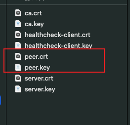
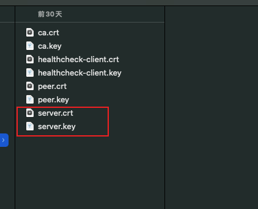

# k8s各证书生成相关内容

https://blog.csdn.net/biqu5401/article/details/100948700


# k8s证书概念

- client certificate is used to authenticate client by server. （客户端证书：用于被服务端认证）
- server certificate is used by server and verified by client for server identity.（服务端证书：用来验证使用证书的服务器的身份）
- peer certificate is used by etcd cluster members as they communicate with each other in both ways.（对等证书：由etcd集群成员使用，因为它们以两种方式相互通信；**对等证书即是客户端证书，也是服务端证书**）

注：**服务端证书一般要指定hosts**，即允许哪些IP或者域名使用此证书，**客户端证书一般不需要指定hosts，或者指定为[]（为空）**

# 本文证书前提

本例中：只采用一个ca根证书；也可以采用多个不同ca分别进行验证

ca证书：ca.pem、ca-key.pem（本例中etcd、k8s组件全使用同一个ca证书）

### etcd证书：

- peer.pem、peer-key.pem：etcd各节点相互通信的对等证书及私钥（hosts指定所有etcd节点IP）
- server.pem、server-key.pem：etcd各节点自己的服务器证书及私钥（hosts指定当前etcd节点的IP）
- client.pem、client-key.pem：命令行客户端访问etcd使用的证书私钥（hosts可以不写或者为空）
- apiserver-etcd-client.pem、apiserver-etcd-client-key.pem：apiserver访问etcd的证书及私钥；
- 注：其中peer.pem和server.pem可以使用一个，因为都是服务端证书（hosts指定所有etcd节点IP）

client.pem和apiserver-etcd-client.pem可以使用一个，因为都是客户端证书（hosts都为空或不写）

### k8s证书：

- kube-apiserver.pem：kube-apiserver节点使用的证书（每个master生成一个，hosts为当前master的IP）
- kubelet.pem：kube-apiserver访问kubelet时的客户端证书（每个master一个，hosts为当前master的IP）
- aggregator-proxy.pem：kube-apiserver使用聚合时，客户端访问代理的证书（hosts为空）
- admin.pem：kubectl客户端的证书（hosts为空或者不写）

# 生成ca证书、ca私钥、签发证书的策略

关于cfssl的用法参考我另一篇博客：https://blog.51cto.com/liuzhengwei521/2120535

## 生成签发证书的策略

```
cat ca-config.json
{
  "signing": {
    "default": {
      "expiry": "438000h"
    },
    "profiles": {
      "kubernetes": {
        "usages": [
            "signing",
            "key encipherment",
            "server auth",
            "client auth"
        ],
        "expiry": "438000h"
      }
    }
  }
}
```

## 生成ca自签名请求

```
cat ca-csr.json
{
  "CN": "kubernetes",
  "key": {
    "algo": "rsa",
    "size": 2048
  },
  "names": [
    {
      "C": "CN",
      "ST": "HangZhou",
      "L": "XS",
      "O": "k8s",
      "OU": "System"
    }
  ],
  "ca": {
    "expiry": "876000h"
  }
}
```

## 生成ca证书及私钥

```
cfssl gencert -initca ca-csr.json | cfssljson -bare ca
```

# 生成etcd的peer(对等)证书

```
cat peer-csr.json
{
  "CN": "etcd",
  "hosts": [
    "192.168.10.110",
    "192.168.10.111",
    "192.168.10.112",
    "127.0.0.1"
  ],
  "key": {
    "algo": "rsa",
    "size": 2048
  },
  "names": [
    {
      "C": "CN",
      "ST": "HangZhou",
      "L": "XS",
      "O": "k8s",
      "OU": "System"
    }
  ]
}

cfssl gencert -ca=ca.pem -ca-key=ca-key.pem -config=ca-config.json -profile=kubernetes peer-csr.json | cfssljson -bare peer

注：因为是对等证书，需要指定hosts（即只能在指定的IP上使用）；hosts指定的IP均为etcd各节点的IP
```

> 

# 生成etcd的server证书

```
cat server-csr.json
{
  "CN": "etcd",
  "hosts": [
    "192.168.10.110",
    "127.0.0.1"
  ],
  "key": {
    "algo": "rsa",
    "size": 2048
  },
  "names": [
    {
      "C": "CN",
      "ST": "HangZhou",
      "L": "XS",
      "O": "k8s",
      "OU": "System"
    }
  ]
}

cfssl gencert -ca=ca.pem -ca-key=ca-key.pem -config=ca-config.json -profile=kubernetes server-csr.json | cfssljson -bare server

注：因为是server证书，需要指定hosts（即只能在指定的IP上使用），hosts当前etcd节点的IP地址；
注：各节点均要生成此证书，如果羡麻烦，可以直接使用peer的证书
```

> 

# 生成etcd的client证书

```
cat client-csr.json
{
  "CN": "etcd",
  "key": {
    "algo": "rsa",
    "size": 2048
  },
  "names": [
    {
      "C": "CN",
      "ST": "HangZhou",
      "L": "XS",
      "O": "k8s",
      "OU": "System"
    }
  ]
}

cfssl gencert -ca=ca.pem -ca-key=ca-key.pem -config=ca-config.json -profile=kubernetes client-csr.json | cfssljson -bare client

注：因为是client端证书，不需要指定hosts，因为需要在任意节点使用此证书
注：因为kube-apiserver也是作为etcd的客户端访问etcd的，所以kube-apiserver也可以使用此证书；
注：kube-apiserver使用上面的证书时，hosts为空，也可以指定hosts单独为apiserver生成证书

使用示例：查看集群是否健康
etcdctl 
	--key-file=./client-key.pem \
	--cert-file=./client.pem \
	--ca-file=./ca.pem 
	--endpoints="https://192.168.10.110:2379" \
	cluster-health
```


# 生成kubectl使用的证书(k8s管理员)

```
cat admin-csr.json
{
  "CN": "admin",
  "hosts": [],
  "key": {
    "algo": "rsa",
    "size": 2048
  },
  "names": [
    {
      "C": "CN",
      "ST": "HangZhou",
      "L": "XS",
      "O": "system:masters",
      "OU": "System"
    }
  ]
}

cfssl gencert -ca=ca.pem -ca-key=ca-key.pem -config=ca-config.json -profile=kubernetes admin-csr.json | cfssljson -bare admin

注：CN相当于k8s中的User，names中的O相当于k8s的Group，在认证时会基于此进行鉴权
注：本例中O对应的值为system:masters，在k8s中system:masters组绑定到了cluster-admin上了
注：cluster-admin的clusterrolebinding是对整个集群具有管理权限

注：此证书也可用于kube-apiserver访问kubelet使用的认证文件
	--kubelet-https=true \
  	--kubelet-client-certificate=/etc/kubernetes/ssl/admin.pem \
  	--kubelet-client-key=/etc/kubernetes/ssl/admin-key.pem
[root@master01 ~]# kubectl describe clusterrolebinding cluster-admin
Name:         cluster-admin
Labels:       kubernetes.io/bootstrapping=rbac-defaults
Annotations:  rbac.authorization.kubernetes.io/autoupdate: true
Role:
  Kind:  ClusterRole
  Name:  cluster-admin
Subjects:
  Kind   Name            Namespace
  ----   ----            ---------
  Group  system:masters  

注：可以看到system:masters的类型为Group,绑定在名字为cluster-admin的clusterrolebinding上
注：由此admin.pem通过k8s的RBAC认证后，才能管理整个集群；
#生成admin使用的kubeconfig文件，以完成对集群的访问

#设置集群参数
kubectl config set-cluster myk8s \
	--certificate-authority=ca.pem \
	--embed-certs=true \
	--server=https://192.168.10.103:6443
#设置客户端认证参数
kubectl config set-credentials cluster-admin \
	--client-certificate=admin.pem \
	--client-key=admin-key.pem \
	--embed-certs=true
#设置上下文参数
kubectl config set-context admin --cluster=myk8s --user=cluster-admin
#选择使用的上下文
kubectl config use-context admin
```

# 生成kube-apiserver的证书

```
cat kube-apiserver-csr.json

{
  "CN": "kubernetes",
  "hosts": [
    "127.0.0.1",
    "192.168.10.103",
    "192.168.10.250",
    "10.68.0.1",
    "www.51yunv.com",
    "kubernetes",
    "kubernetes.default",
    "kubernetes.default.svc",
    "kubernetes.default.svc.cluster",
    "kubernetes.default.svc.cluster.local"
  ],
  "key": {
    "algo": "rsa",
    "size": 2048
  },
  "names": [
    {
      "C": "CN",
      "ST": "HangZhou",
      "L": "XS",
      "O": "k8s",
      "OU": "System"
    }
  ]
}

cfssl gencert -ca=ca.pem -ca-key=ca-key.pem -config=ca-config.json -profile=kubernetes kube-apiserver-csr.json | cfssljson -bare kube-apiserver

注：kube-apiserver作为所有访问的入口，一定要把hosts的内容指全面，否则会造成无法访问的情况；
注：在本例中的192.168.10.103，表示当前master节点的IP地址（每个master的替换IP后，都要生成此证书）
注：在本例中的192.168.10.250，表示VIP，即如果前面用keepalived+haproxy做HA时的VIP地址
注：在本例中的10.68.0.1，表示集群中第一个service的地址，pod会通过此地址访问kube-apiserver；
注：在本例中的www.51yunv.com，表示当kube-apiserver对外部提供访问时使用的域名；
注：在本例中的kubernetes.default.svc.cluster.local，表示此集群中的Pod通过dns访问kube-apiserver使用的地址
```

# 生成aggregator的证书

```
cat aggregator-proxy-csr.json
{
  "CN": "aggregator",
  "hosts": [],
  "key": {
    "algo": "rsa",
    "size": 2048
  },
  "names": [
    {
      "C": "CN",
      "ST": "HangZhou",
      "L": "XS",
      "O": "k8s",
      "OU": "System"
    }
  ]
}

cfssl gencert -ca=ca.pem -ca-key=ca-key.pem -config=ca-config.json -profile=kubernetes aggregator-proxy-csr.json | cfssljson -bare aggregator-proxy

注：aggregator证书用开启kube-apiserver聚合时，客户端访问kube-aggregator使用的证书
```

# 生成kubelet访问kube-apiserver的认证文件

kubelet访问apiserver使用的是kubeconfig文件；需要先生成证书，然后通过证书生成kubeconfig文件

```
cat kubelet-csr.json
{
  "CN": "system:node:10.10.5.218",
  "hosts": [
    "127.0.0.1",
    "10.10.5.218"
  ],
  "key": {
    "algo": "rsa",
    "size": 2048
  },
  "names": [
    {
      "C": "CN",
      "ST": "HangZhou",
      "L": "XS",
      "O": "system:nodes",
      "OU": "System"
    }
  ]
}
cfssl gencert -ca=ca.pem -ca-key=ca-key.pem -config=ca-config.json -profile=kubernetes kubelet-csr.json | cfssljson -bare kubelet

注：hosts中的10.10.5.218为当前node节点的IP地址，不同的node要更换后生成当前node节点可以使用的证书；
   然后在每个节点上都要生成当前节点可用的kubeconfig文件

#生成kubeconfig文件
kubectl config set-cluster k8s \
	--certificate-authority=ca.pem \
	--embed-certs=true \
	--server=https://192.168.10.103:6443 \
	--kubeconfig=kubelet.kubeconfig
kubectl config set-credentials system:node:192.168.10.105 \
	--client-certificate=kubelet.pem \
	--embed-certs=true \
	--client-key=kubelet-key.pem \
	--kubeconfig=kubelet.kubeconfig
kubectl config set-context default --cluster=k8s --user=system:node:192.168.10.105 --kubeconfig=kubelet.kubeconfig
kubectl config use-context default --kubeconfig=kubelet.kubeconfig
```

# 生成kube-proxy访问kube-apiserver的认证文件

kube-proxy访问apiserver使用的是kubeconfig文件；需要先生成证书，然后通过证书生成kubeconfig文件

```
cat kube-proxy-csr.json
{
  "CN": "system:kube-proxy",
  "hosts": [],
  "key": {
    "algo": "rsa",
    "size": 2048
  },
  "names": [
    {
      "C": "CN",
      "ST": "HangZhou",
      "L": "XS",
      "O": "k8s",
      "OU": "System"
    }
  ]
}

cfssl gencert -ca=ca.pem -ca-key=ca-key.pem -config=ca-config.json -profile=kubernetes kube-proxy-csr.json | cfssljson -bare kube-proxy

注：CN相当于k8s中的User，names中的O相当于k8s的Group，在RBAC签权时的需要认证
注：本例中CN对应的值为system:kube-proxy，在k8s中system:kube-proxy绑定到了system:node-proxier
注：system:node-proxier是专用于kube-proxy访问kube-apiserver的


生成kubeconfig文件
kubectl config set-cluster k8s \
	--certificate-authority=ca.pem \
	--embed-certs=true \
	--server=https://192.168.10.103:6443 \
	--kubeconfig=kube-proxy.kubeconfig
kubectl config set-credentials kube-proxy \
	--client-certificate=kube-proxy.pem \
	--embed-certs=true \
	--client-key=kube-proxy-key.pem \
	--kubeconfig=kube-proxy.kubeconfig
	
kubectl config set-context default --cluster=k8s --user=kube-proxy --kubeconfig=kube-proxy.kubeconfig
kubectl config use-context default --kubeconfig=kube-proxy.kubeconfig
[root@master01 etc]# kubectl describe clusterrolebinding system:node-proxier
Name:         system:node-proxier
Labels:       kubernetes.io/bootstrapping=rbac-defaults
Annotations:  rbac.authorization.kubernetes.io/autoupdate: true
Role:
  Kind:  ClusterRole
  Name:  system:node-proxier
Subjects:
  Kind  Name               Namespace
  ----  ----               ---------
  User  system:kube-proxy  

注：可以看到system:kube-proxy用户绑定在system:node-proxier的clusterrolebinding上
	这样当kube-proxy访问kube-apiserver就可以通过RBAC的认证；
```